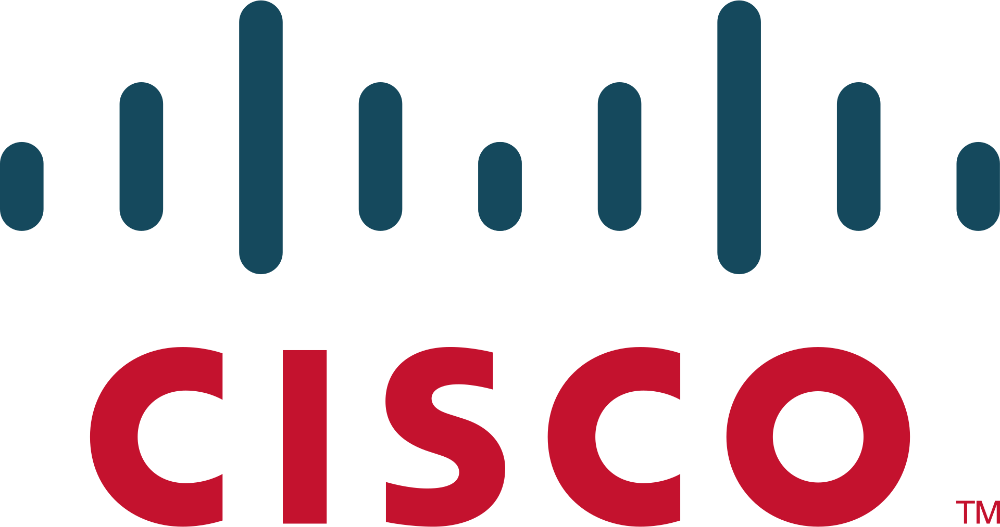
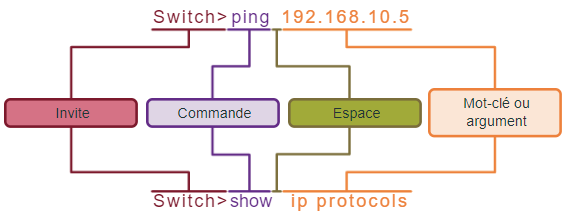

<figure markdown="1">
{width=300}
</figure>

# <span style="color: #3498DB;">Prise en main de Cisco&reg; IOS</span>

Cisco IOS (Internetwork Operating System) est le logiciel interne sur la plupart des routeurs et switchs Cisco Systems.  
Il dispose de fonction de routage (routing), de commutation (switching), d'interconnexion de réseaux (internetworking).  
Il s'agit d'une interface en ligne de commande accessible via Telnet, port série et SSH. Sur certaine machine IOS peut disposer d'une interface web.  

## <span style="color: #F39C12;"><u>Navigation sous IOS</u></span>

### <span style="color: #1ABC9C;">Principaux mode de commande</span>

IOS comporte 2 modes de commande:  

=== "Mode d'exécution utilisateur"
    - Ce mode n'autorise l'accès qu'à un nombre limité de commandes
    - Prompt >
    ```IOS
    Router>
    Switch>
    ```
=== "Mode d'exécution privilégié"
    - Accès a toutes les commandes
    - Prompt #
    ```IOS
    Router#
    Switch#
    ```

### <span style="color: #1ABC9C;">Mode configuration et sous-modes de configuration</span>

IOS comporte 3 modes de configuration:  

=== "Configuration globale"
    - Options de configuration
    ```IOS
    Switch(config)#
    ```
=== "Configuration de ligne"
    - Pour configurer 
        - Console
        - SSH
        - Telnet
        - AUX
    ```IOS
    Switch(config-line)#
    ```
=== "Configuration d'interface"
    - Permet de configurer une interface
        - FastEthernet
        - GigaEthernet
            - La commande `shutdown` va couper un port
            - La commande `no shutdown` allumera le port
    ```IOS
    Switch(config-if)# shutdown     !--- le port sera down
    Switch(config-if)# no shutdown  !--- le port sera up
    ```

### <span style="color: #1ABC9C;">Navigation entre les différents modes</span>

=== "Mode d'exécution privilégié"
    - Utilisateur vers privilégié
    ```IOS
    Switch> enable
    Switch#
    ```
=== "Mode de configuration globale"
    - `Configure Terminal` pour basculer dans le mode
    - `exit` pour en sortir
    ```IOS
    Switch# conf t
    Switch(config)#
    Switch(config)#exit
    Switch#
    ```
=== "Mode de configuration de ligne"
    - `Line <line type> <number line>`
    - `exit` pour sortir du mode de configuration
    ```IOS
    Switch(config)#line console 0
    Switch(config-line)#
    Switch(config-line)#exit
    Switch(config)#
    ```
=== "Sous-modes de configuration"
    - `end` permet de sortir de n'importe quelle mode vers le mode privilégié
    ```IOS
    Switch(config)#line console 0
    Switch(config-line)#
    Switch(config-line)#end
    Switch#```

## <span style="color: #F39C12;"><u>Structures des commandes</u></span>

Les commandes IOS Cisco utilise un format et une syntaxe spécifique, elle ne peuvent être exécutée que dans le mode approprié.  

En général une commande est constituée d'un nom de commande suivi des mots-clés et des arguments appropriés.  
Les commandes ne sont pas sensibles à la casse.  

!!! tip ""
    <figure markdown="1">
    {width=450}  
    La commande fait un appel d'exécution  
    Le mot-clé (ou argument) est une variable
    </figure>

## <span style="color: #F39C12;"><u>L'aide IOS</u></span>

IOS comporte 2 aides :  

- l'aide contextuelle "?"
    - Fournit la liste de commande, des mots-clés et des argumentsdisponibles dans le mode en vigueur.
    - Permet l'affichage d'une liste de commandes disponibles.

```IOS
Switch#cd?
clear clock

Switch#clock set ?
hh:mm:ss Current Time

Switch#clock set 19:50:00 ?
<1-31>  Day of the month
MONTH Month of the year

Switch#clock set 19:50:00 18 August 2023
Switch#
```

- Contrôle de la syntaxe  
    - lorsque qu'une commande est envoyée l'interpréteur analyse la commande de gauche à droite.  
    - En général, l'IOS fournit uniquement des retours négatif
    - S'il ne comprend pas la commande entrée, l'interpréteur affiche les commentaires décrivant le problèmes:
        - Commande ambiguë
        - Commande incomplète
        - Commande incorrecte

```IOS
Switch#c
% Ambiguous command:'c'

Switch#>clock set
% Incomplete command.
Switch#clock set 19:50:00
% Incomplete command.

Switch#clock set 19:50:00 18 8
                            ^
% Invalid input detected at '^' marker
```

## <span style="color: #F39C12;"><u>Configuration de base</u></span>

!!! inline end note ""
    `no` ajouté avant certaines commandes permet la suppression.  
    - `no hostname` supprime le nom
    - `no ip address` supprime l'adresse ip

Concernant les paramétrages les commandes ne seront pas commenter.  
Elles seront référencés par un Titre et les lignes de code suivront directement après.  

### <span style="color: #1ABC9C;">Nommage de l'équipement</span>

````IOS
router(config)#no hostname (hostname)          # supprimer le hostname 
router(config)#hostname (hostname)             # assigner un hostname
````

### <span style="color: #1ABC9C;">Securiser les accès</span>

#### <span style="color: #0C76F5;">Mode exécution utilisateur</span>

````IOS
# Attribuez cisco comme mot de passe de console, puis activez la connexion.

S1(config)# line console 0

S1(config-line)# password cisco

S1(config-line)# login

S1(config-line)# exit
````

#### <span style="color: #0C76F5;">Mode exécution privilégié</span>

```IOS
# Utilisez class comme mot de passe pour le mode d'exécution privilégié chiffré

S1#conf t
S1(config)# enable secret class
S1(config)#exit
S1#
```

#### <span style="color: #0C76F5;">Accès ligne VTY</span>

```IOS
S1#conf t
S1(config)# line vty 0 15   !--- choix des lignes VTY 0 à 15
S1(config)# password cisco  !--- implémentation du mdp cisco
S1(config)# login           !--- définit le mdp pour le login
S1(config)# end
S1#
```

#### <span style="color: #0C76F5;">Chiffrement mot de passe</span>

```IOS
S1# conf t
S1(config)# service password-encryption !--- service permettant le chiffrement des mdp
S1(config)# exit
S1#
```
Possibilité de vérifier avec la commande `show running-config`.  

#### <span style="color: #0C76F5;">MOTD (Message of the day)</span>

La bannière sera affiché lors des tentatives d'accès à l'appareil.  

```IOS
S1# conf t
S1(config)# banner motd "Authorized Access Only!"
```

Cela affichera :  
```IOS
Press RETURN to get started.

Authorized Access Only!

User Access Verification

Password:
```

### <span style="color: #1ABC9C;">Configuration Réseau</span>

#### <span style="color: #0C76F5;">Adresse IP</span>

Vous pouvez attribuer au switch une adresse IP dans les VLAN.  
Si votre switch ne sert pas comme routeur, ce n'est pas indispensable, et permet surtout de faire des tests de connectivité et d'administrer le switch à distance depuis n'importe quel VLAN.  

=== "Switch"
    ```IOS
    S1# conf t
    S1(config)# int vlan1                               !--- Sur un Switch Cisco, ce sont les interfaces VLAN qui portent les IP
    S1(config-if)#ip address 192.168.1.10 255.255.255.0
    S1(config-if)#no shutdown                           !--- Garde le VLAN1 actif
    S1(config-if)#exit
    S1(config)#
    ```
=== "Routeur"
    ```IOS
    S1# conf t
    S1(config)# int g0/0                                !--- Selection de l'interface ou mettre l'IP
    S1(config-if)#ip address 192.168.1.10 255.255.255.0
    S1(config-if)#no shutdown                           !--- Garde l'interface active
    S1(config-if)#exit
    S1(config)#
    ```

#### <span style="color: #0C76F5;">Adresse Passerelle</span>

```IOS
S1#conf t
S1(config)#ip default gateway 192.168.1.1   !--- définit le routeur auquel le switch
S1(config)#exit                                  va ce connecté pour communiquer à
S1#                                              l'extérieur du LAN.
```

#### <span style="color: #0C76F5;">Test Connectivité</span>

```IOS
S1#ping 192.168.1.1
!!!!!
Success rate is 100 percent (5/5), round-trip min/avg/max = 1/1/3 ms

S1#ping 8.8.8.8
!!!!!
Success rate is 100 percent (5/5), round-trip min/avg/max = 6/12/25 ms
```

### <span style="color: #1ABC9C;">Enregistrement de la configuration</span>

- startup-config - Situé dasn la NVRAM. Contient la conf de démarrage
- running-config - Situé dans la RAM. Contient la conf en cours (perdue au redémarrage du périphérique)
- copy running-config startup-config - Copie la conf courante dans la conf de démarrage

```IOS
router(config)#exit
router>copy running-config startup-config   !--- copy run start - également fonctionnelle
router>
```

## <span style="color: #F39C12;"><u>Configuration des ports</u></span>

### <span style="color: #1ABC9C;">Montage/Démontage des ports</span>

=== "shutdown"
    ```IOS
    S1#conf t
    S1(config)#int f0/1
    S1(config-if)#shutdown
    S1(config-if)#
    %LINK-5-CHANGED: Interface FastEthernet0/1, changed state to administratively down
    %LINEPROTO-5-UPDOWN: Line protocol on Interface FastEthernet0/1, changed state to down
    S1(config-if)#ex
    S1(config)#
    ```
=== "no shutdown"
    ```IOS
    S1#conf t
    S1(config)#int f0/1
    S1(config-if)#no shutdown
    S1(config-if)#
    %LINK-5-CHANGED: Interface FastEthernet0/1, changed state to up
    %LINEPROTO-5-UPDOWN: Line protocol on Interface FastEthernet0/1, changed state to up
    S1(config-if)#end
    S1#
    ```

### <span style="color: #1ABC9C;">Suppression configuration d'un port</span>

```IOS
S1(config)#~default int gi1/0/1
Interface GigabitEthernet1/0/48 set to default configuration
S1(config)#end
S1#sh run int gi1/0/1
Building configuration...

Current configuration : 39 bytes
!
interface GigabitEthernet1/0/1
end

S1#
```

### <span style="color: #1ABC9C;">[VLAN](/docs/Reseaux/Switch_VLAN/VLAN.md)</span>

#### <span style="color: #0C76F5;">Création et nommage</span>


=== "VLAN Classique"
    ```IOS
    S1(config)#vlan 10                     !--- creer le VLAN 10
    S1(config-vlan)#name Administration    !--- définit le nom du VLAN 10
    S1(config-vlan)#ex
    S1(config)#vlan 20,30,40               !--- permet la création de plusieurs VLAN
    S1(config-vlan)#ex
    S1(config)#
    S1(config)#no vlan 20                  !--- supprime le VLAN 20
    ```
=== "VLAN Voix"
    ```IOS
    S1(config)# int f0/11
    S1(config-if)# switchport mode access     !--- passage du port en mode access
    S1(config-if)# switchport access vlan 30  !--- vlan 30 assigner au port f0/11
    S1(config-if)# mls qos trust cos          !--- mise en place du [QoS](.)
    S1(config-if)# switchport voice vlan 150  !--- attribue le port au vlan voix
    ```

#### <span style="color: #0C76F5;">Affectation d'un port</span>

```IOS
S1(config)#int fa0/1
S1(config-if)#switchport mode access     !--- passage du port en mode access
S1(config-if)#switchport access vlan 10  !--- affectation du vlan au port
S1(config-if)#

S1(config-if)#no switchport access vlan  !--- supprime le vlan sur le port
S1(config-if)#no switchport mode acc     !--- supprime le mode acc
S1(config-if)#end
S1(config)#
```

### <span style="color: #1ABC9C;">Trunk</span>

#### <span style="color: #0C76F5;">Création et attribution à un port</span>

```IOS
S1(config)#int g1/0/1
S1(config)#switchport trunk encapsulation dot1q                 !--- pas nécessaire sur les modèles 2960
S1(config-if)#switchport mode trunk
S1(config-if)#switchport trunk native vlan 10
S1(config-if)#
```

#### <span style="color: #0C76F5;">Filtrage des VLAN sur un port Trunk</span>

```IOS
S1(coonfig)#int g1/0/1 
S1(config-if)#switchport trunk allowed vlan 10,12,19    !--- autorise les vlans selectionné sur la liaison trunk
S1(config-if)#

S1(config-if)#switchport trunk allowed vlan remove 12   !--- interdit au vlan 3 de passer par le trunk

S1(config-if)#no switchport trunk allowed vlan          !--- supprime la commande de filtrage
```

#### <span style="color: #0C76F5;">Commande `nonegociate`</span>

Le protocole DTP (Dynamic Trunking Protocol) permet à 2 switch connectés de monter un Trunk automatiquement (par exemple la connexion d'un port configuré par défaut en dynamic auto vers un port Trunk).  
Désactiver cette fonctionnalité est, en général, recommandé sur tous les ports access et Trunk.  

```IOS
S1(config)#int range f1/0/1 - 10            !--- selection d'une plage de ports
S1(config-if-range)#switchport nonegotiate  !--- activation de la non négociation auto.

S1#show interfaces fa1/0/2 switchport       !--- verification de la prise en compte sur un port
Name: Fa1/0/2
Switchport: Enabled
Administrative Mode: static access
Operational Mode: down
Administrative Trunking Encapsulation: negotiate
Negotiation of Trunking: Off
Access Mode VLAN: 2 (VLAN0002)
```

### <span style="color: #1ABC9C;">Port-Security</span>

#### <span style="color: #0C76F5;">Activation</span>

```IOS
S1(config)# int fa0/1
S1(config-if)# switchport mode access
S1(config-if)# switchport port-security     !--- active le port-security sur ce port
```

#### <span style="color: #0C76F5;">Apprentissage Statique</span>

```IOS
S1(config-if)# switchport port-security mac-address <xxxx.xxxx.xxx>     !--- <adresse mac>
```
#### <span style="color: #0C76F5;">Apprentissage dynamique</span>

```IOS
S1(config-if)# switchport port-security mac-address sticky      !--- Utilisation du sticky
S1(config-if)# switchport port-security maximum 10              !--- Ce paramètre determine le nob d'adresse maximum pouvant etre prise dynamiquement
```

#### <span style="color: #0C76F5;">Violation</span>

```IOS
S1(config-if)# switchport port-security violation [shutdown | restrict | protect]
```

##### Dépannage du port-security

```IOS
Switch# show port-security                      !--- montre l'état des ports utilisant le "port-security"
Switch# show interfaces status err-disabled     !--- montre les les ports en `err-disable`.
```

Retirer l'equipement non autorisé du port puis faire :  

```IOS
S1(config)# int fax/x
S1(config-if)# shut
S1(config-if)# no shut
```

### <span style="color: #1ABC9C;">Show</span>


