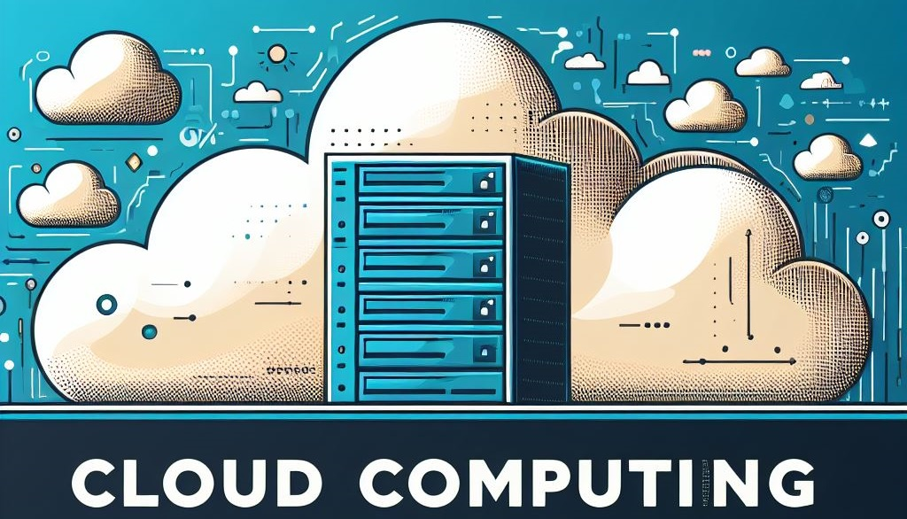
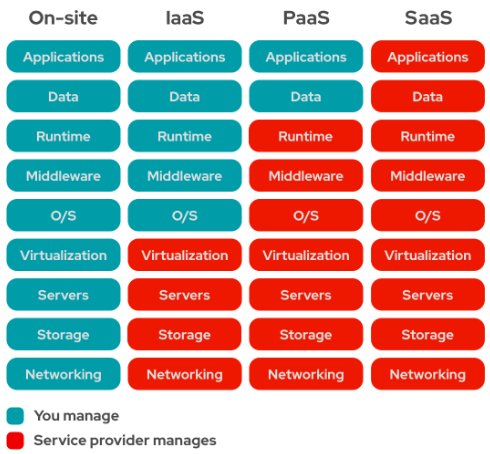
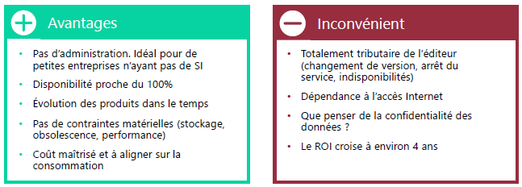
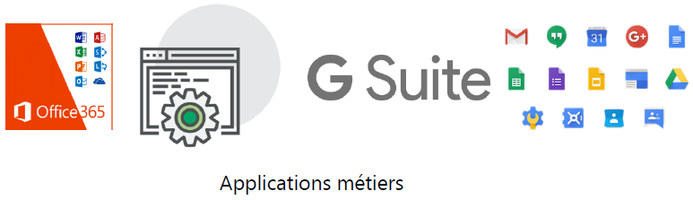
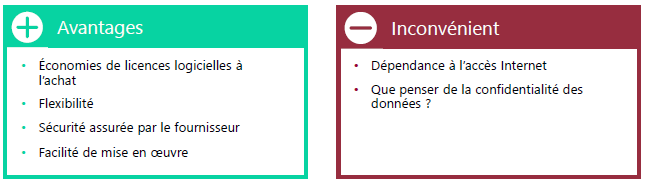
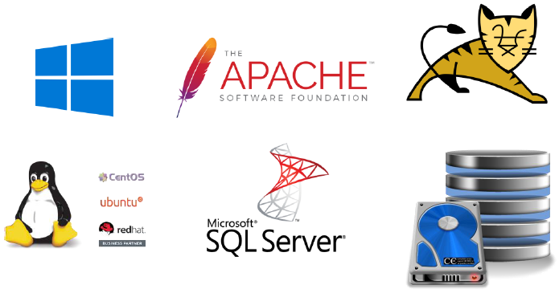
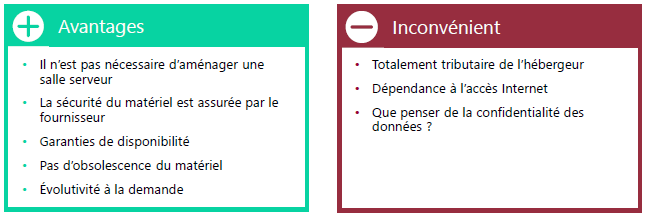
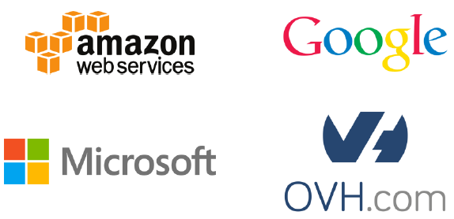
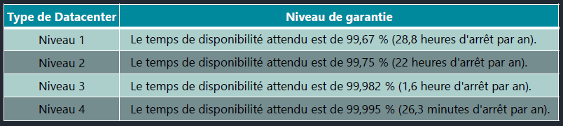

<figure markdown=1>

</figure>

# Cloud

Le "Cloud" vient du symbole utilisé pour désigner le réseau internet dans un schéma d'architecture système ou réseau.  
Il fournit la puissance de calcul (processeurs, RAM, GPU...), du stockage, des logiciels aux infrastructure, machines, logiciel.  
Il ce caractéristique par une grande souplesse, en effet il très facile d'ajouter un composant, une ressource, une VM dans un environnement "cloud"  
Le besoin de l'entreprise et les compétences de l'utilisateur determineront le mode de gestion :  

- Gestion du serveur par l'utilisateur/entreprise  
- Gestion uniquement des services installés  
- Se contenter d'utiliser des applications distantes  

Le cloud apporte de la sécurité d'un point de vue disponibilité des données.  
En effet un data center permet de fournir une garantie de service au niveau :  

- Réseau : En cas de machine défaillante celle-ci seront remplacé, la maintenance sera entièrement gérée par le service d'hébergement;  
- Electricité : Le passage par un data center permet d'accéder à de la redondance énergétique, extremement couteuse si cela était stocké au sein de l'entreprise,  
- Climatisation,  
- Système anti-incendie.  

Le cloud apporte également une meilleure visibilité financière aux entreprises, la facturation des services est dimensionnée en fonction de l'utilisation souhaitée  
La gestion du matériel n'est plus une charge, en effet :  

- L'Obsolescence du matériel n'est plus un souci, celui-ci sera mis régulièrement à jour,  
- L'achats de matériel en fonction des besoins, celui-ci sera pris en charge par l'hébergeur,  
- Gestion des garanties,  
- Accès à du matériel haute performance qui reviendrait vite chère à l'entreprise,  

Cependant le cloud n'as pas que des avantages, en effet avant de passer sur du Cloud Computing il faudra ce poser quelques question de sécurité.  

Ou seront localisé les données ?  
Quelle est le niveau de sécurité du Data Center ? Qui peut y accéder ? Est-ce que les baies et locaux sont sécurisé ?  
Quelles sont les garanties de disponibilité sur les données hébergées ?  
Que se passe-t-il en cas de coupure internet ? A savoir qu'en cas de coupure vos données stocké, ou ayant besoin du cloud, ne seront plus accessible  

## As-A-Service

L'expression "aas" ou "as-a-Service" signifie qu'un tiers se charge de fournir un service de **cloud computing**. Ce mode de fonctionnement permet de ce concentrer sur des aspects plus importants.  
Chaque type de cloud computing allège la gestion de votre infrastructure sur site.  

En effet une infrastructure informatique sur site représente la solution mettant le plus de responsabilité entre les mains des utilisateurs et des techniciens.  

Le Cloud computing permet d'externaliser la gestion d'un, de plusieurs ou de tous les composants d'une infrastructure.  

### SPI - Les différents modèles de Cloud

Il existe 3 principaux types de cloud computing "as-a-Service", permettant un certain degré de gestion.  
Ceux-ci sont repris dans l'acronyme **SPI**  
<figure markdown=1>
{width=400}
</figure>

=== "**SaaS** - **S**oftware **a**s **a** **S**ervice"
    Le **SaaS** permet la mise à disposition d'applications aux utilisateurs finaux  
    L'utilisateur est déchargé de la partie configuration des logiciels ce qui présente des avantages, mais aussi des inconvénients  
    === "Avantages/Inconvénient"
        <figure markdown=1>
        {width=350}
        </figure>
        === "Exemples de **SaaS**"
            <figure markdown=1>
            {width=350}
            </figure>
=== "**PaaS** - **P**latform **a**s **a** **S**ervice"
    Le **PaaS** permet la mise à disposition d'environnements et de plateformes informatiques  
    Il permet de mettre à disposition des OS ou des applications spécifiques sur des infrastructures mutualisées  
    === "Avantages/Inconvénient"
        <figure markdown=1>
        {width=350}
        </figure>
        === "Exemple de **PaaS**"
            <figure markdown=1>
            {width=350}
            </figure>
=== "**IaaS** - **I**nfrastructure **a**s **a** **S**ervice"
    L'**IaaS** permet la mise à disposition d'infrastructures aux administrateurs  
    Les administrateurs n'ont plus besoin de se préoccuper des problématiques liées à l'hébergement interne des serveurs, le matériel est mis à disposition par le fournisseur  
    === "Avantages/Inconvénient"
        <figure markdown=1>
        {width=350}
        </figure>
        === "Exemple d'**IaaS**"
            <figure markdown=1>
            {width=350}
            </figure>

### Types de Cloud

#### Cloud Public

Le matériel (serveurs, stockage) est la propriété du fournisseur de services, en effet généralement les environnements cloud public n'appartiennent pas aux utilisateurs finaux.  
Les principaux fournisseurs de Cloud Public sont :  

- Microsoft Azure  
- Google Cloud  
- Amazon Web Services (AWS)  

L'extensibilité est pratiquement illimitée, celui-ci apporte énormément de fiabilité avec un coûts relativement faibles.  
L'utilisateur final n'aura pas de matériel à maintenir, le fournisseur de service s'en charge  
Il faudra cependant faire attention aux volumes de données qui circulent et aux temps d'allumage des VM  

#### Cloud Privé

Un cloud privé est définis comme un environnement cloud spécifique à un utilisateur final ou à un groupe, ils sont habituellement exécutés derrière le pare-feu de l'utilisateur ou du groupe.  
En effet l'intégration du matériel est généralement dans un datacenter tiers ou interne à l'entreprise  
De ce faite la fiabilité, la sécurité (accrue car le matériel n'est pas mutualisé) et l'extensibilité sont à la charge de l'entreprise  
L'evolutivité est limité sous réserve d'investissements souvent couteux  
Tous les clouds deviennent des clouds privés lorsque l'infrastructure informatique est spécifique à un client unique, avec un accès entièrement isolé.  

##### Cloud Privé Gérés

Cloud créé et utilisé par les clients, il est déployé, configuré et géré par un fournisseur tiers.  
Ils permettent aux entreprises de fournir de meilleurs services et infrastructures de cloud privé, même lorsqu'elles ne disposent pas du personnel informatique qualifié et nécessaire.  

##### Cloud Privé Dédiés

Il s'agit d'un Cloud au sein d'un autre Cloud. Il est possible de déployer un Cloud spécialisé dans un cloud public ou dan un cloud privé.  
Un service de l'entreprise peut disposer de son propre cloud réservé au sein du cloud privé de l'entreprise.  

#### Cloud Hybride

Il s'agit de la combinaison de l'hébergement local ou d'un Cloud privé avec un Cloud public,  
Il permet de gérer les coûts, de maîtriser la sécurité et d'optimiser les performances en prenant le meilleur des différents types de Cloud  
Permet de fiabiliser les services en les "éclatant" sur les différents types de Cloud  
Expansion facile grâce au Cloud public, performance et sécurité grâce au Cloud privé  
Rapport coût/efficacité  

Un cloud hybride peut inclure :  

- Au moins un cloud privé et au moins un cloud public  
- Au moins 2 clouds privés  
- Au moins 2 clouds publics  
- Un environnement nu ou virtuel connecté à au moins un cloud privé ou public  

#### Garantie du Cloud

Les plateformes hébergées dans les datacenter proposent des niveaux de garantie de disponibilité différents :  

<figure markdown=1>

</figure>

#### Hébergement interne ou Cloud ?

Faut-il fdisk -dev