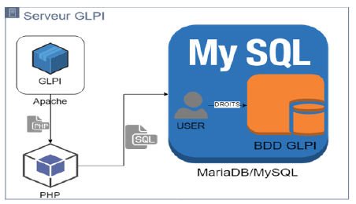

<figure markdown=1>

</figure>

# GLPI

## Présentation de GLPI

GLPI est l'acronyme de **G**estion **L**ibre de **P**arc **I**nformatique porté par la société Teclib'  
GLPI est un logiciel complet pour la gestion de parc et les centres de services, celui-ci est disponible en plusieurs langues et comporte un grand nombre de plugins.  
Il s'agit d'un outil ITSM (IT Service Management) conforme aux bonnes pratiques ITIL, il est adaptable aussi bien au petits comme au grands systèmes d'information  
Celui-ci est sous licence GPL (GNU Public License) 100% libre  
Son installation est possible sur Linux et Windows (bien que mieux optimisé sur Linux)  
Celui-ci est modifiable via de nombreux plugins et est disponible également en plusieurs langues.  

## Les composants de GLPI

### Serveur Web

GLPI nécessite une "LAMP" (Linux, Apache2, MySql, Php) pour fonctionner.  
GLPI est encodé en PHP, permettant une grande portabilité.  
Comme indiqué au dessus son installation nécessite un serveur web (de préférence apache2) mais il également possible de l'installer sur un serveur IIS ou Nginx capable d'interpreter du code PHP  

Pour que GLPI puisse fonctionner correctement le serveur devra comporter des extensions PHP obligatoire/recommandées :  

- <u>php-mysql</u> : Extension pour la gestion de base de données  
- <u>php-mbstring</u> : Permet la gestion des codages de caractères multi-octets  
- <u>php-curl</u> : Permet l'installation de la librairie cURL (Client Url Library)  
- <u>php-gd</u> : Permet d'acceder à la librairie GD  
- <u>php-xml</u> : Permet l'affichage de fichier xml  
- <u>php-ldap</u> : Nécessaire pour coupler glpi avec active directory  
- <u>php-xmlrpc</u> : Echange de procédure distante  
- <u>php-imap</u> : Pour l'utilisation de la messagerie et la création de ticket via les adresses mail  
- <u>php-intl</u> : Module d'internalisation pour PHP  
- <u>php-zip</u> : Module pour les fichiers zip  
- <u>php-bz2</u> : Module pour les fichiers bz2  
- <u>php-apcu-bc</u> : permet l'authentification automatisée  
- <u>php-cas</u> : permet l'authentification automatisée  

## Serveur de base de données

Pour que GLPI fonctionne, celui-ci à besoin de stocker des informations sur une base de données.  
Pour cela il utilise un SGBD (**S**ystème de **G**estion de **B**ase de **D**onnées)  

<figure markdown=1>

</figure>

### Fonctionnement

Composants du serveur GLPI

<figure markdown=1>

</figure>

## Installation GLPI

l'installation complète :  

- Serveur web GLPI  
- Base de donnée Mariadb  
- Client  

est à retrouver en cliquant [ici](./Procédure/installation_glpi.md).  