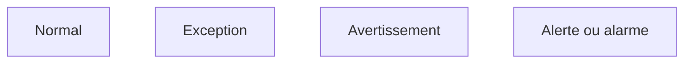

# Livre 4 - Exploitation des services

<u>Objectifs</u>  

Définir le rôle de l'exploitation des services  
Définir le centre de services  
Différencier les types de support  
Identifier les types d'architecture d'un centre de services  
Identifier les processus  

## L'exploitation des services

<u>Objectif</u>  

- Coordonner les activités des processus garantissant l'atteinte des niveaux de service convenus
- Gérer l'exploitation au quotidien

<u>Ses missions</u>  

- Coordonner et réaliser les activités nécessaires à la fourniture des services
  - Exploitation - Supervision - Pilotage - Support - Maintenance
- Etre efficace puis efficient tout au long de la vie des services (coût)
- Produire des indicateurs pour permettre à la phase d'amélioration continue de faire des propositions d'optimisation de la DSI

### Terminologie

<u>Stabilité</u>  

- Le SI fonctionne normalement et est disponible : on ne change plus rien
- Réduction du nombre de changements et donc de **M**ises **E**n **P**roduction au minimum (**MEP**)

<u>Réactivité</u>  

- Réaction aux sollicitations des métiers pour les rendre les plus performantes possibles

<u>Coûts par rapport à qualité</u>  

- Eviter la surqualité, réduire les coûts en gardant le niveau demandé : industrialisation de l'exploitation, supervision et pilotage

<u>Réactivité par rapport à proactivité</u>

- Agir en fonction des évènements ou incidents
- Essayer d'anticiper en recherchant des moyens d'optimiser le SI
- Investir pour garantir un bon fonctionnement

## Les 4 fonctions ITIL v3

## Le centre de service : au coeur de l'exploitation

### Fonction centre de service

<u>Ses missions</u>  

- Le "service Desk"
- Etre point de contact unique pour les utilisateurs
- Porter toute la relation avec les utilisateurs : relation bidirectionnelle
- Servir les utilisateurs et les satisfaires
- Garantir la bonne image de la DSI auprès des utilisateurs
- Etre vitrine du département informatique
- Répondre aux questions et demandes des utilisateurs
- Restaurer le service dans un état normal, standard le plus rapidement possible dans le respect des délais définis et contractuels
- Assurer les activités de N1, gérer les escalades aux groupes supérieurs et coordonner

<u>Les concepts</u>  

- Le centre d'appels (Call Center)
- Le centre d'assistance (Help Desk)
- Le centre de services (Service Center)

### Centre d'appels

- Prendre des appels
- PAsser des appels en masse
- Un standard téléphonique est en place
  - On l'appelle / Il nous rappelle
  - On s'identifie (nom, numéro de contrat, etc.)
  - On explique les raisons de l'appel
  - La réponse du centre d'appel est souvent: "On vous rappellera", "Un technicien vous rappellera"
  - Très peu de valeur ajoutée, réponse minimale pour l'appelant
  - Il est le niveau 0
  - Gère très peu d'actions, amène une forte frustration des utilisateurs
  - Transfert le ticket d'appel

### Centre d'assistance

- Gère les pannes et les dysfonctionnements remontés par les utilisateurs
- Gère et coordonne toutes les activités liées au dépannage de l'utilisateur
- Donne des informations sur l'avancement du dépannage si l'utilisateur le demande
- Est dans des actions de type réactif
- Attend que l'utilisateur appelle pour le renseigner
- Le centre d'assistance
  - Est là en support des utilisateurs qui appellent
  - Répond aux sollicitations des utilisateurs
  - A peu ou pas d'actions proactives vers les utilisateurs

### Centre de service

- Est un surensemble du centre d'assistance en ajoutant des activités de proactivité
- Intervient dans tous les processus de l'exploitation des services
- Et dans une partie des activités de deux processus de la transition des services
  - La gestion des changements
  - La gestion des déploiements et des mises en production
- Ses activités
  - La prise en compte de l'appel de l'utilisateur 
  - Ouverture du ticket d'appel dans l'outil de gestion du centre de services
  - Enregistrement des informations liées à l'appel de l'utilisateur
  - La catégorisation
  - La codification
  - L'investigation et le diagnostic
  - La réponse dépendra de la demande utilisateur
  - Escalade vers les groupes support de niveau 2 et de niveau 3 si nécessaire
  - La suivi de l'appel
  - La résolution / clôture du ticket
  - La gestion des enquêtes de satisfaction des utilisateurs
  - La mise à jour de la base de connaissance

#### Centre de service local

Implanté sur le même site que les utilisateurs  
Architecture souvent représentée par un guichet, un bureau où les utilisateurs peuvent venir  
Implémente des environnements très spécialisés avec des besoins spécifiques  

#### Centre de service centralisé

Implanté sur un site unique  
Externalisé  
Contacté par des canaux de télécommunication (téléphone, e-mail, intranet)  

#### Centre service virtuel

Mettre le demandeur en relation avec le technicien possédant le meilleur profil  
En fonction de :
- L'heure
- Du pays ou du site d'appel
- Du profil de l'utilisateur appelant
- Du métier du demandeur

#### Centre service qui suit le soleil

Couvre une problématique particulière  
Fonctionne 24h/24  
Réparti dans plusieurs entités aux quatre coins du monde dans des faisceaux horaires différents  
A toute heure du jour ou de la nuit, l'appel est aiguillé vers un centre ou une équipe de jour présente  
Choix des moyens et des outils  
Avoir des procédures et des escalades communes et partagées  
Avoir une langue commune (souvent l'anglais)  

### Les Outils du centre de service

L'autocommutateur téléphonique intelligent  
Serveur Vocal Interactif  
Couplage téléphonique informatique  
Logiciel de relation utilisateur (CRM)  
Intégration avec les autres outils  

- Le CMS
- La base des erreurs connues (KEDB)
- La gestion documentaire de l'entreprise (SKMS)
- Les outils de gestion de services

Centre de services dit en libre-service (utilisateurs autonomes)

## Les processus de l'exploitation des services

- L'exécution des requêtes
  - Traiter les demandes de services provenant des utilisateurs
- La gestion des accès
  - Traiter les requêtes relatives à l'accès, aux droits et aux privilèges des utilisateurs
- La gestion des incidents
  - Restauration au plus vite du service dégradé ou arrêté dans les délais impartis
- La gestion des problèmes
  - Rechercher les causes et solutions à des incidents récurrents
- La gestion des évènements
  - Interpréter et gérer tous les faits détectables qui arrivent sur l'infrastructure, qu'ils soient normaux ou anormaux

### L'exécution des requêtes

<u>Objectifs</u>  

Fournir un canal privilégié vers la DSI aux utilisateurs pour émettre et traiter leurs demandes  
Fournir de l'assistance auprès des utilisateurs sur l'utilisation des services  
Approvisionner des composants standards des services suivant les demandes des utilisateurs  
Fournir un canal pour faire remonter les plaintes des utilisateurs vers la DSI  

<u>Une requête : demande de service provenant d'un utilisateur</u>  

Assistance  
Conseil  
Information  
Changement standard simple  

<u>Une requête va réaliser une action</u>  

Limitée dans le temps  
A faible risque et coût  
Traitée par une seule personne  

<u>Le catalogue des requêtes</u>  

Base du fonctionnement de ce processus  
Liste précise et détaillée des demandes de services provenant des utilisateurs  
Identifie précisément quel profil d'utilisateur a le droit de demander telle requête  
Diffusion et promotion de ce catalogue auprès de tous les utilisateurs sont un enjeu majeur  

### La gestion des accès

<u>Objectifs</u>  

Mettre en place les procédures définies par :  

- La politique de sécurité de la DSI
- Les recommandations de la gestion de la disponibilité
- Les procédures doivent aussi être connues et diffusées auprès de tous

Fournir aux utilisateurs les droits et privilèges d'un service ou d'un groupe de services  

<u>Les droits</u>  

Ensemble des règles qui vont définir les types d'accès à un service ou un groupe de services  

<u>L'identité</u>  

Gestion d'une installation fiable des utilisateurs qui vont accéder à ce service  

<u>L'accès au service</u>  

Est le niveau, le périmètre de fonctionnalités ou de données auquel un utilisateur peut avoir accès  
Notions de confidentialité, gestion des mots de passe et règles associées (initialisation, validation et revalidation)  

<u>L'identité des groupes</u>  

Cartographie des groupes de l'entreprise nécessaire  
Notions de groupe de services offerts à un utilisateur ou groupe d'utilisateurs  
Cartographie des services mettant en avant les familles de services en fonction des droits  

## La gestion des incidents

<u>Objectifs</u>  

- Rétablir le service dans un état normal le plus rapidement possible conformément au **SLA**
- Rétablir c'est trouver une solution, un palliatif, qui va relancer le service dans son état normal
- Minimiser l'impact de l'incident sur les utilisateurs (les conséquences pour l'utilisateur)
- Rétablir le service dans les délais contractuels (engagement auprès du client)
- Ce processus ne s'occupe pas de trouver la cause de l'incident

<u>Définition d'un incident</u>  

- Ne pas confondre **incident**, **évènement** et **problème**
- Un évènement est un fait détectable qui arrive du SI alors que l'incident est un évènement qui altère ou dégrade le service rendu
- Il survient lorsque le service est arrêté ou quand la qualité du service est diminuée
- L'incident a pour origine un évènement (détecté ou non), mais tous les évènements ne créent pas d'incident
- Il est détecté soit par un utilisateur, des outils de supervision ou de pilotage par la gestion des évènements

!!! warning "Codifier un incident"
    C'est déterminer la priorité que l'on va lui attribuer  
    Pour cela:  
          - Identifier l'impact de l'incident  
          - Identifier l'urgence de l'incident  
          - Utilisation d'une matrice ou d'un référentiel applicatif  
    Détermination du délai de rétablissement  

!!! danger ""
    Toutes ces notions devront être notées dans les SLA pour chaque service et négociées avec les clients avant la mise en exploitation du service.

L'impact : effet de l'incident sur l'utilisation d'un service  

- Perte d'exploitation:
  - Nombre d'utilisateurs bloqués
  - Non-respect des dispositions légales
- Positionné sur une échelle de 1 à 3 ou de 1 à 5 (1 élevé, 3 ou 5 faible)

L'urgence : temps dont dispose la DSI pour rétablir le service  

- Positionnée sur une échelle de 1 à 3 ou de 1 à 5

### L'incident majeur

- Fort impact sur les clients
- Hors grille de codification
- D'une priorité très élevée
- Traité différemment des autres incidents
- Utilisation d'une procédure dite de "crise"

<u>Les escalades</u>  

<u>Concepts</u>

- Période de fourniture des services : définir un calendrier d'utilisation des services
- Arbre de résolution
  - Modèle d'incident - Branche de l'arbre la plus souvent parcourue
  - Listing de dépannage - Check-list
- Base de connaissance : liste des incidents connus et leurs solutions
- Incident majeur : gravité importante pour les clients
- Crises : incident majeur à résoudre tout de suite. Peut donner suite à un Post-Mortem

## Gestion des problèmes

<u>Objectifs</u>  

- Faire diminuer le nombre d'incidents  
- Prévenir l'apparition de nouveaux incidents et problèmes  
- Minimiser l'impact des incidents  
- Optimiser l'efficacité des équipes supports  
- Contrôler les problèmes : les transformer en erreurs connues  
- Gérer les erreurs  
- La proactivité:
  - Participe à maintenir le niveau de qualité de service demandé
  - Prend l'iniative de la recherche de situations qui dégradent ce niveau

<u>Un problème</u>  

Situation dont on recherche la cause inconnue d'un ou plusieurs incidents  
La gestion des incidents traite en temps réel les situations (front line)  
La gestion des problèmes traite les causes de ces situations (back office)  
Tous les incidents ne déclenchent pas de problèmes  
On ouvre un problème dans le cas d'incidents récurrents ou dans un contexte d'incident majeur  

<u>Une erreur connue</u>  

Problème dont on connait la cause et dont on a identifié une solution temporaire ou définitive  
La base des erreurs connues (KEBD) contient l'ensemble de ces problèmes transformés en erreurs connues  
Base mise à disposition du centre de services sous la responsabilité des groupes support  

## Gestion évènements

<u>Objectifs</u>  

- Minimiser le nombre d'incidents  
- Objectif principal:
  - Plus d'efficacité dans la gestion des évènements entraîne moins d'incidents
  - Surveiller les évènements et les comprendre
  - Positionner des seuils et des alarmes
- Garantir le niveau de qualité de service
  - Anticiper les situations pouvant détériorer le niveau de qualité de service
  - Avoir une action proactive sur la gestion des évènements pour maintenir et garantir le niveau de qualité de service
  - Positionner des seuils sur les composants clés

<u>Définition d'un évènement</u>  

Fait détectable arrivant sur le système d'information ou sur la fourniture d'un service  
Changement d'état d'un ou plusieurs composants de l'infrastructure  
Aléatoire, observable et mesurable  
Des outils sont nécessaires pour le détecter et le mesurer  
Sans outillage, pas d'évènements  

<u>4 types d'évènements</u>  

???+ note "Type Evènements"
    === "Normal"
        Indique un fonctionnement normal dans la Baseline.  
    === "Exception"
        Evènement anormal survenu sur l'infrastructure  
        Peut-être visible par les utilisateurs sans dégrader le niveau de qualité de service offert  
        Peut se transformer en incident si la situation impacte le niveau de qualité de service  
    === "Avertissement"
        Evènement inhabituel, un avertissement (Approche d'un seuil critique, un pic d'activité)  
    === "Alerte (Alarme)"
        Exception nécessitant une intervention  
        Prédéfini en avance avec positionnement d'un seuil  
        Des consignes préétablies vont permettre d'intervenir  
        Un travail préliminaire sur l'identification des seuils est nécessaire  

