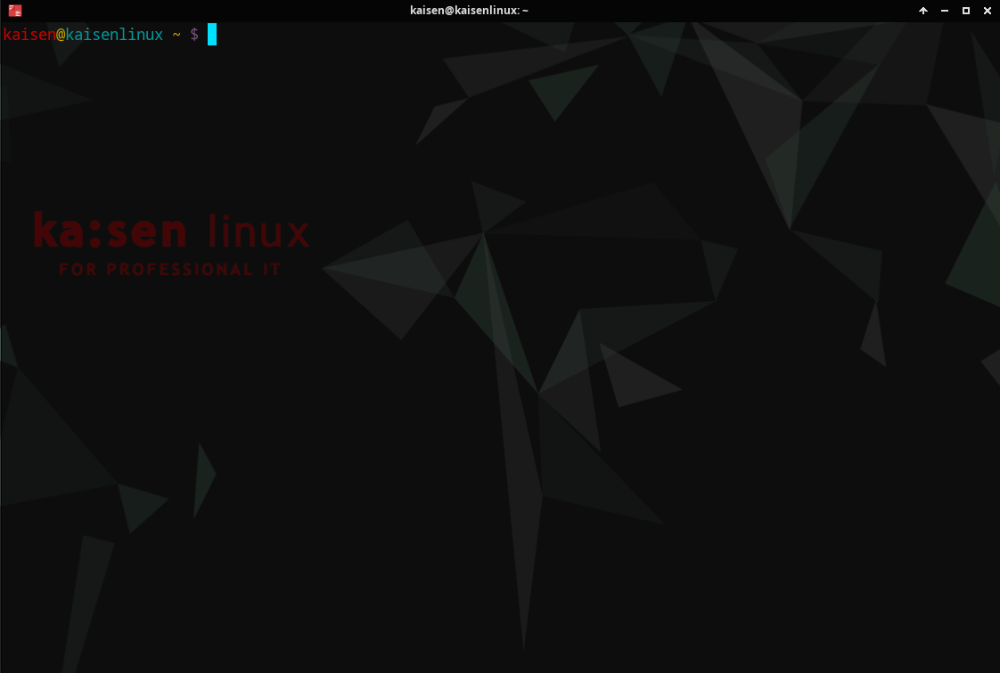
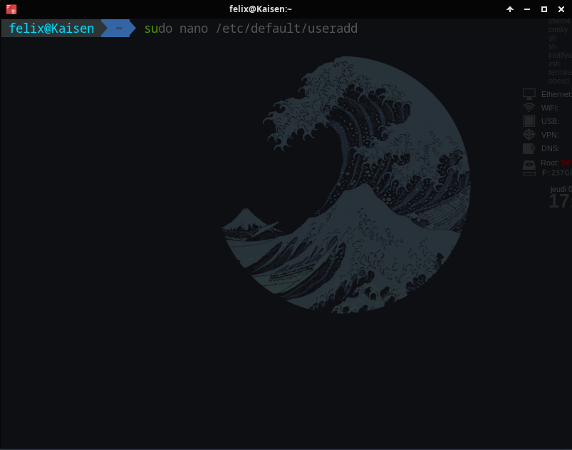

# Modification du terminal Kaisen en Terminal Kali

Cette fiche permet d'activer l'autosuggestion ainsi que la coloration syntaxique kali sur un terminal kaisen  

## Utilisez ZSH pour un simple utilisateur

Le terminal par défaut de Kaisen Linux est Bash.  
Bash convient à la majorité des utilisateurs et c'est pour cette raison qu'il est devenu le terminal par défaut depuis Kaisen 2.1.  
Vous n'êtes qu'un utilisateur et vous n'avez qu'un seul compte installé, utilisez la commande suivante ( comme utilisateur et non comme root ):  

```bash
chsh -s /bin/zsh
```
la prochaine fois que vous vous reconnecterez à votre session, ZSH sera activé.  

## Utilisez ZSH pour plusieurs utilisateurs

### `useradd`

A l'ajout d'un utilisateur la commande `useradd` permettra de lui donner le shell zsh par défaut :  

```bash
sudo useradd -s /bin/zsh [user]
```

#### Modifier la configuration de l'utilisateur ajouté

Dans le fichier `/etc/default/useradd` modifiez la ligne suivante :  

```bash
SHELL=/bin/bash
```
en
```bash
SHELL=/bin/zsh
```
Après cela, avec la commande `useradd`, le shell bash sera défini par défaut et l'option `-s` n'aura plus besoin d'être spécifié.  

### `adduser`

A l'ajout d'un utilisateur, via la commande `adduser`, la commande suivante permettra de lui donner le shell par défaut :  

```bash
sudo adduser --shell /bin/zsh [user]
```

#### Modifier la configuration de l'utilisateur ajouté
```bash
DSHELL=/bin/bash
```
en
```bash
DSHELL=/bin/zsh
```
Après cela, avec la commande `adduser`, le shell bash sera défini par défaut et l'option `-s` n'aura plus besoin d'être spécifié.  

## Activation de l'autosuggestion et de la coloration syntaxique KALI

!!! note "Afin de passer de ce style de terminal :"
    === "Terminal Kaisen Basique"
        <figure markdown=1>
        {width=400}
        </figure>
    === "Terminal style KALI"
        <figure markdown=1>
        {width=400}
        </figure>

Nous devons dans un premier temps récuperer les plugins sur des dépot github.  
Pour cela :  

```bash
wget https://github.com/robbyrussell/oh-my-zsh/raw/master/tools/install.sh -O - | zsh
cp ~/.oh-my-zsh/templates/zshrc.zsh-template ~/.zshrc
source ~/.zshrc     # Permet de relancer le shell
git clone https://github.com/zsh-users/zsh-autosuggestions ${ZSH_CUSTOM:-~/.oh-my-zsh/custom}/plugins/zsh-autosuggestions
git clone https://github.com/zsh-users/zsh-syntax-highlighting.git ${ZSH_CUSTOM:-~/.oh-my-zsh/custom}/plugins/zsh-syntax-highlighting
```
Ensuite il faut activer les 2 plugins dans le fichier `.zshrc`  
Pour cela il faut ouvrir le fichier `$ ~/.zshrc` et modifier la ligne :  

!!! note "plugins"
    === "Fichier de base"
    ```bash
    plugins=(git)
    ```
    === "Fichier modifié"
    ```bash
    plugins=(git
    zsh-autosuggestions
    zsh-syntax-highlighting
    )
    ```
puis lancer la commande :  
```bash
source ~/.zshrc
```