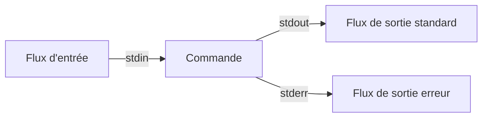
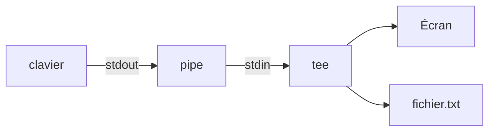

# Mécanisme Linux et Bash Avancé

## Gestion du système

Cette note fait référence aux séquences de démarrage reprises dans la page [Gestion Debian](./Gestion_debian.md)

`systemctl <action> [cible/service/unit]`  

Il s’agit de ^^**la**^^ commande par laquelle nous pourrons, entre autres :  

- afficher la cible par défaut
- changer de cible par défaut
- changer de cible directement
- gérer les services
- lister les cibles, services, et autres éléments de SystemD

### Connaitre la cible par défaut

Permets de connaitre la cible par défaut lancé au démarrage de l’OS

```bash
root@deb:~# systemctl get-default
graphical.target
```

### Changer la cible par défaut

```bash
root@deb:~# systemctl set-default multi-user.target
Removed /etc/systemd/system/default.target
Created symlink /etc/systemd/system/default.target -> /lib/systemd/system/multi-user.target
```

### Changer de cible

Dans l’exemple suivant, cette commande permettra de passer en mode maintenance

```bash
root@deb:~# systemctl ìsolate rescue.target
```

### Lister les éléments

```bash
root@deb:~# systemctl list-units
...
networking.service      loaded active exited    Raise network interfaces
rsyslog.service         loaded active running   System Logging Service
...
multi-user.target       loaded active active    Multi-User System
network.target          loaded active active    Network
```

### Lister tous les units

```bash
root@deb:~# systemctl list-units --all
getty-pre.target        loaded    inactive  dead    Login Prompts (Pre)
getty.target            loaded    active    active  Login Prompts
graphical.target        loaded    inactive  dead    Graphical Interface
local-fs-pre.target     loaded    active    active  Local File Systems (Pre)
```

`--all` permets de lister l’intégralité des services de la machine, qu’ils soient actifs ou non  

## Gestion des services

Le plus souvent, nous allons gérer des services, cela est également réalisable avec la commande `systemctl`

### Voir le statut d’un service

```bash
root@deb:~# systemctl status cron.service
    cron.service - Regular background program daemon
...
```

### Démarrer un service

<!--recopie code p20 support cours Module 3 -->

### Arrêter un service

<!--recopie code p21 support cours Module 3 -->

### Redémarrer un service

<!-- recopie code p21 support cours Module 3 -->

### Activer et désactiver un service

À noter les commandes, `enable/disable`ne joue pas sur l’état actuel de la machine et des services.  
Cela n’affectera les services qu’au prochain démarrage de la machine.  

<!-- recopie code p22 support cours Module 3-->

## Gestion des processus

Un processus est l’image d’un fichier programme en cours d’exécution, identifié par un **PID** Unique dans la mémoire vive de notre OS.  
Un utilisateur peut lancer plusieurs processus simultanément.  
Un processus peut également créer d’autres processus, formant une hiérarchie (Notions de processus parents & enfants)  

### Lister les processus

#### Commande `ps`

`ps [-a -e -f -u -x]`

```Bash
user30@deb:~$ ps
    PID TTY             TIME  CMD
    808 pts/0       00:00:00  bash
    1212 pts/0       00:00:00  ps
user30@deb:~$
```

??? tip "Explication des Colonnes"
    === "PID"
        Process ID: Identifiant unique d'un processus
    === "TTY"
        Nom du terminal auquel le processus est rattaché
    === "TIME"
        Temps cumulé d'éxécution
    === "COMMAND"
        Commande à l'origine du processus

??? example "lister tous les processus en cours"
    === "Commande"
        ```bash
        user30@deb:~$ ps -ef
        UID         PID    PPID  C  STIME  TTY          TIME    CMD
        `[...]`
        systemd+    504       1  0  08:57  ?        00:00:00    /lib/systemd/systemd-timesyncd
        message+    510       1  0  08:57  ?        00:00:00    /usr/bin/dbus-daemon --system
        root        512       1  0  08:57  ?        00:00:00    /lib/systemd/systemd-logind
        root        513       1  0  08:57  ?        00:00:00    /usr/sbin/rsyslogd -n -iNONE
        root        591       1  0  08:57  ?        00:00:00    /usr/sbin/sshd -D
        user30      798       1  0  15:08  ?        00:00:00    /lib/systemd/systemd --user
        user30      799     798  0  15:08  ?        00:00:00    (sd-pam)
        user30      807     795  0  15:08  ?        00:00:00    sshd: user30@pts/0
        user30      808     807  0  15:08  pts/0    00:00:00    -bash
        ```
    === "Option -f"
    Ajoute les colonnes  
    - UID = Identifiant Unique de l'utilisateur  
    - PPID = Processus Parents  
    - STIME = Information sur l'heure de lancement du processus
    === "Option -e"
    Affiche les processus de tous les utilisateurs

??? example "lister sous forme d’arbre"
    === "Processus de l'utilisateur"
        ```bash
        user30@deb:~$ ps -uf
        USER        PID  %CPU  %MEM    VSZ   RSS  TTY       STAT   START    TIME  COMMAND
        user30      808   0.0   0.2   7652  4424  pts/0     Ss     15:08    0:00  -bash
        user30     1309   0.0   0.1  10916  3204  pts/0     R+     16:10    0:00   \_ps -uf
        ```
    === "Processus de tous les utilisateurs"
        ```bash
        user30@deb:~$ ps -faux
        USER        PID  %CPU  %MEM    VSZ   RSS  TTY       STAT   START    TIME  COMMAND
        `[...]`
        root        591  0.0    0.3  15852  6676  ?         Ss     08:57    0:00  /usr/sbin/sshd -D
        root        795  0.0    0.3  16632  7892  ?         Ss     15:08    0:00   \_ sshd: user30 `[priv]`
        user30      807  0.0    0.2  16916  6016  ?         S      15:08    0:00      \_sshd: user30@pts/0
        user30      808  0.0    0.2   7652  4424  pts/0     Ss     15:08    0:00        \_ -bash
        user30     1348  0.0    0.1  11076  3620  pts/0     R+     16:17    0:00            \_ ps -faux
        ```

#### Commande `lsof`

Permets de dénombrer les fichiers en cours d'utilisation par des processus.  
Possibilité de filtrer les résultats avec la commande `grep`

??? Example "Utilisation `lsof`"
    === "syntaxe de base"
        ```bash
        root@deb:~# lsof |grep /var
        ```
    === "Connaitre l'activité des fichiers ouverts dans un répertoire donné"
        ```bash
        root@deb lsof /root
        lsof: WARNING: can't stat() fuse.gvfsd-fuse file system /run/user/1000/gvfs
              Output information may be incomplete.
        COMMAND  PID  USER FD  TYPE DEVICE SIZE/OFF NODE    NAME
        bash     2074 root cwd DIR  254,0  4096     781836  /root
        bash     2179 root cwd DIR  254,0  4096     781836  /root
        lsof     3826 root cwd DIR  254,0  4096     781836  /root
        lsof     3827 root cwd DIR  254,0  4096     781836  /root
        ```

### Stopper des processus

#### Commande `kill`

`kill [-sig] <pid> (<pid> <pid>)`  

Permets d’arrêter (tuer) un processus en précisant le type d’arrêt  
Sans précision, le signal envoyé est 15, ou `SIGTERM`  

|   Nom   | ID Num | Effet                                                                                                                     |
| :-----: | :----: | ------------------------------------------------------------------------------------------------------------------------- |
| SIGTERM |   15   | Envoi d’une instruction au processus pour qu’il se termine proprement. C’est la valeur par défaut et celle à privilégier. |
| SIGINT  |   2    | Envoi d’un signal d’interruption (équivalent de `[ctrl+c]` dans un terminal)                                                |
| SIGHUP  |   1    | Envoi d’un signal d’arrêt de session terminal (HangUp)                                                                    |
| SIGKILL |   9    | Arrêt inconditionnel. Tuer directement le processus (dangereux)                                                           |

??? example "Stopper des processus"
    === "Sans SIG spécifique"
        ```bash
        user30@deb:~$ ps -f
        UID         PID     PPID   C  STIME  TTY         TIME  CMD
        user30      745      744   0  15:31  pts/0   00:00:00  -bash
        user30      749      745   0  15:32  pts/0   00:00:00  sleep 600
        user30@deb:~$ kill 749
        user30@deb:~$ ps -f
        user30      745      744   0  15:31  pts/0   00:00:00  -bash
        ```
    === "Avec SIGINT"
        ```bash
        user30@deb:~$ ps -f
        UID         PID     PPID    C   STIME   TTY     TIME      CMD
        user30      634      633    0   10:13   pts/0   00:00:00  -bash
        user30      954      634    0   15:16   pts/0   00:00:00  /bin/bash ./erp-install.sh
        user30@deb:~$ kill -2 954
        ```

#### Commande `pkill`

`pkill [-sig] <processname>`

Permets d’arrêter les processus correspondant au nom `<processname>`  

!!! example "Example `pkill`"
    ```bash
    user30@deb:~$ pkill firefox
    ```
    Dans l'exemple cette commande stop le processus **firefox**

### Connaitre le temps d’exécution d’une commande

`time <commande>`

Visualiser le temps d’exécution d’une commande.

!!! example ""
    ```bash
    user30@deb:~$ time wc -l Edition
    31 Edition
    real    0m0,007s
    user    0m0,002s
    sys     0m0,000s
    ```

### processus en arrière-plan

Lancer une commande en arrière-plan se fait simplement en ajoutant le caractère `&`à la fin de la ligne.  
    `commande [opt] <arg> &`  

Visualiser les processus en arrière-plan  
    `jobs [-l]`  

`-l` Afficher les PID des processus.  

!!! example "lancement processus arrière plan"
    ```bash
    user3030@deb:~$ ./sauvegarde.sh &
    `[1]` 841
    user30@deb:~$ ./erp-install.sh &
    `[2]` 843
    user30@deb:~$ sleep 300 &
    `[3]` 845
    user30@deb:~$ jobs
    `[1]`     En cours d'exécution    ./sauvegarde.sh &
    `[2]`-    En cours d'exécution    ./erp-install.sh &
    `[3]`-    En cours d'exécution    sleep 300 &
    ```

Certains processus demandent énormément de ressources (temps ou matériel) et nécessitent d’être lancé en arrière-plan.  
Malheureusement, il peut arriver d’oublier de placer le `&`le processus se lancera donc en front ground.  
Dans ce cas, l’exécution de la séquence de touche `[ctrl+z]` basculera le processus en arrière plan, par contre, celui-ci sera mis en *pause*.  
Pour relancer l’exécution il faudra exécuter la commande `bg`pour (background) + le n° de `jobs`et non le n° de **PID**  

!!! Example "Oublie de lancement de processus en arrière plan"
    === "commande"
        ```bash
        user30@deb:~$ ./erp-install.sh # oubli de `&` permettant le lancement en arrière plan
        Installation de l'ERP
        `[ctrl+z]`
        `[1]`+ **Stoppé**             ./erp-install.sh
        user30@deb:~$ bg 1 # met en pause l'exécution du processus et le passe en background
        `[1]`+ ./erp-install.sh & # présence du `&` stipulant le passage en arrière plan
        user30@deb:~$ jobs
        `[1]` **En cours d'exécution**    ./erp-install.sh &
        user30@deb:~$ fg 1
        ./erp-install.sh
        l'ERP a été installé
        `[1]`+ **Fini**
        user30@deb:~$
        ```
    === `ctrl+z`
        Permet de mettre en pause l'exécution du processus
    === "`bg + n°_de_jobs`
        Permet de passer l'exécution du processus en arrière-plan
    === "`fg + n°_de_jobs`
        Permet de passer l'exécution du processus en avant-plan

### Commande `nohup`

Permet de détacher le processus/script du terminal l’ayant lancé et ainsi d’éviter la coupure, a la fermeture du dit terminal, a la fermeture (ou timeout) de la session PUttY.  

En effet à la fin d’une session ou à la déconnexion tous les processus ouverts avec un terminal reçoivent le signal `SIGHUP`  

!!! example ""
    ```bash
    user30@deb~$ nohup ./erp-install.sh &
    `[1]` 867
    user30@deb:~$ nohup: les entrées sont ignorées et la sortie est ajoutée à 'nohup.out'
    user30@deb:~$
    ```

!!! warning ""
    A noter que les flux `stdout` et `stderr` seront copié dans un fichier **nohup.out**  
    Celui-devrai être supprimé apres l'exécution de la commande

## Mécanisme de redirection



### Le Pipe `|`

L’utilisation du `|`vas permettre de rediriger le flux de la première commande vers le flux d’entrée de la deuxième commande.  

`Commande1 | Commande 2`


### Le chevron `>`

Le caractère `>`ou `>>`permet d’enregistrer la sortie standard dans un fichier  

!!! tip "À noter"
    Si le fichier n'est pas existant il sera crée au moment de la rédirection

`commande>fichier.txt` Écrase le contenu du fichier si celui-ci est déjà existant  

`commande>>fichier.txt` Ajoute le contenu au fichier déjà existant  


### Rediriger un flux d’erreur

#### Vers un fichier

L’ajout du chiffre `2`à la fin de la commande couplé aux caractères `>`ou `>>`permet d’enregistrer la sortie d’erreur dans un fichier  

!!! tip "À noter"
    Si le fichier n'est pas existant il sera crée au moment de la rédirection

`commande 2>fichier.txt` Écrase le contenu du fichier si celui-ci est déjà existant  

`commande 2>>fichier.txt` Ajoute le contenu au fichier déjà existant  


#### Vers le flux de sortie standard

En reprenant les éléments précédents de redirection du flux d’erreur, il est possible de le renvoyer vers la sortie standard via`2>&1`, utile pour un fichier de journalisation ou nous souhaiterions faire apparaitre l’intégralité des actions  

`commande 2>&1`  

??? example "Redirection des sorties 1 & 2 vers le fichier "result.log""
    ```bash
    user30@deb:~$ head -3 Edition dir1/fic2 >> result.log 2>&1
    user30@deb:~$ cat result.log
    ==>Edition<==
    Aboaf Maurice 244748
    Adda Jen 239234
    Allo Jean-Pierre 255398
    head: impossible d'ouvrir 'dir1/fic2` en lecture: Aucun fichier ou dossier de ce type
    ```

!!! tip "`&>`"
    Specifique au bash la syntaxe `commande &>` permet la même action

### Doubler la redirection

Permet d'afficher la sortie standard à l'écran et de la rediriger dans un fichier en même temps afin de l'avoir en sauvegarde pour pouvoir l'exploiter  

`commande | tee [-a] fichier. txt`

- `tee` sans option écrasera le fichier deja existant (équivalent a `>`)
- `[] -a]` permet d'écrire à la suite d'un fichier déja existant (équivalent a `>>`)



### Rediriger un fichier vers le flux d’entrée

Permets de rediriger le contenu d’un fichier vers une commande  

`Commande < fichiersource.txt`

!!! example "Utilisation du `<`"
    === "Diffusion de message"
        ```bash
        user30@deb:~$ wall < modeles/warning.txt
        Diffusion de message de user30@deb (pts/0) (Tue Sep 8 16:11:45 2020) :
        /!\ Attention /!\
        Redemarrage du serveur
        dans dix minutes
        user30@deb:~$
        ```
    === "Remplacement des minuscules par des majuscules"
        ```bash
        user30@deb:~$ cat fichier.txt
        bonjour,
        ceci est un message générique de test
        user30@deb:~$ tr a-z A-Z < fichier.txt
        BONJOUR,
        CECI EST UN MESSAGE GéNéRIQUE DE TEST
        ```

## Archivage et compression

!!! tip inline end ""
    Archive ne veut pas dire obligatoirement compression  
    Un fichier iso est une archive et elle n'est pas compressé

- Archiver : créer un fichier conteneur dans lequel on pourra en plusieurs autres.
- Compresser: réduire la taille d'un fichier dans le but de minimiser l'espace de stockage occupé ainsi que de réduire les temps de transfert.
  - Ex: un fichier zip ou rar

### Commande `tar`

La commande `tar`: une commande pour tout faire !  

`tar [-c -t -x -z -j -v -f] archive. tar`

!!! note inline end ""
    === "bzip2"
        Format de compression disponible sous Linux  
        Plus efficace en terme de compression que Gzip  
        Demande plus de ressource.
    === "tgz"
        Il s'agit d'une version  
        raccourcie de `tar.gz`

| option | description                                          |
| :----: | ---------------------------------------------------- |
|  `c`   | Créer une archive                                    |
|  `t`   | Lister le contenu                                    |
|  `x`   | Extraire le contenu                                  |
|  `z`   | Préciser l'utilisation de la compression avec `gzip` |
|  `j`   | Préciser l'utilisation de la compression avec `bzip` |
|  `u`   | Mettre à jour une archive existante                  |
|  `v`   | Activer le mode verbeux                              |
|  `f`   | Préciser le nom du fichier                           |

#### Extraire une archive

???+ example "Extraction"
    === "à l'emplacement actuel"
        ```bash
        user30@deb:~$ tar -xf archive.tar.gz
        user30@deb:~$
        ```
    === "dans le dossier restau.d en mode verbeux"
        ```bash
        user30@deb:~$ tar xvf archive.tar.gz -C restau.d
        contacts.txt
        edition1.txt
        err.txt
        Fait.txt
        ```

!!! tip inline end ""
    On rencontre régulièrement l'extension `.tgz`  
    Une version raccourcie de `tar.gz`

???+ example "Création d'une archive"
    === "archive.tar contient fichier "Edition" et tous les "txt""
        ```bash
        user30@deb:~$ tar -cvf archive.tar Edition *.txt
        Edition
        contacts.txt
        edition1.txt
        err.txt
        Fait.txt
        ```
    === "Création "archive.tar.gz" compréssé au format "gzip""
        ```bash
        user30@deb:~$ tar -czf archive.tar.gz Edition *.txt
        user30@deb:~$
        ```
    === "Création archive compressé au format `bzip2`"
        ```bash
        user30@deb:~$ tar -cjvf archive.tar.bz2 Edition *.txt
        Edition
        contacts.txt
        edition1.txt
        err.txt
        Fait.txt
        ```

#### Ajouter des fichiers à une archive existante

Utilisation de l'option `[u]` update.  

Pour l'utilisation de l'option il faut ce rendre a la racine via `cd /` afin d'éviter les soucis dus à la suppression du `/`, représentant la racine, par la commande `tar`.

!!! example "Ajout de fichiers .txt dans une archive existante"
    ```bash
    user30@deb:~$ cd / # permet de ce rendre a la racine
    user30@deb:~$ tar uvf archive.tar home/user30/*.txt
    user30@deb:~$
    ```

#### Lister le contenu d'une archive

!!! abstract ""
    === "Lister basiquement"
        ```bash
        user30@deb:~$ tar -tf archive.tar.gz
        Edition
        contacts.txt
        edition1.txt
        err.txt
        Fait.txt
        ```
    === "Lister avec plus d'information"
        ```bash
        user30@deb:~$ tar -tvf archive.tar.gz
        -rw-------  user30/user30    586  2020-04-16  17:26  Edition
        -rw-r--r--  user30/user30     71  2020-07-21  14:16  contacts.txt
        lrwxrwxrwx  user30/user30      0  2020-07-20  14:55  edition1.txt
        Edition
        -rw-r--r--  user30/user30     86  2020-09-08  15:06  err.txt
        -rw-r--r--  user30/user30     39  2020-08-13  17:31  Fait.txt
        ```

## Gestion des alias

Les alias sont des raccourcis, permettant de simplifier des commandes complexe.  
Permettant également d'avoir des séquences plus courtes, voir plus sécurisé.  

Dans le cas présent l'**alias** `ll` remplacera l'appel à `ls -l`  

!!! abstract ""
    ```bash
    user30@deb:~$ aliass ll="ls -l"
    user30@deb:~$ ll
    -rw------- user30/user30    586  2020-04-16  17:26  Edition
    -rw-r--r-- user30/user30     71  2020-07-21  14:16  contacts.txt
    lrwxrwxrwx user30/user30      0  2020-07-20  14:55  edition1.txt -> Edition
    -rw-r--r-- user30/user30     86  2020-09-08  15:06  err.txt
    -rw-r--r-- user30/user30     39  2020-08-13  17:31  Fait.txt
    ```

Dans ce cas **alias** `rm` fait appel a `rm -i`, permet de forcer la commande avec l'option `-i` permettant l'intéractivité avec l'utilisateur  

!!! abstract ""
    ```bash
    user30@deb:~$ alias rm="rm -i"
    user30@deb:~$
    ```

La commande `alias` permet de lister les alias de la session  

!!! abstract ""
    ```bash
    user30@deb:~$ alias
    alias grep='grep --color=auto'
    alias ipa='ip address show dev ens33 |grep '\"inet '\"'
    alias ll='ls -l'
    alias ls='ls --color=auto'
    alias rm='rm -i'
    user30@deb:~$
    ```

Les alias crée durant une session seront effacé a la fermeture de celle-ci.  
Pour pouvoir les conserver il faudra les enregistrer dans un fichier de parametre.  
Le fichier en question est `.bashrc`  
Il y a possibilité de commenter ou decommenter un alias deja crée via `#`  

!!! abstract ""
    ```bash
    user30@deb:~$ vim ~/.bashrc
    `[...]`
    # some more ls aliases
    alias ll='ls -l'
    #alias la='ls -A'
    #alias l='ls -CF'
    `[...]`
    ### Mes alias ###
    alias rm="rm -i"
    alias ipa="ip address show dev ens33 |grep 'inet '"
    user30@deb:~$ . .bashrc
    ```

Les paramètres enregistré dans le fichier ne sont pas directement appliqué a leurs créations, il faudra relancer une session ou relancer le fichier `.bashrc` via `. . bashrc`
`bashrc` n'est pas le seul fichier de personnalisation du shell, utlisation également de .bash_profil ou un .profil  

Commande `unalias`
Permet de supprimer un alias crée  

!!! abstract ""
    === "avant suppresion"
        ```bash
        user30@deb:~$ alias
        alias grep='grep --color=auto'
        alias ipa='ip address show dev ens33 |grep '\"inet '\"'
        alias ll='ls -l'
        alias ls='ls --color=auto'
        alias rm='rm -i' # la ligne supprimé
        user30@deb:~$
        ```
    === "apres Suppression"
        ```bash
        user30@deb:~$ unalias rm
        user30@deb:~$ alias
        alias grep='grep --color=auto'
        alias ipa='ip address show dev ens33 |grep '\"inet '\"'
        alias ll='ls -l'
        alias ls='ls --color=auto'
        ```

## plus loin avec les variables

Chaque **variable** porte un nom  
Ce nom permet de récupérer, modifier, le contenu de cette mémoire  
La donnée n'existe que dans la **mémoire vive** du système  
    Si le système s'eteint la variable disparait!
Pour lire une variable, on accole un caractère `$` avant le nom de la variable  

Création de la variable `var` puis son appel  

!!! abstract ""
    ```bash
    var="Ceci est le contenu de ma variable"
    echo var
    Ceci est le contenu de ma variable
    ```

^^Création d'une variable d'une variable locale^^  

Une variable locale ne sera utilisable que sur le terminal l'ayant crée. l'export vers une variable d'environnement la rendra utlisable sur tous les autres shell.  

!!! abstract ""
    === "variable locale"
        ```bash
        user30@deb:~$ prenom=Romain
        user30@deb:~$ echo $prenom
        Romain
        ```
    === "Export en variable d'environnement"
        ```bash
        user30@deb:~$ export prenom
        user30@deb:~$ bash
        user30@deb:~$ echo $prenom
        Romain
        ```

Pour creer une variable d'environnement sans passer par une variable locale  
il faut passer par la commande `export` puis le nom de notre variable et son contenu  

```bash
user30@deb:~$ export departement="Comptabilité"
user30@deb:~$ bash
user30@deb:~$ echo $departement
user30@deb:~$ Comptabilité
```

Détruire une variable utilisation de la commande `unset` suivi du nom de la variable

```bash
user30@deb:~$ unset departement
user30@deb:~$ echo departement

user30@deb:~$
```

il est possible de créer une variable a partir d'une commande, afin "d'automatiser" certaine commande et les rendres plus facile à l'utilisation

```bash
user30@deb:~$ heure=$(date +%Hh%M)
user30@deb:~$ echo $heure
11h35
```

!!! warning ""
    Les variables d'environnement systèmes sont saisies en majuscule  

La variable `$ PATH`  
Si un utilisateur cherche à executer une commande, qui n'est pas interne au shell, `PATH` vas chercher les fichiers correspondant a cette commande dans les repertoires présent dasn la variable $PATH  

```bash
user30@deb:~$ echo $PATH
/usr/local/bin:/usr/bin:/bin:/usr/local/games:/usr/games
```

La commande `which` permet de lister le chemin de la commande taper en option de cette commande.  

```bash
user30@deb:~$ which ls
/usr/bin/ls
```


