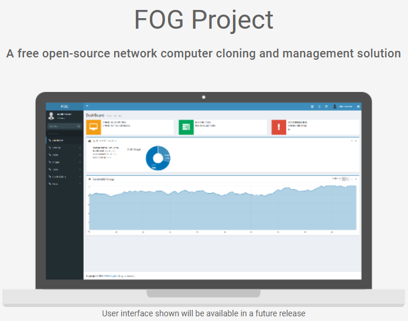
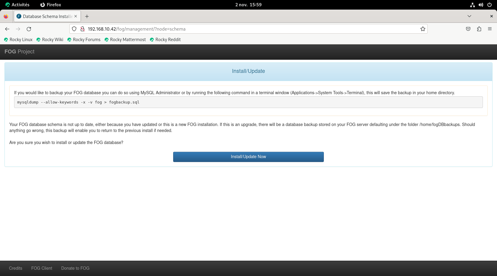
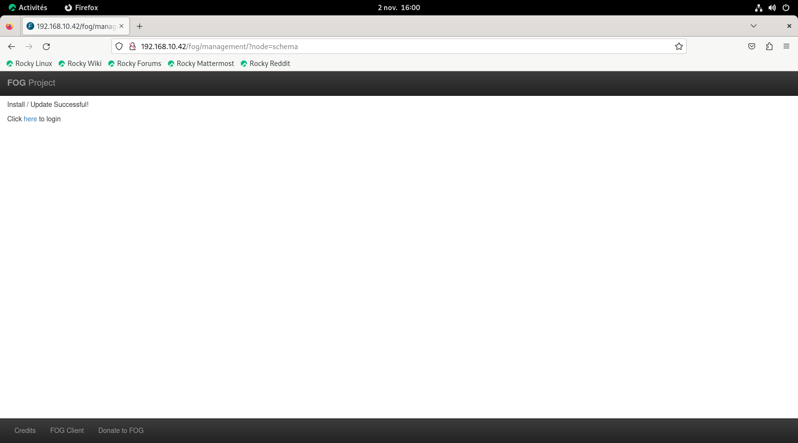
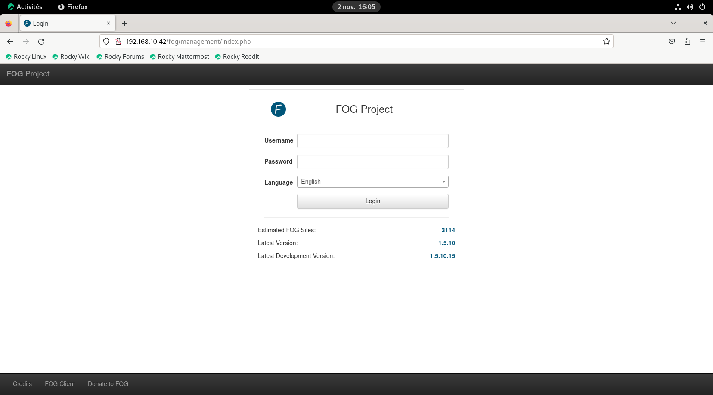
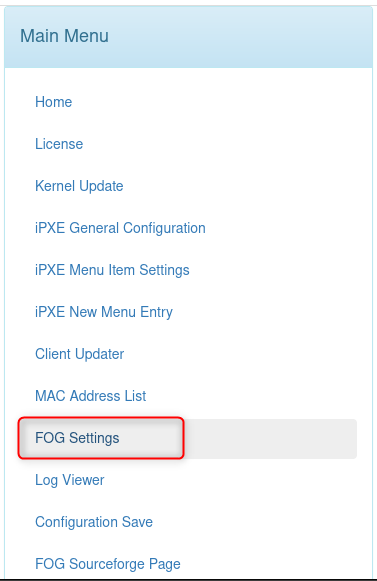
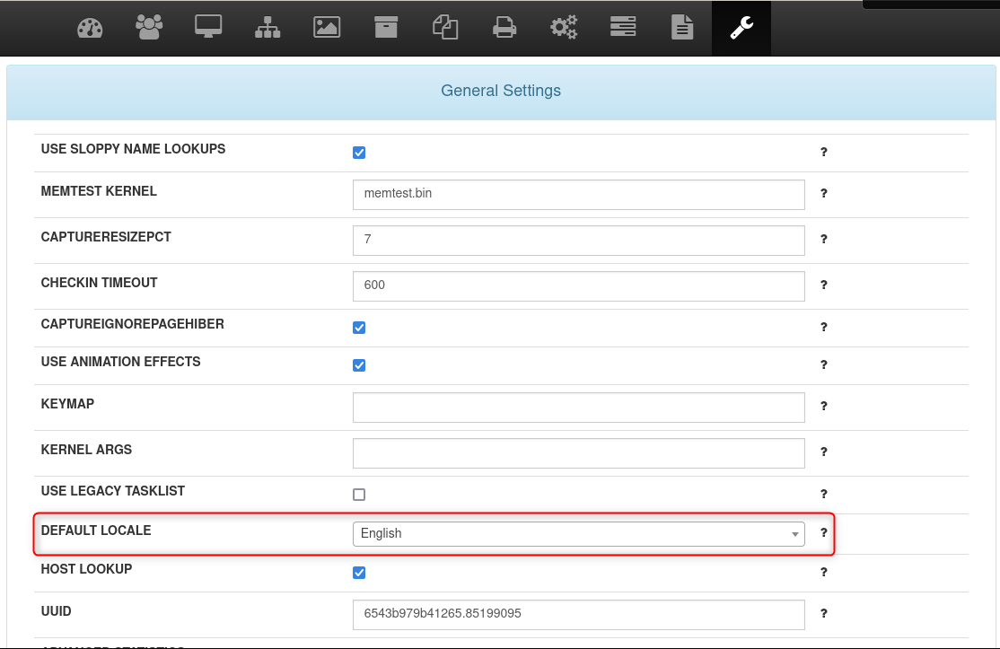
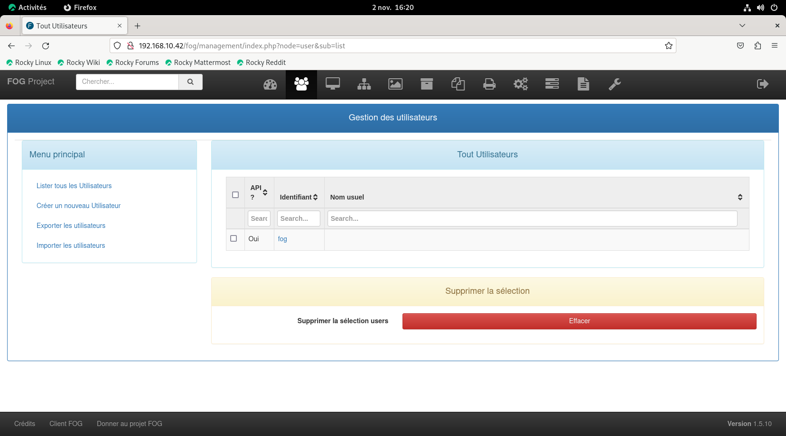

<figure markdown=1>
{width=300}
</figure>

# Tuto déploiement FogProject

Fog Project est un logiciel permettant, via le PXE (Preboot Execution Environment) :  
- Gestion de parc informatique (inscription des machines du parc)  
- La capture et le déploiement d'images système (Microsoft Windows, Linux, MacOS).  
- Exécution de scripts sur un ensemble de machine  

## Pré-requis

- Disposer des droits administrateur  
- Disposer d'une connexion internet configurée et activée  
- Avoir une adresse IP fixe pour le serveur  

!!! warning ""
    Il est fortement recommandé d'installer FOG sur un serveur dédié.  
    Le script d'installation est prévu pour un système fraichement installé.  

## Récupération de FOG via le dépot Github

!!! tip ""
    Selon la machine utilisé la commande d'installation peut varier.  
    Etant sur une machine `Rocky Linux` mes commandes seront faite avec `yum`  
    A vous d'adapter avec la commande de votre Distribution  

### 1 - Install Git

Avant d'installer la dernière version de `FOG` il est nécéssaire d'sintaller `git` afin de cloner le dépot sur la machine :  

```bash linenums="1" title="install git"
[root@fogsrv ~]# apt install git
Dernière vérification de l’expiration des métadonnées effectuée il y a 0:44:44 le jeu. 02 nov. 2023 12:01:37.
Dépendances résolues.
=============================================================================================================================================
 Paquet                                Architecture                Version                              Dépôt                          Taille
=============================================================================================================================================
Installation:
 git                                   x86_64                      2.39.3-1.el9_2                       appstream                       61 k
Installation des dépendances:
 git-core-doc                          noarch                      2.39.3-1.el9_2                       appstream                      2.6 M
 perl-Error                            noarch                      1:0.17029-7.el9                      appstream                       41 k
 perl-Git                              noarch                      2.39.3-1.el9_2                       appstream                       37 k
 perl-TermReadKey                      x86_64                      2.38-11.el9                          appstream                       36 k
 perl-lib                              x86_64                      0.65-480.el9                         appstream                       15 k

Résumé de la transaction
=============================================================================================================================================
Installer  6 Paquets

Taille totale des téléchargements : 2.8 M
Taille des paquets installés : 17 M
Voulez-vous continuer ? [o/N] : o
Téléchargement des paquets :
(1/6): perl-lib-0.65-480.el9.x86_64.rpm                                                                       77 kB/s |  15 kB     00:00    
(2/6): perl-Error-0.17029-7.el9.noarch.rpm                                                                   201 kB/s |  41 kB     00:00    
(3/6): perl-TermReadKey-2.38-11.el9.x86_64.rpm                                                               173 kB/s |  36 kB     00:00    
(4/6): git-2.39.3-1.el9_2.x86_64.rpm                                                                         804 kB/s |  61 kB     00:00    
(5/6): perl-Git-2.39.3-1.el9_2.noarch.rpm                                                                    369 kB/s |  37 kB     00:00    
(6/6): git-core-doc-2.39.3-1.el9_2.noarch.rpm                                                                9.2 MB/s | 2.6 MB     00:00    
---------------------------------------------------------------------------------------------------------------------------------------------
Total                                                                                                        3.8 MB/s | 2.8 MB     00:00     
Test de la transaction
La vérification de la transaction a réussi.
Lancement de la transaction de test
Transaction de test réussie.
Exécution de la transaction
  Préparation           :                                                                                                                1/1 
  Installation          : git-core-doc-2.39.3-1.el9_2.noarch                                                                             1/6 
  Installation          : perl-TermReadKey-2.38-11.el9.x86_64                                                                            2/6 
  Installation          : perl-lib-0.65-480.el9.x86_64                                                                                   3/6 
  Installation          : perl-Error-1:0.17029-7.el9.noarch                                                                              4/6 
  Installation          : git-2.39.3-1.el9_2.x86_64                                                                                      5/6 
  Installation          : perl-Git-2.39.3-1.el9_2.noarch                                                                                 6/6 
  Exécution du scriptlet: perl-Git-2.39.3-1.el9_2.noarch                                                                                 6/6 
  Vérification de       : perl-Error-1:0.17029-7.el9.noarch                                                                              1/6 
  Vérification de       : perl-lib-0.65-480.el9.x86_64                                                                                   2/6 
  Vérification de       : perl-TermReadKey-2.38-11.el9.x86_64                                                                            3/6 
  Vérification de       : perl-Git-2.39.3-1.el9_2.noarch                                                                                 4/6 
  Vérification de       : git-core-doc-2.39.3-1.el9_2.noarch                                                                             5/6 
  Vérification de       : git-2.39.3-1.el9_2.x86_64                                                                                      6/6 

Installé:
  git-2.39.3-1.el9_2.x86_64            git-core-doc-2.39.3-1.el9_2.noarch  perl-Error-1:0.17029-7.el9.noarch  perl-Git-2.39.3-1.el9_2.noarch 
  perl-TermReadKey-2.38-11.el9.x86_64  perl-lib-0.65-480.el9.x86_64       

Terminé !
```

### 2 - Clonage repository

Maintenant nous procédons au clonage du dépôt `github` :  

```bash linenums="1" title="clonage repository github"
root@fogsrv:/# cd /opt
git clone https://github.com/FOGProject/fogproject.git fog_stable/
Clonage dans 'fog_stable'...
remote: Enumerating objects: 158144, done.
remote: Counting objects: 100% (4146/4146), done.
remote: Compressing objects: 100% (1059/1059), done.
remote: Total 158144 (delta 3078), reused 3988 (delta 2975), pack-reused 153998
Réception d'objets: 100% (158144/158144), 848.71 Mio | 8.47 Mio/s, fait.
Résolution des deltas: 100% (112889/112889), fait.
root@fogsrv:/opt# ls
fog_stable
```

### 3 - Lancement Script d'Installation

```bash linenums="1"
root@fogsrv:/opt# ls
fog_stable
root@fogsrv ~# cd fogproject/
root@fogsrv fogproject]# ls
 authors.txt   bin   CONTRIBUTING.md   lib   LICENSE   packages   README.md  'Release Notes.MD'   SECURITY.md   SELinux   src   utils
```

Il suffit de ce rendre dans le dossier `/bin`  
et de lancer le script `installfog.sh`  

```bash linenums="1" title="Lancement Script ./installfog.sh"
root@fogsrv:/opt# ls
fog_stable
root@fogsrv:/opt# cd fog_stable/
root@fogsrv:/opt/fog_stable# ls
 authors.txt   CONTRIBUTING.md   LICENSE    README.md            SECURITY.md   src
 bin           lib               packages   'Release Notes.MD'   SELinux       utils
root@fogsrv:/opt/fog_stable/bin# ./installfog.sh
Installing LSB_Release as needed
 * Attempting to get release information......................../installfog.sh: ligne 369: lsb_release : commande introuvable
Done


   +------------------------------------------+
   |     ..#######:.    ..,#,..     .::##::.  |
   |.:######          .:;####:......;#;..     |
   |...##...        ...##;,;##::::.##...      |
   |   ,#          ...##.....##:::##     ..:: |
   |   ##    .::###,,##.   . ##.::#.:######::.|
   |...##:::###::....#. ..  .#...#. #...#:::. |
   |..:####:..    ..##......##::##  ..  #     |
   |    #  .      ...##:,;##;:::#: ... ##..   |
   |   .#  .       .:;####;::::.##:::;#:..    |
   |    #                     ..:;###..       |
   |                                          |
   +------------------------------------------+
   |      Free Computer Imaging Solution      |
   +------------------------------------------+
   |  Credits: http://fogproject.org/Credits  |
   |       http://fogproject.org/Credits      |
   |       Released under GPL Version 3       |
   +------------------------------------------+


   Version: 1.5.10 Installer/Updater

 * SELinux is currently enabled on your system. This is often causing
 * issues and we recommend setting to permissive on FOG Servers as of now.
 * Should the installer set this for you now? (Y/n) Y
```
Suite à la validation les étapes de configuration de l'installation se lance  

```bash linenums="1" title="Installation Fog"
 * The local firewall, currently, seems to be enabled on your system. This can cause
 * issues on FOG Servers if you are not well experienced and know what you are doing.
 * Should the installer try to disable the local firewall for you now? (y/N) y
 * Firewall disabled - proceeding with installation...
  
  # La question suivante vous demande la version de votre OS Linux
  # (Celui-ci est normalement deja choisi)  
  What version of Linux would you like to run the installation for?

          1) Redhat Based Linux (Redhat, Alma, Rocky, CentOS, Mageia)
          2) Debian Based Linux (Debian, Ubuntu, Kubuntu, Edubuntu)
          3) Arch Linux
 
 Choice: [2] 

  Starting Redhat based Installation

  # Fog Demande si il s'agit d'une installation de Serveur Classique ou de Stockage  
  # Dans mon cas il s'agit d'une installation de serveur classique 
  FOG Server installation modes:
      * Normal Server: (Choice N) 
          This is the typical installation type and
          will install all FOG components for you on this
          machine.  Pick this option if you are unsure what to pick.

      * Storage Node: (Choice S)
          This install mode will only install the software required
          to make this server act as a node in a storage group

  More information:  
     http://www.fogproject.org/wiki/index.php?title=InstallationModes

  What type of installation would you like to do? [N/s (Normal/Storage)] N

  We found the following interfaces on your system:
      * ens160 - 192.168.10.42/24
  # A ce stade l'installateur demande si vous voulez utiliser la carte réseau détectée 
  # et si vous voulez ou non changer l'IP associée à celle-ci
  Would you like to change the default network interface from ens160?
  If you are not sure, select No. [y/N] N

  # Question concernant la passerelle utilisé pour le DHCP 
  # et donc l'attribution d'IP pendant le déploiement  
  # Généralement indiquer la passerelle sur lequel votre serveur est raccordé
  Would you like to setup a router address for the DHCP server? [Y/n] Y
  What is the IP address to be used for the router on
      the DHCP server? [192.168.10.254]
  
  # Indiquer l'adresse du serveur DNS de votre DHCP  
  # (Dans le cas d'un domaine il s'agit du DNS du Domaine)  
  Would you like DHCP to handle DNS? [Y/n] Y
  What DNS address should DHCP allow? [192.168.10.20]
  
  # A ce stade il s'agit d'activer ou non le service DHCP de FOG  
  # Si vous possédez un serveur DHCP déja présent sur votre réseau 
  # Il sera nécessaire de répondre non
  Would you like to use the FOG server for DHCP service? [y/N] N
  
  # FOG demande si vous voulez installer les packs de langue supplémentaire
  # (Répondre oui pour bénéficier du Français sur l'interface graphique)
  This version of FOG has internationalization support, would  
  you like to install the additional language packs? [y/N] y
  
  # Il s'agit de rebalancer toutes les connexions au web via HTTPS  
  # Bien entendu à activer ! (dans mon environnement de test et afin de bénéficier  
  # d'une installation plus rapide j'ai répondu Non)
  Using encrypted connections is state of the art on the web and we
  encourage you to enable this for your FOG server. But using HTTPS
  has some implications within FOG, PXE and fog-client and you want
  to read https://wiki.fogproject.org/HTTPS before you decide!
  Would you like to enable secure HTTPS on your FOG server? [y/N] N
  
  # Choisir le Nom de votre Machine
  Which hostname would you like to use? Currently is: fogsrv
  Note: This hostname will be in the certificate we generate for your
  FOG webserver. The hostname will only be used for this but won't be
  set as a local hostname on your server!
  Would you like to change it? If you are not sure, select No. [y/N] N
  
  FOG would like to collect some data:
      We would like to collect the following information:
        1. OS Name (CentOS, RedHat, Debian, etc....)
        2. OS Version (8.0.2004, 7.2.1409, 9, etc....)
        3. FOG Version (1.5.9, 1.6, etc....)

  What is this information used for?
      We would like to simply track the common types of OS
      being used, along with the OS Version, and the various
      versions of FOG being used.

  Are you ok with sending this information? [Y/n] n

   ######################################################################
   #     FOG now has everything it needs for this setup, but please     #
   #   understand that this script will overwrite any setting you may   #
   #   have setup for services like DHCP, apache, pxe, tftp, and NFS.   #
   ######################################################################
   # It is not recommended that you install this on a production system #
   #        as this script modifies many of your system settings.       #
   ######################################################################
   #             This script should be run by the root user.            #
   #      It will prepend the running with sudo if root is not set      #
   ######################################################################
   #            Please see our wiki for more information at:            #
   ######################################################################
   #             https://wiki.fogproject.org/wiki/index.php             #
   ######################################################################

 # Voici un récapitulatif des choix effectués  

 * Here are the settings FOG will use:
 * Base Linux: Redhat
 * Detected Linux Distribution: Rocky Linux
 * Interface: ens160
 * Server IP Address: 192.168.10.42
 * Server Subnet Mask: 255.255.255.0
 * Hostname: fogsrv
 * Installation Type: Normal Server
 * Internationalization: Yes
 * Image Storage Location: /images
 * Using FOG DHCP: No
 * DHCP will NOT be setup but you must setup your
 | current DHCP server to use FOG for PXE services.

 * On a Linux DHCP server you must set: next-server and filename

 * On a Windows DHCP server you must set options 066 and 067

 * Option 066/next-server is the IP of the FOG Server: (e.g. 192.168.10.42)
 * Option 067/filename is the bootfile: (e.g. undionly.kkpxe or snponly.efi)
 * Send OS Name, OS Version, and FOG Version: No

 * Are you sure you wish to continue (Y/N) Y
```
Je vous passe les installations de paquets, après un certain temps vous devriez avoir ce message signifiant que l'installation c'est bien passé.  

```bash linenums="1" title="Installation base de donnée"
 * You still need to install/update your database schema.
 * This can be done by opening a web browser and going to:

   http://192.168.10.43/fog/management

 * Press [Enter] key when database is updated/installed.
```
Il faudra ce rendre sur l'URL indiqué et d'initialiser la base de donnée afin de finaliser l'installation de celle-ci  

<figure markdown=1>
{width=450}
</figure>

<figure markdown=1>
{width=450}
</figure>

Sur le terminal la validation de la base de donnée en interface web se traduira par cette affichage  
Celui-ci stipule les informations de connexion par défaut  
```bash linenums="1" title="Finalisation d'installation"
 * Setup complete

   You can now login to the FOG Management Portal using
   the information listed below.  The login information
   is only if this is the first install.

   This can be done by opening a web browser and going to:

   http://192.168.10.43/fog/management

   Default User Information
   Username: fog
   Password: password

 * Changed configurations:

   The FOG installer changed configuration files and created the
   following backup files from your original files:
   * /etc/vsftpd/vsftpd.conf <=> /etc/vsftpd/vsftpd.conf.1698936954
   * /etc/exports <=> /etc/exports.1698936954
```

## Interface Graphique

### Page de connexion

<figure markdown=1>
{width=480}
</figure>

### Dashboard

<figure markdown=1>
{width=480}
</figure>

#### Premieres modification

##### Passage en Français de l'interface graphique  
Pour cela il faut ce rendre dans le menu de configuration  

<figure markdown=1>

</figure>

Selection de "FOG Settings"  
<figure markdown=1>
{width=250}
</figure>

Descendre jusqu'a l'onglet "General Settings" puis changer le "Default Locale" de "English->Français"  
<figure markdown=1>
{width=480}
</figure>

##### Modification des Identifiants de connexion par défaut  

<figure markdown=1>

</figure>

Une fois sur l'interface "Utilisateurs" selectionné "Fog" puis choisir un nom "admin" dans mon cas  
<figure markdown=1>
{width=480}
</figure>

Ensuite pour des raisons de sécurité il faudra changer le mdp par défaut  
<figure markdown=1>
{width=480}
</figure>

#### Capture d'une image Windows 10 (également applicable sur Windows 11 ?)

