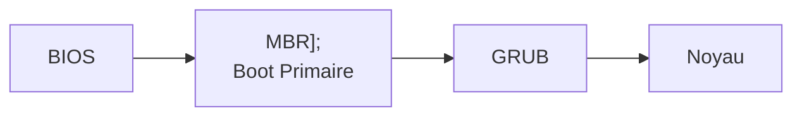
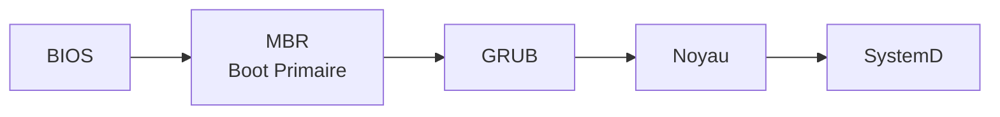

# Utiliser une distribution Linux

Objectif :  
Comprendre les diverses étapes de démarrage  
Apprendre à gérer le système et les services avec systemD  
Arrêter ou redémarrer un système d’exploitation Linux

## Démarrage de Linux, services et niveaux

<!-- diagram demurrage Linux p 4 -->
<pre class="mermaid">
    graph LR
    A[BIOS] --> B["MBR 
    Boot Primaire"];
    B --> C[GRUB];
    C --> D[Noyau];
    D --> E[SystemD];
    E --> F[Cible];
</pre>

Sous Debian, le chargeur est le programme **GRUB2**. Il se divise en plusieurs parties nommées ***stage***.  

#### BIOS

<pre class="mermaid">
    graph LR
    A[Bios]
</pre>

- BIOS = Basic Input/Output system: système élémentaire d’entrée/sortie. C’est un ensemble de fonctions contenu dans la mémoire morte (ROM) de la carte mère d’un ordinateur lui permettant d’effectuer des opérations élémentaires lors de sa mise sous tension.
- Exécute des opérations de vérification de l’intégrité du système.
- Cherche, charge et exécute le programme d’amorçage.
- Il cherche le programme d’amorçage sur un disque dur, une disquette, un CD-Rom ou une clé USB.
- Une fois le programme d’amorçage trouvé et chargé en mémoire, le BIOS lui donne le contrôle.
- Simplement, le BIOS exécute la MBR.

#### MBR (**M**aster **B**oot **R**ecord) = Stage 1

<pre class="mermaid">
graph LR
 A[BIOS] --> B[MBR];
</pre>

??? tip inline end "MBR"
    Il s'agit du *Boot Primaire*, sa taille étant limité à 512 octets, il n'a pour fonction que de lancer le boot secondaire qui occupe un plus gros espace aillerus sur le disque.

- C’est le premier secteur adressable d’un disque dur. Le plus souvent appelé /dev/hda ou /dev/sda.
- La taille de cette zone est de 512 bits au maximum. Elle contient :
    1. le programme d’amorçage se trouve dans les 446 premiers bits.
    2. la table des partitions (les 4 partitions primaires) du disque dur sur les 64 bits suivants.
    3. vérification de la validité du MBR dans les 2 derniers bits.

- Il contient une routine d’amorçage dont le but est de charger le système d’exploitation (ou le « boot loader »/chargeur d’amorçage s’il existe - GRUB ou LiLo) présent sur la partition active.
- Simplement, le MBR exécute le programme d’amorçage GRUB.

#### GRUB (**GR**and **U**nified **B**ootloader)


!!! danger inline end "GRUB"
    ¡ IL NE FAUT PAS ÉDITER CE FICHIER !  

- Lorsque le micro-ordinateur héberge plusieurs systèmes (on parle alors de multiamorçage), il permet à l’utilisateur de choisir quel système démarrer.
- Il présente une interface qui permet à l’utilisateur de choisir quel système d’exploitation démarrer.
- Si vous avez plus d’un noyau installé sur votre système, il est possible de sélectionner celui que vous voulez exécuter.
- Il connaît le système de fichiers (ext3, ext4, Btrfs, etc.) utilisé sur le système.
- Simplement, GRUB charge et exécute le noyau sélectionné et l’image initrd (image d’un système minimal initialisé au démarrage du système = Initial Ram Disk).  

Le fichier de configuration de grub se trouve dans **/boot/grub/grub.cfg**  
Il est conseillé de procéder aux modifications de la configuration de GRUB à partir de :  

- **/etc/default/grub**, contenant les paramètres et options globales  
- scripts présents dans le dossier **/etc/grub.d/**

Pour la prise en compte de ces modifications, deux commandes permettent de régénérer le fichier /boot/grub/grub.cfg  
**grub-mkconfig** & **update-grub**  

```bash
root@deb:~# update-grub
Création du fichier de configuration GRUB...
Image Linux trouvée : /boot/vmlinuz-4.19.0-12-amd64
Image mémoire initiale trouvée : /boot/initrd.img-4.19.0.12-amd64
Image Linux trouvée : /boot/vmlinuz-4.19.0-11-amd64
Image mémoire initiale trouvée : /boot/initrd.img-4.19.0-11amd64
fait
```

#### Le **Noyau**



- Monte le système de fichiers racines (« root »). Donc, relie une partition ou un périphérique à un répertoire, répertoire par lequel les données présentes sur la partition ou le périphérique sont accessibles.
- Il met en relation la partie matérielle (carte électronique.) avec les interfaces utilisateur (périphérique, application…)
- Le noyau charge et exécute le programme /sbin/init.
- Comme le programme init est le premier programme a être exécuté par le noyau Linux, il porte le PID (ID du processus) numéro 1.
- Le initrd permet ainsi d’avoir un système minimal pouvant ensuite charger le système de fichier principal ou bien des systèmes sans disques. Il peut être instable d’avoir « en dur » dans le kernel tous les drivers de disques. Pour éviter cela, les distributions compilent un kernel minimal avec les options de bases puis chargent les modules obligatoires nécessaires contenus dans l’archive de l’initrd.
- Le Noyau est dit modulaire, car il est constitué de plusieurs fichiers.
  - Parmi cela, 2 sont indispensables au démarrage d’un OS Debian
    - vmlinuz-[version_du_fichier]-amd64 : fichier principal du noyau avec sa version dans le nom
    - initrd.img-[version_du_fichier]-amd64 : fichier secondaire généré à chaque mise à jour. Il contient la configuration spécifique au matériel et les options importantes de systèmes d’exploitation (ex. : gestion du raid, chiffrement, pilote des systèmes de fichiers, etc.)  

```bash
root@deb:~# ls -l /boot/
total 72280
-rw-r--r-- 1 root root  206143 oct.   18 10:43 config-4.19.0.12-amd64
drwxr-xr-x 5 root root    4096 nov.   19 12:00 grub
...
```

Lors du démarrage, il est possible d’accéder au paramètre de lancement du noyau via le **GRUB**.  
Pour cela, il suffit de presser la touche « e » pour passer en mode édition puis de chercher la ligne  

`linux /vmlinuz-[version_du_fichier] root=/dev/mapper/debian--vg-root ro quiet`

- **/vmlinuz-[version_du_fichier]** : nom de l’image noyau à charger.
- **root=/dev/mapper/debian--vg-root**: déclaration du système de fichier contenant la racine du système d’exploitation (/)
- **ro** : indique que la racine du système d’exploitation sera montée en lecture seule. Il est important de ne pas changer ce paramètre (si l’intégrité du système de fichier doit être vérifiée, celui-ci doit être en lecture seule).
- **quiet** : indique que le noyau se lancera de façon non verbeuse.

#### SystemD



**SystemeD** est le **gestionnaire système**, le premier programme lancé par le noyau (PID1).  
Il est en charge de lancer tous les programmes suivants afin d’obtenir un système opérationnel pour l’utilisateur.  
Le démarrage des programmes (services) est parallèle avec des dépendances entre services.  
La gestion des services est matérialisée dans des fichiers spécifiques au sein du dossier 
`/lib/systemd/system`.  

SystemD utilise des cibles (target) pour savoir quels sont les programmes à exécuter ou arrêter suivant l’objet de la cible.  
Il utilise 6 cibles pour savoir quels sont les programmes a démarré ou arrêter suivant l’intérêt de la cible en question sous Debian la cible *graphical.target* est la cible par défaut (qu’elle soit installée ou non).  

|  Nom de la cible  |                         Objet de la cible                         | Equiv. SysV |
| :---------------: | :---------------------------------------------------------------: | :---------: |
|  poweroff.target  |                         Arrêt du système                          |      0      |
|   rescue.target   |                    Passer en mode maintenance                     |      1      |
| multi-user.target | Système d’exploitation en mode CLI avec session multi-utilisateur |      3      |
| graphical.target  |          Système d’exploitation en mode GUI si installé           |      5      |
|   reboot.target   |                      Redémarrage du système                       |      6      |

la commande `systemctl`est détaillée dans la page : [commande bash](Bash_avance.md)  

### Gestion des services

La gestion des services fait également appel à la commande `systemctl` [commande bash](Bash_avance.md)  

## Arrêter / Redémarrer le Système

Pour arrêter le système, il faudra passer par la commande `shutdown` 

`shutdown [-r -h c] <heure> <message>`

| option | description                             |
| :----: | --------------------------------------- |
|  `-r`  | permets de programmer un redémarrage     |
|  `-h`  | permets de programmer l’arrêt du système |
|  `-c`  | Annule une commande shutdown en attente |

??? abstract "exemple d’arrêt du système"
    === "arret immédiat"
        ```bash
        root@deb:~# shutdown -h now
        ```
    === "arret différé"
        ```bash
        root@deb:~# shutdown -h +10 "Arrêt du serveur dans 10min !"
        ```

??? abstract "exemple de redémarrage du système"
    === "Redémarrage immédiat"
        ```bash
        root@deb:~# reboot
        ```
        ou
        ```bash
        root@deb:~# shutdown -r now
        ```
    === "Redémarrage du système pour 16h30"
        ```bash
        root@deb:~# shutdown -r 16:30 "reboot à 16h30"
        ```

??? abstract "annuler un shutdown"
    ```bash
    root@deb:~# shutdown -c
    ```
    Ne fonctionne pas avec l'option `now` ou une fois l'heure programmée atteinte.