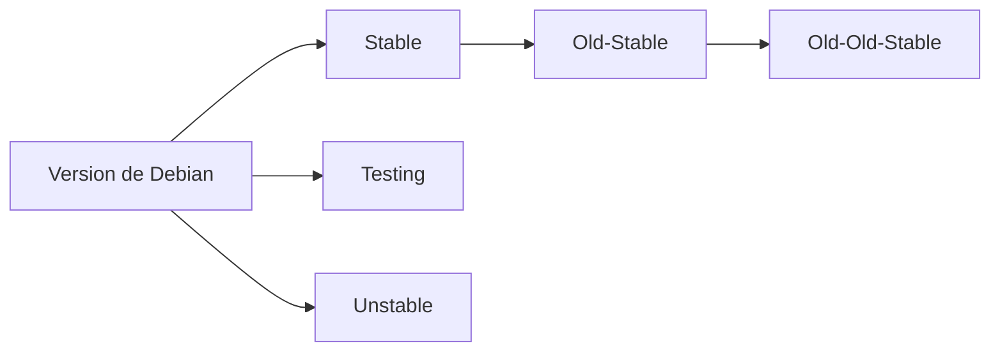

# Linux

## Historique UNIX

Objectif :

Connaitre les racines historiques de GNU/Linux  
Avoir une idée de l’importance de Linux dans le monde actuel  
Savoir donner des exemples d’utilisation de Linux dans la vie courante  

1969/70 : création de unics par ken thompson, dennis Ritchie et brian Kernighan première version écrite en langage B (ken thompson et dennis ritchie)  
1971 : première version officielle d’UNIX (changement de nom définitif)
1972 : Dennis Ritchie créé le langage C (amélioration du langage B plus portable)  
1973 : réécriture du noyau Unix en langage C, l’université de Berkeley est la première a disposer d’Unix.  
1976 : Unix Time-Sharing System V6. disponible avec les sources afin de pouvoir lire, modifier, comprendre le principe du fonctionnement du système  
1977 : Bill Joy travaille a la création de 1 BSD sur les bases d’Unix V6.
1979 : sortie de 2 BSD incluant notamment le C Shell et l’éditeur Vi crées par Bill Joy (Bill joy sera un fondateur de la société Sun Microsystems célèbre pour les logiciels java et la suite bureautique open office)  
1983 : Richard MAthew Stallman créé le projet GNU, a la suite des fermetures des sources par de nombreux industriels (plus d’accès aux codes), le but du projet est de crée un OS dont tous les composants sera un logiciel libre, afin d’accéder au code sources modifiable a l’envies afin d’adapter ou modifier celui-ci  
le projet GNU ce developpe sans noyau jusque dans les années 90.  
1987 : création d’un clone Unix nommé minix compatible IBM PC par Andrew Tanenbaum, système destiné principalement aux gens qui souhaitent étudier le fonctionnement d’un système d’exploitation  

## Historique LINUX

1991 : 25/08/1991 Linus Torvalds annonce son projet de création d’un système d’exploitation libre, aux utilisateurs de minix pour arch i386 compatible ibm pc.  
Il s’agit de base d’un hobbie et il ne souhaitait rien de massif et de professionnel comme le projet GNU.  
Projet GNU auquel il manquait un noyau, trouvera celui-ci dans le projet Linux  
1992 : sortie de première distribution GNU/Linux nommée SLS (distribution = différente version des systèmes complets GNU/Linux qui mélange le noyau Linux et tous les logiciels liés au projet GNU)  
1993 : SLS laisse place à Slackware et la création de la distribution Debian  
1994 : arrive les distributions Red Hat et SuSE, c’est 4 distributions sont toujours présentes à l’heure actuelle  
1996 : création de la mascotte Tux, création de l’environnement graphique KDE  
1997 : création de l’environnement graphique Gnome  
2004 : création de la distribution Ubuntu par Mark Shuttleworth, distribution Linux à destination du grand public, car plus facile d’accès  

## Qu’est-ce que Linux ?

- Linux est un OS majeur, issue d’Unix, très fréquent dans les infrastructures réseau
- Linux s’utilise principalement en CLI, à la différence des OS plus graphiques (windows, MACoS)
- Linux peut aussi utiliser des GUI, plus intéressant pour des utilisateurs non initiés et/ou relancer des machines un peu vieilles (Linux demandant moins de ressources que Windows)  
- interface graphique les plus connue :
  - Gnome
  - KDE
  - XFCE
  - LXDE

Les distributions GNU/Linux sont aujourd’hui très nombreuses.  
Avec parfois de simple variante Kubuntu, Lubuntu, Xubuntu variante de la distribution mère Ubuntu (Kubuntu = Ubuntu + GUI KDE, Lubuntu = Ubuntu + LXDE)
Dans le monde professionnel, on rencontre principalement les distributions suivantes :

- Red Hat Entreprise Linux (RHEL) : Distribution soumise a licence de par son éditeur, abonnement donne accès au support privilégié de Red Hat.  
  Possibilité d’accéder à une licence gratuite pour tester la distribution avec le programme développeur, mais interdite en production.  
- CentOS : distribution issue de Red Hat, jusqu’en 2021 il s’agissait d’une version downstream, il s’agissait d’un Red Hat sans support officiel ce qui permettait de la déployer en entreprise sans s’acquitter d’une licence, il s’agit d’une distribution à part entière avec sa propre équipe de développement. En 2021 la distribution a évolué vers CentOS stream (version plus upstream) moins adapté pour les entreprises. (LTS)
- Debian : distribution GNU/Linux entièrement libre et gratuite, réputée pour sa stabilité (LTS)
- SuSE Linux : également en version libre au travers openSUSE et la version SUSE Linux entreprise, rencontrée à travers des appliances (un paquet avec un mini OS Linux sur lequel est apposé un produit logiciel particulier, un produit intégré directement dans l’OS et donne donc un ensemble prêt a l’emploi, à travers un DVD, une iso, une machine virtuelle)
- Ubuntu Server : a l’origine ubuntu était orientée machine de bureau (desktop) une version serveur est arrivée en 2006. Ubuntu propose un LTS (long Time Support) afin de bénéficié d’un support et des maj sur 5 ans, la ou une version intermédiaire ne propose 1 support que sur 1 an.  

Linux est majoritairement présent dans le monde.  
Depuis le web avec UNIX, jusqu’aux nouveaux outils de miniaturisation (raspberry, Arduino). Linux est présent au quotidien dans nos utilisations  
cela grâce à une certaine stabilité liée a un impact relativement modique du système sur les performances en plus de sa relative gratuité (libre ne veut pas dire gratuit voir Red Hat).

Grosse utilisation de Linux

- Serveur web 
  - service Apache, Nginx
- Serveurs de base de données
  - MySql, OracleDB, MariaDB
- Serveurs d’applications Java
- Smartphone
  - Android est un dérivé de Linux
- Internet des Objets (IoT= Internet Of Things)
  - SmartWatch, Smart-TV, Véhicules Intelligents, …

### Distribution spécialisée (liste non exhaustive)

- Kali Linux (orientée sécurité) certain des outils natifs à Kali Linux peuvent être considéré comme des outils de piratage en entreprise, avant de le déployer bien se renseigner au niveau de la sécurité de l’entreprise.
- Debien pour Raspberry (Raspbian) (Debian sur RaspberryPi)
- 3CX (Distribution basée sur Debian implémentant la solution de téléphonie éponyme)
- System Rescue CD (Récupération de système et de données en LiveCD/USB) peut faire partir de la boite à outils du technicien en entreprise.
- PrimTux (Distribution orientée éducation)

### Distribution Client (Liste non exhaustive)

Distribution orientée poste de travail, Linux étant moins gourmand au niveau ressource il peut servir a remettre en service des machines plus anciennes et sera largement suffisant pour effectuer de la bureautique, de la navigation web ou du multimédia (écoute de musique, lecture de vidéo)

- Linux Mint : Dérivé d’Ubuntu, très populaire et bien adapté aux débutants.
- ZorinOS : A pour but de permettre une transition facile depuis Windows ou MacOS avec un travail soigné sur la GUI. Existe aussi en version light et éducative.
- Kubuntu/Xubuntu/Lubuntu : Ubuntu et ses diverses déclinaisons avec divers environnements graphiques peuvent offrir plusieurs expériences aux utilisateurs.

## Licences et logiciels libres

La notion de logiciels libres est très importante dans le monde Linux.  
Cela permet à chacun de librement modifier, adapter les logiciels à ses besoins.  

Free Software Foundations  
Sa mission première est de financer les logiciels libres
Elle met en avant la liberté et non la gratuité des logiciels libres.

- Association fondée par Richard Stallman en 1985
- Promotion des logiciels libres
- Défense des utilisateurs

Différentes licences dites libres coexistent.  
Elles précisent des droits et devoirs qui peuvent diverger sur la forme comme sur le fond.  

### La licence GNU General Public License est la plus connue et la plus fréquente, celle-ci est actuellement en version 3.  
Licence utilisée par les développeurs du noyau Linux et des diverses briques du projet GNU.  

- Quatre droits et devoirs :
  - Liberté d’exécuter le logiciel, pour n’importe quel usage.
  - Liberté d’étudier un programme et de l’adapter, via l’accès aux codes sources.
  - Liberté de redistribuer des copies.
  - Faire bénéficier la communauté des versions modifiées.

La licence GNU GPL n’est pas seule il y a notamment les licences 

#### Apache
  - Géré par Apache Software Foundation
  - Autorise la modification et distribution du code source
  - Respect du Copyright 

#### BSD
  - Autorise la réutilisation sans restriction
  - Licence dans le domaine public et librement modifiable
  - Pas de copyleft
  - Plusieurs versions (BSD, Bsd3)

#### CeCILL (License Française)
  - Abréviation de **CE**A **C**NRS **I**NRIA **L**ogiciels **L**ibres
  - Conforme au droit Français
  - Respect des principes du logiciel libre
  - Intéressant pour des dev proposant les créations en interner, au sein du pays

#### Creative Commons
  - S’applique aux créations artistiques
  - Utilisé pour les photos, logos, graphiques ou autres musiques présentes dans les logiciels libres
  - De nombreuses sous-catégories

## Debian

1993 - Création de Debian depuis cette date une quinzaine de versions on vu le jour.  

La distribution Debian a été conçue dès son origine pour les systèmes serveur.  
Ce qui implique un calendrier de sorties assez long et que cette distribution n’est pas une ergonomie d’utilisation propice au utilisateurs finaux.  
Ce dernier point ayant pu être comblé via les distributions Ubuntu et Linux Mint.  

Debian a toujours, depuis sa création, eu 2 objectifs **Qualité** et **Aspect non commercial**  

Le projet Debian a défini les principes du logiciel libre, que la communauté s’engage à respecter :  

- Redistribution libre
- Disponibilité du code source
- Licences

Par ce biais le projet Debian a également établi un contrat social avec la communauté :  

1. Debian demeurera totalement libre.
2. Nous donnerons nos travaux à la communauté des logiciels libres.
3. Nous ne dissimulerons pas les problèmes.
4. Nos priorités sont nos utilisateurs et les logiciels libres.
5. Les travaux non conformes aux principes du logiciel libre pourront être disponibles dans des sections différenciées ne faisant pas partie du système Debian.

[https://www.debian.org/social_contract.fr.html]

### différentes Branches et Version

La version actuelle de Debian est la 11 -Bulleyes (la 12 étant en cours de déploiement).

Toutes les versions de Debian comportent 3 principales branches (Release)  

**Stable** : Version de production de Debian, celle recommandée d’utiliser  
**Testing**: contiens la future version stable de Debian  
**Unstable**: Version en constante évolution (on parle de Rolling Release). Cette version est toujours appelée *Sid*.  

En plus des 3 branches principales, des sous-branches existent **Old-Stable** & **Old-Old-Stable**, elles désignent les branches N-1 et N-2.  

!!! tip ""
    Version **Stable** actuel = 11,  
    **Old-Stable** = 10  
    **Old-Old-Stable** = 9
