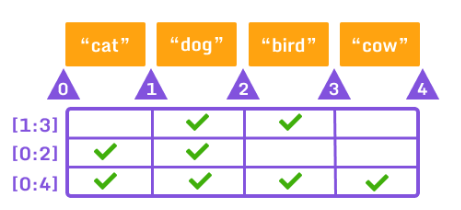

# Python

- `var` = entier,decimal,caractère (int,float,string)
- `\n` sauté une ligne dans string ou print
- `liste` = ['salut' , 'ça' , 'va']
- print(liste[0:3]) print(*liste)

<figure markdown=1>

</figure>

| Opérateur | Nom   |
| :----:    | :----:|
| +


| Opérateur | Nom              |
|-----------|------------------|
| +         | Addition         |
| –         | Soustraction     |
| *         | Multiplication   |
| /         | Division         |
| %         | Modulo           |
| **        | Puissance        |
| //        | Division entière |
| x = 3 print:3|
| -= | x -=3 print:0 | soustraction |
|  /=  | x /=3 print:1   | division |
|  *=   | x *= 3 print:12   | multiplication |
| += | x += 3 print:6 | addition |
| := |  | 
| != | true ou false |  non egal
| == | true ou false  | egal
| <> | true ou false | plus grand ou plus petit 
| <= >= | true false |  plus petit, grand et égal

````py
print(num:=int(input()))  # creer une variable  
raw_input('tapez ip: ')  # valeur entré au clavier 
input() # idem au dessus mais pour python3

int() deviens une valeur entier example int(raw_input('3'))
````
````py
print("""texte
sur
plusieurs
lignes""")
````


````py
>>> x = 3
>>> print "x vaut : " + str(x) 
x vaut : 3
# x etant un entier il ne peu pas s'additionner a une chaine de caractère 

>>> x = 3.125
>>> print "x vaut : " + str(float(x))
x vaut : 3.125
>>> print " x vaut : " + str(int(x))
x vaut : 3

````
## fonction


````py
input()     # entrée au clavier 

print()     # afficher 

int('')     # nombre entier : 3

float('')   # nombre decimal : 3.254

str('')     # chaine de caractère 

.upper()    # majuscule x = text.upper()

.lower()    # minuscule x = text.lower()

.capitalize() # majuscule première lettre 

len()       # compte len("salut") retourne 5

.pop()      # supprime un élément de liste 
                liste.pop(1)
.append()   # ajoute a la fin d'une liste 

.insert(2,'') # ajoute a la place donné  

def fonct():  # crée sa fonction
    return
````

## if 

````py
if 10 > 5:          # attention aux deux points 
    print("10 greater than 5")

print("Program ended")

````

## else

``````py
x = 4
if x == 5:
    print("Yes")
else:
    print("No")

``````

## elif

``````py
num = 3
if num == 1:
    print("One")
elif num == 2:
    print("Two")
elif num == 3: 
    print("Three")
else: 
    print("Something else")

``````

## and et or 

```py

temperature = 35

if temperature > 18 and temperature < 22:       # temp supp a 18 et inf a 22
    print('il fais bon')

if temperature > 18 or temperature == 22:       # temp supp a 18 ou égal (bolléen)
    print('test')
```

## not 

```py 

print(not 1 == 1)
false
print(not 1 > 7)
true

```

## Boucle

### for in 

````py
for _ in range(): # nombre ou variable
a = 1
b = 1
for loop in range(20):
    for loop in range(20):
        print(a * b, end=' ')
        b = b + 1
    a = a+ 1
    b = 1
    print()
````

### while

````py
a=1
while a < 10:
    print(a)
    a = a + 1
````