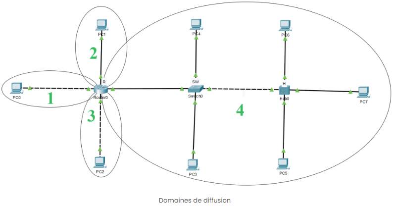

# Domaine de Diffusion et de Collision

<figure markdown="1">
{width=600}
</figure>

## <u>Définition d'un domaine</u>

Un domaine est une région d'un réseau ou tous les ordinateurs utilisateurs, les imprimantes et autres périphériquess sont enregistrés.  
Il s'agit d'une base de données centrale sur un ou plusieurs clusters (grappe) d'ordinateurs centraux, appelée contrôleurs de domaine.

## <u>Domaine de Diffusion</u>

<figure markdown="1">
{width=600}
<figcaption>Il y a 4 domaines de diffusion</figcaption>
</figure>

Un domaine de diffusion contient tous les périphériques qui peuvent ce joindre au niveau de la couche 2 du modèle OSI.  
Tous les ports d'un switch sont, par défaut, dans le même domaine de diffusion.  
Tous les ports d'un routeur se trouvent dans des domaines différents, et les routeurs ne transfèrent pas les d'un domaine de diffusion à un autre.  

!!! success "En résumé"
    - un switch gardent les domaines de diffusion
    - un routeur divisent les domaines de diffusion

### Les différents mode de diffusion

#### Diffusion Unicast 

Une communication Point à Point.  
Un message est envoyé d'un émetteur à un destinataire spécifique.

#### Diffusion Broadcast

Dans ce mode de diffusion, un message est envoyé à tous les noeuds (ou périphériques) du réseau.  
Cela signifie que tous les appareils connectés au réseau peuvent recevoir le message.

#### Diffusion Multicast

C'est une combinaison de la diffusion *unicast* et de la diffusion *broadcast*.  
Dans ce mode, un message est envoyé à groupe spécifique de destinataires qui se trouvent dans la même catégorie ou ont intérêts communs.  
Seuls les membres du groupe recevront le message.  
Typiquement un réseau vidéo il y aura un émetteur (la caméra) et plusieurs récepteurs.  

#### Diffusion anycast

Dans ce mode, un message est envoyé à l'un des noeuds d'un groupe de noeuds qui sont tous désignés par la même adresse.  
Le message est reçu par le noeud le plus proche (ou le plus approprié) parmi les membres du groupe.  

## <u>Domaine de Collision</u>

A la différence d'un domaine de diffusion, un domaine de collision est la partie du réseau où des collisions de paquets peut se produire.  
Une collision se produit lorsque 2 périphériques envoient un paquet en même temps sur le même segment de réseau partagé.  
Les paquets entrent en collision et les 2 appareils doivent renvoyer les paquets, ce qui impact l'efficacité du réseau.  
Les collisions se produisent souvent sur les switchs, car chaque port est dans le même domaine.  

!!! success " A noter"
    Chaque port d'un concentrateur est dans le même domaine de collision.
    Chaque port d'un routeur, switch, passerelle est dans un domaine de collision séparé.

<figure markdown="1">
{width=600}
<figcaption>Il y a 7 domaines de collision</figcaption>
</figure>

## <u>Différence entre domaine de collision et de diffusion</u>

| Domaine de collision                                                                                                              | Domaine de diffusion                                                                                                                 |
| :-------------------------------------------------------------------------------------------------------------------------------- | :----------------------------------------------------------------------------------------------------------------------------------- |
| Le domaine de Collision est une section de qui permet au trafic de circuler en avant et en arrière                          | Un domaine de diffusion est un type de domaine dans lequel le trafic circule sur tout le réseau                                |
| Le domaine Collision fait référence à un ensemble de périphériques dans lesquels une collision de paquets peut se produire. | Le domaine de Diffusion fait référence à un ensemble logique de systèmes informatiques accessibles sans utiliser de routeur.   |
| Les périphériques peuvent inclure les périphériques d'autres sous-réseaux IP.                                                  | Le domaine de Diffusion n'est jamais limité au sous-réseau IP spécifique pour tous les types de diffusion IP.                  |
| Une colission de paquets se produit lorsque plusieurs périphériques transmettent des données sur une seule liaison filaire. | Le domaine de Diffusion utilise principalement un environnement commuté pour diffuser, donc aucune collision ne se produit. |
| Les Switchs se planteront dans le domaine de diffusion                                                                         | Les Switchs ne seront jamais interrompus dans le domaine de diffusion.                                                            |
| Dans le domaine de collision, chaque port d'un routeur se trouve dans les domaines de diffusion distincts.                  | Tous les ports d'un switch sont suceptible d'être dans le même domaine de diffusion. |
