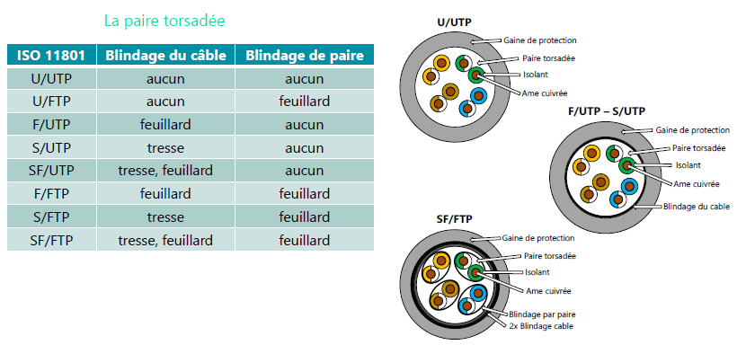
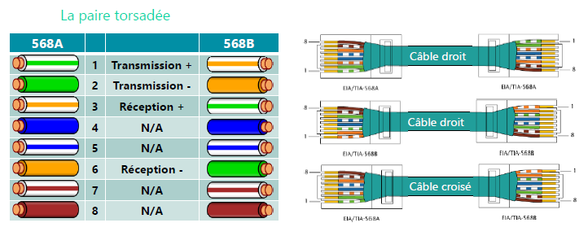
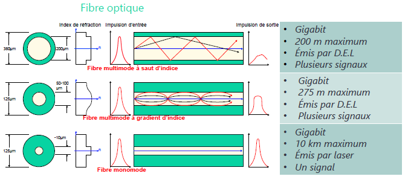
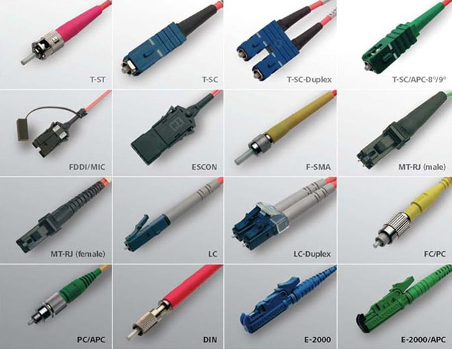

# Couche Physique

Le mail est maintenant formaté et prêt à l’envoi, il faut maintenant le mettre sur le média.

La couche `Physique`reçoit les trames de la couche [liaison](./2_Couche_Liaison.md) et les convertit en succession de bits qui seront ensuite envoyés sur le média.

Cette couche transmet donc les bits en signaux électriques ou optiques.

On y trouve des services tels que :

- Détection de collisions
- Multiplexing
- Modulation
- Circuit Switching
-…

!!! note "Unités de la couche Physique"
    - **bit**

## <u>Moyen de Transmission</u>

La connexion est effectué via la carte réseau  

- La carte réseau est présente sur les couches 1 & 2 du modèle OSI
    - Couche 1 : connectique et modulation de données (Transmission des bits en signaux électriques ou optiques)
    - Couche 2 : Adresse Physique (Adresse MAC)

## <u>Support de Transmission</u>

### Câble Cuivre

<figure markdown="1">
{width=600}
<figcaption>coupe d'un câble cuivre</figcaption>
</figure>

<figure markdown="1">
{width=600}
<figcaption>Cablage Rj45</figcaption>
</figure>

### Fibre Optique

<figure markdown="1">
{width=600}
<figcaption>Plan Coupe Fibre Optique</figcaption>
</figure>

<figure markdown="1">
{width=600}
<figcaption>Caractéristique Fibre Optique</figcaption>
</figure>

<figure markdown="1">
{width=600}
<figcaption>Connecteur Fibre Optique</figcaption>
</figure>
