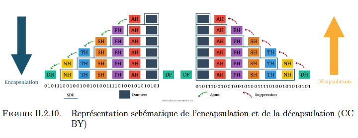

# Encapsulation

L'encapsulation est l'équivalent d'une enveloppe pour une lettre manuscrite.  
Dans notre cas les `données` sont enveloppées à chaque couche et le nom de [l'unité de données](Unites_donnees.md) n'est rien d'autre que le nom de l'enveloppe.  

Les PDU (qui forment l'enveloppe) sont constitué de 2 choses :

- la donnée en elle meme.
  - composé de la donnée initiale (mail...) & des en-têtes des couches précédente,
- l'en-tête spécifique à la `couche` ou il se trouve.

## Relation entre les couches

Notre couche `C+1`utilise les services de la couche `C`.

Dans l'image la [couche Session](./5_Couche_Session.md) utilise les services de la couche transport.

- C+1 transmet à C une donnée appelée `SDU`
- Tant que la couche C n'aura pas **encapsulé** celle-ci elle restera en `SDU`
- Apres l'encapsulation, effectué par C celle-ci prend le nom de **PDU**

## Relation entre PDU & SDU

Comme vu précédemment le PDU de la couche C est le SDU de la couche C+1 plus son en-tête (couche C).
Ce SDU devient un PDU qu'après l'encapsulation.
La couche C ajoute des informations dans l'en-tête (*Header*) et/ou le pied (*Trailer*) du SDU afin que celui-ci devienne un PDU.
Ce PDU deviendra alors le SDU de la couche C-1.
Le PDU est donc un SDU encapsulé avec un en-tête

>Sur le schéma suivant tous les éléments encadrés en bleu forment un SDU (comme indiqué sur la légende)

Une couche ne connait pas l'existence de l'en-tête ajouté par la couche du dessus (C+1). En fait cette en tête, via l'encapsulation, devient une partie intégrante de la donnée initiale.

sur le schéma ci-dessus `DF`signifie Data link Footer. c'est le *trailer* ou l'en-queue.

## Désencapsulations

Lors de la **Désencapsulation,** chaque en-tête ajouté durant l’encapsulation sera « supprimé » au fur et à mesure que le message grimpera les couches (voir image suivante)

