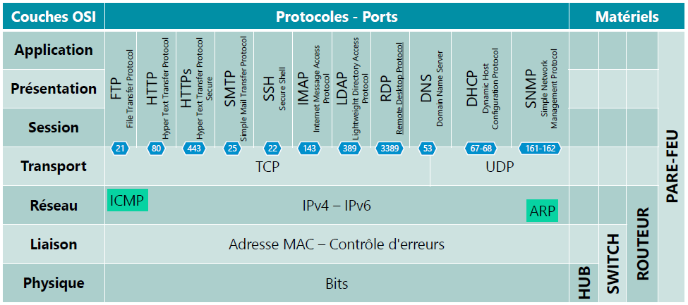

# Le Modèle OSI

Le modèle ***OSI*** (Open System Interconnection) est composé de :

- 7 `couches`indépendantes et communicantes (couches adjacentes)
- Une `couche`est un ensemble de service précis
- représente la communication entre systèmes d’information en réseau
  
Le modèle ***OSI*** explique de façon détaillée la communication entre 2 équipements

>Moyen mnémotechnique pour ce souvenir des `couches`
Pour Le Réseau, Tout Se Passe Automatiquement
(à lire de la `couche`1 à 7)

<figure markdown="1">

</figure>

## <u>Couche par Couche</u>

### 7- APPLICATION (couche applicative)

[Couche Application](7_Couche_Applicative.md)
Point de contact avec les services réseau.

- Communication entre applications,
- Communication entre l’utilisateur et les applications (interface IHM),
- Entrée et Sortie des données.  

### 6- Présentation

[Couche Présentation](6_Couche_Presentation.md)
Elle s’occupe de tout aspect lié à la présentation/traduction des données :

- formatage des données,
- (Dé) chiffrement,
- (Dé) compression,
- encodage…

### 5- Session

[Couche Session](5_Couche_Session.md)
Responsable de l’initialisation de la session, de sa gestion et de sa fermeture.

- Authentification entre les PC,
- Synchronisation des échanges,
- Création de points de contrôle

### 4- Transport

[Couche Transport](4_Couche_Transport.md)
Choix du protocole de transmission et préparation de l’envoi des données.
Elle spécifie le port utilisé par l’application émettrice ainsi que celui de l’application réceptrice.
Elle fragmente les données en plusieurs séquences (ou segments).

- Communication entre mêmes types applications (ports)
- contrôle de flux (segmentation et réduction de l’encombrement)

### 3- Réseau

[Couche Réseau](3_Couche_Reseau.md)
Connexion logique entre les hôtes.
Elle traite de tout ce qui concerne l’identification et le routage dans le réseau.

- Communication entre les PC expéditeurs et destinataires
- Choix de la meilleure route (routage)
- Adressage logique (Adresses IPv4 et IPv6)

### 2- Liaison de données

[Couche Liaison de données](2_Couche_Liaison.md)
Établissement d’une liaison physique entre les hôtes (Point à point).
Elle fragmente les données en plusieurs trames.

- Communication entre noeuds adjacents
- Contrôle d’erreurs et de flux
- Adressage physique (adresse MAC)

### 1- Physique

[Couche Physique](1_Couche_Physique.md)
Transmission du signal

- Conversion des trames en bits,
- Transmission physique des données sur le média (Modulation).

----

## <u>Processus de Transmission/Réception</u>

Quand un hôte A envoi vers un hôte B, le processus d’envoi va de la couche :

Modele OSI

<pre class="mermaid">
    classDiagram
    class Couche{
    Couche : Application
    Couche : Présentation
    Couche : Session
    Couche : Transport
    Couche : Réseau
    Couche : Liaison
    Couche : Physique
    }
</pre>

----

## <u>OSI vs TCP/IP</u>

- Le modèle ***OSI*** a été développé à vocation **normative**.
C’est-à-dire qu’il référence le déroulement de la communication entre 2 hôtes.

- Le modèle ***TCP/IP*** à lui été développé dans un but **descriptif**.
C’est-à-dire qu’il décrit la façon dont se passe la communication en 2 hôtes.

En d’autres termes

- **TCP/IP** : si vous voulez comprendre comment se déroule la communication « sur le terrain ».
- **OSI** : si vous voulez la suite logique et la procédure selon la norme.

<figure markdown="1">

</figure>

!!! warning ""
    Le modèle OSI servira de « plan » pour la création d’un protocole ou d’un matériel réseau

## <u>Les Ports et Protocoles</u>

### La notion de protocole

Selon la définition un protocole est "un ensemble de règles définissant le mode de communication entre deux ordinateurs"  
En reseaux, un protocole est un ensemble de règles permettant de formater et de traiter les données.  
Il s'agit d'un langage commun pour les ordinateurs. l'utilisation de protocoles leurs permet de communiquer même si ils utilisent des logiciels ou du matériels différents.  

Ci dessous en tableau reprenant les differents protocole et ports utilisé par le modèle OSI.  

<figure markdown="1">

</figure>

### La notion de port

Un port est une adresse d'application sur une machine.  

La plupart des machines (serveur ou client) ont des ports ouverts.  

Un serveur web aura, par exemple, le port 80 *ouvert* cela permettra à des personnes de se connecter dessus via ce même port 80.  
Le port 80 sera l'adresse de l'application web.  

quand le nom du site à joindre sera taper dans un navigateur, celui-ci va automatiquement interroger ce port (80).  

!!! tips "visualisation des ports ouverts"
    La manière la plus simple de visualiser les ports ouverts sur une machien est d'utilisé la commande `netstat` sur linux
    === "`netstat -an`"
    === "`netstat -anpe`"
        Permet de visualiser les détails sur le PID, l'utilisateur et le processus
    === "`netstat -antp`"
        Permet de visualiser uniquement les ports TCP

#### Port Commun

| Port             | TCP | UDP | Nom           | Description                                                                                                                  |
| :--------------- | :-- | :-- | :------------ | :--------------------------------------------------------------------------------------------------------------------------- |
| 1                | ✔  | ✔  | tcpmux        | TCP Port Multiplexer (service de multiplexage de TCP port)                                                                   |
| 5                | ✔  | ✔  | rje           | Remote Job Entry (saisie de tâche à distance)                                                                                |
| 7                | ✔  | ✔  | echo          | Service d’écho                                                                                                               |
| 9                | ✔  | ✔  | discard       | Service zéro à des fins de test                                                                                              |
| 11               | ✔  | ✔  | systat        | Informations système                                                                                                         |
| 13               | ✔  | ✔  | daytime       | Saisie de la date et de l’heure                                                                                              |
| 17               | ✔  | ✔  | qotd          | Envoie la citation du jour                                                                                                   |
| 18               | ✔  | ✔  | msp           | Transfère des SMS                                                                                                            |
| 19               | ✔  | ✔  | chargen       | Envoie une séquence de caractères infinie                                                                                    |
| 20               | ✔  |     | ftp-data      | Transmission de données FTP                                                                                                  |
| 21               | ✔  | ✔  | ftp           | Connexion FTP                                                                                                                |
| 22               | ✔  | ✔  | ssh           | Service Secure Shell                                                                                                         |
| 23               | ✔  |     | telnet        | Service Telnet                                                                                                               |
| 25               | ✔  |     | smtp          | Simple Mail Transfer Protocol (protocole simple de transfert de courrier)                                                    |
| 37               | ✔  | ✔  | time          | Protocole temporel lisible par un ordinateur                                                                                 |
| 39               | ✔  | ✔  | rlp           | Resource Location Protocol (protocole de localisation des ressources)                                                        |
| 42               | ✔  | ✔  | nameserver    | Service de noms                                                                                                              |
| 43               | ✔  |     | nicname       | Service d’annuaire WHOIS                                                                                                     |
| 49               | ✔  | ✔  | tacacs        | Terminal Access Controller Access Control System (protocole d’authentification à distance)                                   |
| 50               | ✔  | ✔  | re-mail-ck    | Remote Mail Checking (consultation de messagerie à distance)                                                                 |
| 53               | ✔  | ✔  | domain        | Résolution de nom par DNS                                                                                                    |
| 67               |     | ✔  | bootps        | Services Bootstrap Protocol                                                                                                  |
| 68               |     | ✔  | bootpc        | Bootstrap Client                                                                                                             |
| 69               |     | ✔  | tftp          | Trivial File Transfer Protocol (protocole simplifié de transfert de fichiers)                                                |
| 70               | ✔  |     | gopher        | Recherche de document                                                                                                        |
| 71               | ✔  |     | genius        | Protocole Genius                                                                                                             |
| 79               | ✔  |     | finger        | Transmet les coordonnées des utilisateurs                                                                                    |
| 80               | ✔  |     | http          | Hypertext Transfer Protocol (protocole de transfert hypertexte)                                                              |
| 81               | ✔  |     |               | Torpark : Onion-Routing (non officiel - routage en oignon)                                                                   |
| 82               |     | ✔  |               | Torpark : Control (non officiel)                                                                                             |
| 88               | ✔  | ✔  | kerberos      | Système d’authentification de réseau                                                                                         |
| 101              | ✔  |     | hostname      | NIC Host Name (nom d’hôte NIC)                                                                                               |
| 102              | ✔  |     | Iso-tsap      | ISO-TSAP-Protocol (protocole ISO TSAP)                                                                                       |
| 105              | ✔  | ✔  | csnet-ns      | Mailbox-Mailserver (serveur de messagerie électronique)                                                                      |
| 107              | ✔  |     | rtelnet       | Remote Telnet (Telnet à distance)                                                                                            |
| 109              | ✔  |     | pop2          | Post Office Protocol v2 (protocole de bureau de poste v2) pour la communication par e-mail                                   |
| 110              | ✔  |     | pop3          | Post Office Protocol v3 (protocole de bureau de poste v3) pour la communication par e-mail                                   |
| 111              | ✔  | ✔  | sunrpc        | Protocole RPC pour NFS                                                                                                       |
| 113              |     | ✔  | auth          | Service d’authentification                                                                                                   |
| 115              | ✔  |     | sftp          | Simple File Transfer Protocol (version simplifiée de FTP)                                                                    |
| 117              | ✔  |     | uucp-path     | Transmission de fichiers entre systèmes Unix                                                                                 |
| 119              | ✔  |     | nntp          | Transmission de fichiers au sein de groupes de discussion                                                                    |
| 123              |     | ✔  | ntp           | Service de synchronisation temporelle                                                                                        |
| 137              | ✔  | ✔  | netbios-ns    | Service de noms NETBIOS                                                                                                      |
| 138              | ✔  | ✔  | netbios-dgm   | NETBIOS Datagram Service (service de datagramme NETBIOS)                                                                     |
| 139              | ✔  | ✔  | netbios-ssn   | NETBIOS Session Service (service de session NETBIOS)                                                                         |
| 143              | ✔  | ✔  | imap          | Internet Message Access Protocol (protocole d’accès aux messages électroniques) pour communication par e-mail                |
| 161              |     | ✔  | snmp          | Simple Network Management Protocol (protocole simple de gestion de réseau)                                                   |
| 162              | ✔  | ✔  | snmptrap      | Simple Network Management Protocol Trap (Trap de protocole simple de gestion de réseau)                                      |
| 177              | ✔  | ✔  | xdmcp         | X Display Manager (gestionnaire d’affichage X)                                                                               |
| 179              | ✔  |     | bgp           | Border Gateway Protocol (protocole d’échange de route)                                                                       |
| 194              | ✔  | ✔  | irc           | Internet Relay Chat (discussion relayée par Internet)                                                                        |
| 199              | ✔  | ✔  | smux          | SNMP UNIX Multiplexer (service de multiplexage UNIX SNMP)                                                                    |
| 201              | ✔  | ✔  | at-rtmp       | AppleTalk Routing (routage d’AppleTalk)                                                                                      |
| 209              | ✔  | ✔  | qmtp          | Quick Mail Transfer Protocol (protocole de transfert de courrier rapide)                                                     |
| 210              | ✔  | ✔  | z39.50        | Système d’informations bibliographiques                                                                                      |
| 213              | ✔  | ✔  | ipx           | Internetwork Packet Exchange                                                                                                 |
| 220              | ✔  | ✔  | imap3         | IMAP v3 pour la communication par e-mail                                                                                     |
| 369              | ✔  | ✔  | rpc2portmap   | Coda Filesystem Portmapper (portmapper de systèmes de fichiers Coda)                                                         |
| 370              | ✔  | ✔  | codaauth2     | Coda Filesystem Authentication Service (service d’authentification de systèmes de fichiers Coda)                             |
| 389              | ✔  | ✔  | ldap          | Lightweight Directory Access Protocol (protocole DAP version allégée)                                                        |
| 427              | ✔  | ✔  | svrloc        | Service Location Protocol (protocole de découverte de services)                                                              |
| 443              | ✔  |     | https         | HTTPS (HTTP via SSL/TLS)                                                                                                     |
| 444              | ✔  | ✔  | snpp          | Simple Network Paging Protocol (protocole simple d’appel de réseau)                                                          |
| 445              | ✔  |     | microsoft-ds  | SMB via TCP/IP                                                                                                               |
| 464              | ✔  | ✔  | kpasswd       | Modification de mot de passe pour Kerberos                                                                                   |
| 500              |     | ✔  | isakmp        | Protocole de sécurité                                                                                                        |
| 512              | ✔  |     | exec          | Remote Process Execution (exécution de processus à distance)                                                                 |
| 512              |     | ✔  | comsat/biff   | Client et serveur de messagerie                                                                                              |
| 513              | ✔  |     | login         | Connexion à l’ordinateur à distance                                                                                          |
| 513              |     | ✔  | who           | Whod User Logging Daemon                                                                                                     |
| 514              | ✔  |     | shell         | Remote Shell                                                                                                                 |
| 514              |     | ✔  | syslog        | Unix System Logging Service (service de connexion au système Unix)                                                           |
| 515              | ✔  |     | printer       | Services d’impression : Line Printer Daemon                                                                                  |
| 517              |     | ✔  | talk          | Talk Remote Calling (appel à distance)                                                                                       |
| 518              |     | ✔  | ntalk         | Network Talk (discussion en réseau)                                                                                          |
| 520              | ✔  |     | efs           | Extended Filename Server (serveur de noms de fichiers étendu)                                                                |
| 520              |     | ✔  | router        | Routing Information Protocol (protocole d’information de routage)                                                            |
| 521              |     | ✔  | ripng         | Routing Information Protocol (protocole d’information de routage) pour IPv6                                                  |
| 525              |     | ✔  | timed         | Serveur de temps                                                                                                             |
| 530              | ✔  | ✔  | courier       | Courier Remote Procedure Call (appel de procédure à distance Courier)                                                        |
| 531              | ✔  | ✔  | conference    | Discussion via AIM et IRC                                                                                                    |
| 532              | ✔  |     | netnews       | Netnews Newsgroup Service (service d’actualités Netnews)                                                                     |
| 533              |     | ✔  | netwall       | Diffusions d’urgence                                                                                                         |
| 540              | ✔  |     | uucp          | Unix-to-Unix Copy Protocol (protocole de copie Unix vers Unix)                                                               |
| 543              | ✔  |     | klogin        | Kerberos v5 Remote Login (connexion à distance Kerberos v5)                                                                  |
| 544              | ✔  |     | kshell        | Kerberos v5 Remote Shell (Shell à distance Kerberos v5)                                                                      |
| 546              | ✔  | ✔  | dhcpv6-client | DHCP v6 Client                                                                                                               |
| 547              | ✔  | ✔  | dhcpv6-server | DHCP v6 Server                                                                                                               |
| 548              | ✔  |     | afpovertcp    | Apple Filing Protocol (protocole AppleShare) via TCP                                                                         |
| 554              | ✔  | ✔  | rtsp          | Commande de flux                                                                                                             |
| 556              | ✔  |     | remotefs      | Remote Filesystem (système de fichiers à distance)                                                                           |
| 563              | ✔  | ✔  | nntps         | NNTP via SSL/TLS                                                                                                             |
| 587              | ✔  |     | submission    | Message Submission Agent (agent de soumission de message)                                                                    |
| 631              | ✔  | ✔  | ipp           | Internet Printing Protocol (protocole d’impression internet)                                                                 |
| 631              | ✔  | ✔  |               | Common Unix Printing System (non officiel - système d’impression Unix commun)                                                |
| 636              | ✔  | ✔  | ldaps         | LDAP via SSL/TLS                                                                                                             |
| 674              | ✔  |     | acap          | Application Configuration Access Protocol (protocole d’accès à la configuration d’applications)                              |
| 694              | ✔  | ✔  | ha-cluster    | Service Heartbeat                                                                                                            |
| 749              | ✔  | ✔  | kerberos-adm  | Administration Kerberos v5                                                                                                   |
| 750              |     | ✔  | kerberos-iv   | Services Kerberos v4                                                                                                         |
| 873              | ✔  |     | rsync         | Services de transfert de fichiers rsync                                                                                      |
| 992              | ✔  | ✔  | telnets       | Telnet via SSL/TLS                                                                                                           |
| 993              | ✔  |     | imaps         | IMAP via SSL/TLS                                                                                                             |
| 995              | ✔  |     | pop3s         | POP3 via SSL/TLS                                                                                                             |
| Registered Ports |     |     |               |                                                                                                                              |
| Port             | TCP | UDP | Nom           | Description                                                                                                                  |
| 1080             | ✔  |     | socks         | Proxy SOCKS                                                                                                                  |
| 1433             | ✔  |     | ms-sql-s      | Serveur Microsoft SQL                                                                                                        |
| 1434             | ✔  | ✔  | ms-sql-m      | Moniteur Microsoft SQL                                                                                                       |
| 1494             | ✔  |     | ica           | Client Citrix ICA                                                                                                            |
| 1512             | ✔  | ✔  | wins          | Windows Internet Name Service                                                                                                |
| 1524             | ✔  | ✔  | ingreslock    | Ingres DBMS                                                                                                                  |
| 1701             |     | ✔  | l2tp          | Protocole de tunnelisation de niveau 2/transfert de couche 2                                                                 |
| 1719             |     | ✔  | h323gatestat  | H.323                                                                                                                        |
| 1720             | ✔  |     | h323hostcall  | H.323                                                                                                                        |
| 1812             | ✔  | ✔  | radius        | Authentification RADIUS                                                                                                      |
| 1813             | ✔  | ✔  | radius-acct   | Accès RADIUS                                                                                                                 |
| 1985             |     | ✔  | hsrp          | Cisco HSRP                                                                                                                   |
| 2008             | ✔  |     |               | Teamspeak 3 Accounting (non officiel)                                                                                        |
| 2010             |     | ✔  |               | Teamspeak 3 Weblist (non officiel)                                                                                           |
| 2049             | ✔  | ✔  | nfs           | Système de fichiers en réseau                                                                                                |
| 2102             | ✔  | ✔  | zephyr-srv    | Serveur Zephyr                                                                                                               |
| 2103             | ✔  | ✔  | zephyr-clt    | Client Zephyr                                                                                                                |
| 2104             | ✔  | ✔  | zephyr-hm     | Gestionnaire d’hôte Zephyr                                                                                                   |
| 2401             | ✔  |     | cvspserver    | Concurrent Versions System (système de gestion de versions)                                                                  |
| 2809             | ✔  | ✔  | corbaloc      | Common Object Request Broker Architecture (architecture logicielle pour le développement de composants et d’object requests) |
| 3306             | ✔  | ✔  | mysql         | Service de base de données MySQL (pour MariaDB également)                                                                    |
| 4321             | ✔  |     | rwhois        | Remote Whois Service (service Whois à distance)                                                                              |
| 5999             | ✔  |     | cvsup         | CVSup                                                                                                                        |
| 6000             | ✔  |     | X11           | X Windows System Services (services système pour Windows X)                                                                  |
| 11371            | ✔  |     | pgpkeyserver  | Serveur de clés publiques pour PGP                                                                                           |
| 13720            | ✔  | ✔  | bprd          | Symantec/Veritas NetBackup                                                                                                   |
| 13721            | ✔  | ✔  | bpdbm         | Symantec/Veritas Database Manager                                                                                            |
| 13724            | ✔  | ✔  | vnetd         | Symantec/Veritas Network Utility                                                                                             |
| 13782            | ✔  | ✔  | bpcd          | Symantec/Veritas NetBackup                                                                                                   |
| 13783            | ✔  | ✔  | vopied        | Symantec/Veritas VOPIE                                                                                                       |
| 22273            | ✔  | ✔  | wnn6          | Conversion Kana/Kanji                                                                                                        |
| 23399            |     |     |               | Skype (non officiel)                                                                                                         |
| 25565            | ✔  |     |               | Minecraft                                                                                                                    |
| 26000            | ✔  | ✔  | quake         | Quake et autres jeux multijoueurs                                                                                            |
| 27017            |     |     |               | MongoDB                                                                                                                      |
| 33434            | ✔  | ✔  | traceroute    | Suivi de réseau                                                                                                              |

