# Adressage IPv4

## <u>Explication</u>

Une adresse IPv4 est constitué de :

- 32 `bits` découpés en 4 nombres.
- 4 nombres correspondant à 4 octets compris entre 0 & 255.
- chaque octets est séparé par des "."
- Un identifiant réseau (*ID_Réseau*) commun à l'ensemble des hötes du réseau
- Un identifiant hôte (*ID_Hôtes*) unique à la machine dans le réseau  

<figure markdown="1">
  
</figure>

!!! tips ""
    Pour reprendre l'adresse IP du tableau : 192.168.1.1
    === "l'***ID_Réseau***"
        est 192.168.1  
    === "l'***ID_Hôte***"
        est .1 (situé a la fin de l'adresse)  

    Cela est definie par le [masque de sous-réseau](.)  

Sur chaque `Réseau` une plage d'hôte sera definie en fonction du masque réseau et du nb de bits disponible.  

<u>Mettons cela en demonstration:</u>  

!!! inline end warning ""
    Rappel un octet ne peut contenir que 255 bits maximum  

Dans le cas du tableau ci-dessus, le masque étant en 255.255.255.0 nous voyons que seul le dernier octet est disponible (à 0) cela signifie que le réseau peut avoir 255 hôtes disponible.  

Cependant sur chaque réseau (et sous-réseau) 2 adresses son non adressable et non exploitable.  
il s'agit de la .0 & .255  

## <u>Les classes</u>

Il existe 4 classes pour les adresses IPv4  

<figure markdown="1">
| Classe | Masque réseau | Adresses réseau             |
| :----: | :------------ | :-------------------------- |
|   A    | 255.0.0.0     | 1.0.0.0 - 126.255.255.255   |
|   B    | 255.255.0.0   | 128.0.0.0 - 191.255.255.255 |
|   C    | 255.255.255.0 | 192.0.0.0 - 223.255.255.255 |
|   D    | 240.0.0.0     | 224.0.0.0 - 239.255.255.255 |
</figure>
Pour cela nous allons faire appel a la notion d'*ID_Réseau* & d'*ID_Hôtes*

***ID_Réseau*** : identifie le réseau de l'adresse  
***ID-Hôte*** : nb de machines pouvant être rattaché au réseau  

### Classe A Privées et Publiques

<figure markdown="1">
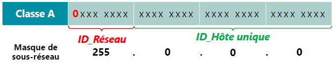
</figure>
L'*ID_Réseau est compris entre :

- Classe entière : 0 et 127
- Classe utilisable : 1 et 126

L'**ID_Hôte contient :  
Nb `bits` @IP - Nb `bits`*ID_Réseau*  
$32 - 8 = 24$  
$2^{24}-2 = 16.777.214$ hôtes possibles
<figure markdown="1">
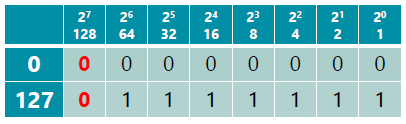
</figure>

### Classe B Privées et Publiques

<figure markdown="1">
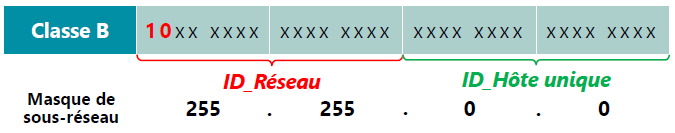
</figure>
L'*ID_Réseau est compris entre :

- Classe entière & utilisable: 128 et 191

L'**ID_Hôte contient :  
Nb `bits` @IP - Nb `bits`*ID_Réseau*  
$32 - 16 = 16$  
$2^{16}-2 = 65.534$ hôtes possibles

<figure markdown="1">
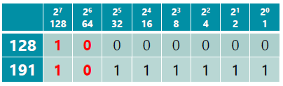
</figure>

### Classe C Privées et Publiques

<figure markdown="1">
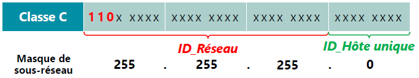
</figure>
L'*ID_Réseau est compris entre :

- Classe entière & utilisable : 192 et 223

L'**ID_Hôte contient :  
Nb `bits` @IP - Nb `bits`*ID_Réseau*  
$32 - 24 = 8$  
$2^{8}-2 = 254$ hôtes possibles

<figure markdown="1">
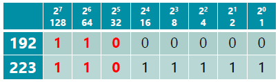
</figure>

### Classe D Multidiffusion

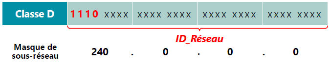

L'*ID_Réseau est compris entre :

- Classe entière & utilisable : 224 et 239

L'**ID_Hôte contient :  
Nb `bits` @IP - Nb `bits`*ID_Réseau*  
La Classe D ne contient aucun hôtes  

<figure markdown="1">
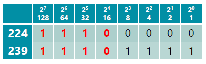
</figure>

### Résumé

<figure markdown="1">
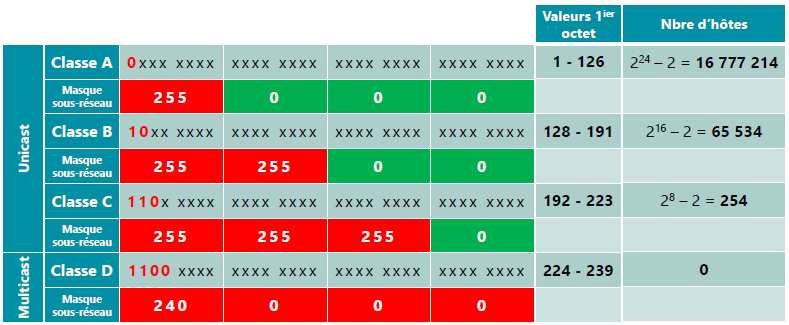{width=650}
</figure>

## <u>Privé et Publique</u>

### Adresse Privé

Les adresses privées ne sont utilisables que dans les réseaux locaux privés et ne sont pas routables sur Internet
Pour sortir sur le web un routeur utilisera le principe de [NAT/PAT](.)

<figure markdown="1">
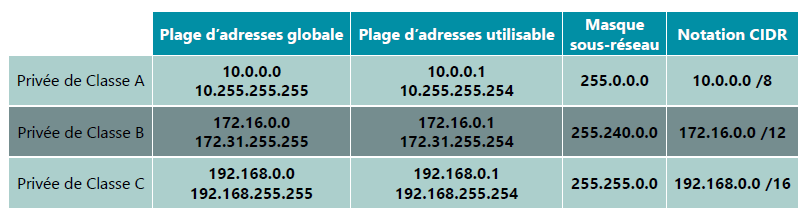
</figure>

### Publique

Les adresses publique sont ouverte sur l'extérieur (publique), elle permet d'accéder à internet.  
Les autres ordinateurs connectés au web utilisent l'IP Publique pour communiquer avec les appareils de votre réseau.  

Dans un réseau domestique, le routeur sert d'intermédiaire entre les appareils de votre réseau et le web. Il gère toutes les connexions au nom des équipements de votre réseau.

## <u>Adresse de diffusion ou Broadcast</u>

Chaque réseau possède une adresse de diffusion dit *Broadcast*  
Chaque hôte du réseau répond à cette adresse, cela permet d'envoyer un paquet à tout le réseau.  

En général cette adresse se termine par `255` par rapport au masque de sous-réseau.  

Ce qui donne:  

- 192.168.1.255 est le broadcast du réseau 192.168.1.0 avec un masque 255.255.255.0 ou /24
- 10.0.255.255 est le broadcast du réseau 10.0.0.0 avec un masque 255.255.0.0 ou /16

## <u>Adresse APIPA</u>

APIPA pour : **A**utomatic **P**rivate **I**nternet **P**rotocol **A**ddressing (Adressage Privé IP Automatique).  
Il s'agit d'adresse d'autoconfiguration.  
Généralement attribué à la carte réseau quand le serveur DHCP est HS.  
Ces adresses ne sont :  

- Pas routables sur Internet
- Non distribuables par un DHCP
- Non déclarées dans un serveur DNS

L'adresse de réseau logique est :  

- 169.254.0.0/16

## <u>L'en-tête Ipv4</u>

Pour envoyer un paquet IP, il faut ajouter une en-tête contenant les informations nécessaires pour arriver à destinations.  

<figure markdown="1">
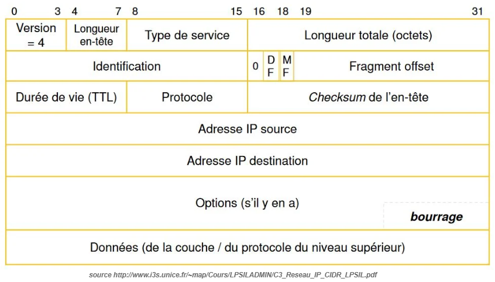{width=500}
<figcaption>en-tête IPv4 empilé</figcaption>
</figure>

Explication des différents champs :  

- <u>Version (4bits)</u> indique la version d'IP actuellement utilisée.
- <u>Longueur en-tête - IP Header Length (IHL) (4bits)</u> indique le nombre de mots de 32 bits dans l'en-tête IP
- <u>Type de service - Type-of-service (8bits)</u> spécifie comment un protocole de couche supérieure particulier voudrait que le datagramme actuel soit traité. Les datagrammes peuvent se voir attribuer différents niveaux d'importance via ce champ
- <u>Longueur totale (16bits)</u> spécifie la longueur du paquet IP entier, y compris les données et l'en-tête, en octets
- <u>Le champs d'identification (16bits)</u> contient un entier qui identifie le datagramme actuel. Ce champ est utilisé pour aider à reconstruire des fragments de datagrammes
- <u>Flags (4bits; un n'est pas utilisé)</u> contrôle si les routeurs sont autorisés à fragmenter un paquet et indique les parties d'un paquet au récepteur.
- <u>TTL - Time-to-live (8bits)</u> maintient un compteur qui décrémente progressivement à zéro, point auquel le datagramme est rejeté. Cela empêche les paquets de boucler sans fin.
- <u>Protocole (8bits)</u> indique quel protocole de couche supérieure reçoit les paquets entrants une fois le traitement IP terminé.
- <u>Header Checksum (16bits)</u> permet de grantir l'intégrité de l'en-tête IP.
- <u>Adresse IP source (32bit)</u> spécifie le noeud d'envoi
- <u>Adresse IP de destination (32bits)</u> spécifie le noeud de réception
- <u>Options (32bits)</u> permet à IP de prendre en charge diverses options, telles que la sécurité
- <u>Le champ de données (32bits)</u> contient des informations de couche supérieure

Ci-dessous une capture Wireshark&reg; d'une trame IPv4  

<figure markdown="1">
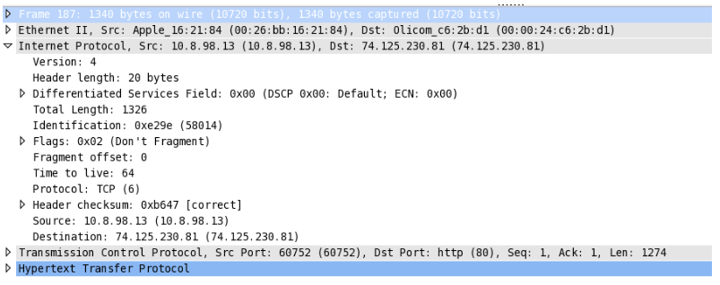{width=600}
<figcaption>capture ipv4 Wireshark&reg;</figcaption>
</figure>

!!! note "1ere Couche"
    === "Version"
        4
    === "Header lenght : Longueur de l'en-tête"
        20 octets (la vraie valeur est 5, mais wireshark l'interprète directement)
    === "TOS -Type Of Service"
        0
    === "Longueur Totale : Total Length"
        1326 octets

!!! note "2eme Couche"
    === "IPID"
        58014
    === "Flag"
        2
    === "Fragment offset"
        0

!!! note "3eme Couche"
    === "TTL"
        64
    === "Protocole"
        6 soit TCP
    === "Checksum"
        Il est correct !

!!! note "4eme Couche"
    === "Adresse IP Source"
        10.8.98.13
    === "Adresse IP destination"
        74.125.230.81