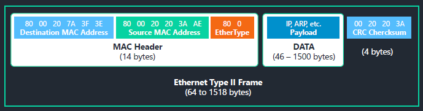
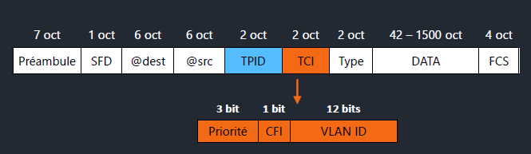

# Trame Ethernet

## <u>Trame 802.3</u>

La trame ethernet est une technologie de communications pour les réseaux locaux.  
Elle à été standardisé par l'organisation IEEE sous le nom IEEE 802.3  

!!! success ""
    Ethernet est aujourd'hui la technologie la plus utilisée sur des supports filaires,  
    qu'il s'agisse de câble électrique ou de fibre optique.

Pour que les machines communiquent, Ethernet définit un format commun, structuré en plusieurs champs.  

<figure markdown="1">

</figure>

- Destination MAC Address : il s'agit de l'adresse mac de destinations sur 6 octets
- Source MAC Address : Toujours sur 6 octets il s'agit de l'adresse MAC de la source de la transmission
- EtherType : Sur 2 octets, ils definissent le protocole de niveau supérieur utilisé dans le champs "DATA" de la trame
- DATA : Celle-ci à une taille minimale et maximale imposé pour les données à transporter.  
La taille minimale imposée est une conséquence directe de la méthode d'accès utilisée, CSMA/CD, qui nécessite une durée minimale de transmission pour chaque message
- CRC Checksum : Champ utilisé par le récepteur afin de déterminer si la trame a été impactée par une erreur de transmission.

## <u>Trame 802.1Q</u>

La norme 802.1Q permet l'utilisation de VLAN, en ajoutant 4 octets dans l'entête de la trame juste après les adresses MAC destination et source.  
On parle de trame Ethernet "taggé" ou VLAN "taggé", réparties dans 2 champs distincts  

!!! success ""
    <figure markdown="1">
    
    </figure>
    === "TPID"
        Tag Protocol Identifier détermine le type du tag
    === "TCI"
        Composé de 3 parties:  
        === "Priorité"
            Ce champs permet de réaliser une priorisation des flux.  
            Le champs étant sur 3 bits il est possible de déterminer 7 niveaux de priorité.
        === "CFI"
            Ce bit permet de déterminer si le tag s'applique à une trame de type Ethernet ou Token-Ring.
        === "VID"
            Vlan Identifier. Comme son nom l'indique c'est l'identifiant du VLAN.  
            L'appartenance d'une trame à un VLAN se fait grâce à cet identifiant.  
            Le champs étant sur 12 bits, il est possible de déclarer jusqu'à 4096 VLANs.

