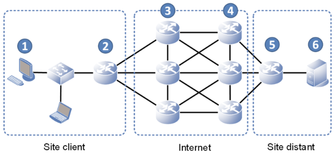

# Routeur

## <u>Principe du routage</u>

Le routage est la fonctionnalité qui permet d'acheminer les données d'un point A vers un point B situé dans un réseau distant.  
Le routage, effectué par les routeurs, se base sur l'adresse IP de destination contenu dans le paquet reçu.  

<figure markdown="1">
{width=400}
</figure>

1. Le PC envoi un paquet IP à destination du serveur de droite.  
   Ce paquet est envoyé à sa passerelle par défaut (le premier routeur de gauche, cf explication précédente)
2. La passerelle (le routeur) reçoit le paquet, extrait l’adresse IP de destination (le serveur de droite) et la compare à sa table de routage. La table lui indique d’envoyer ce paquet à un routeur voisin précis
3. Idem que l’étape 2
4. Idem que l’étape 2
5. Le routeur reçoit le paquet : il extrait l’adresse IP de destination et la compare à sa table de routage.  
   La table lui indique cette fois-ci qu’une de ses interfaces est directement dans le réseau de destination (qui contient l’adresse IP du serveur).  
   Le routeur envoi le paquet IP à la destination (le serveur de droite) sans passer par un autre routeur.  

