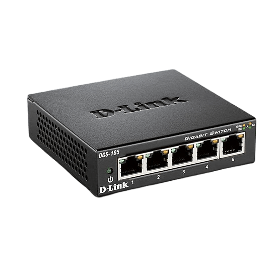
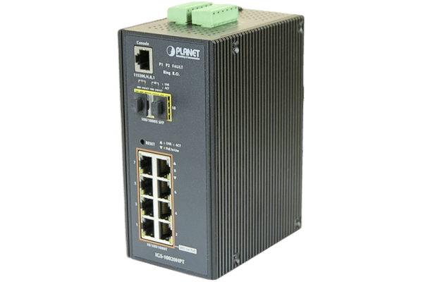
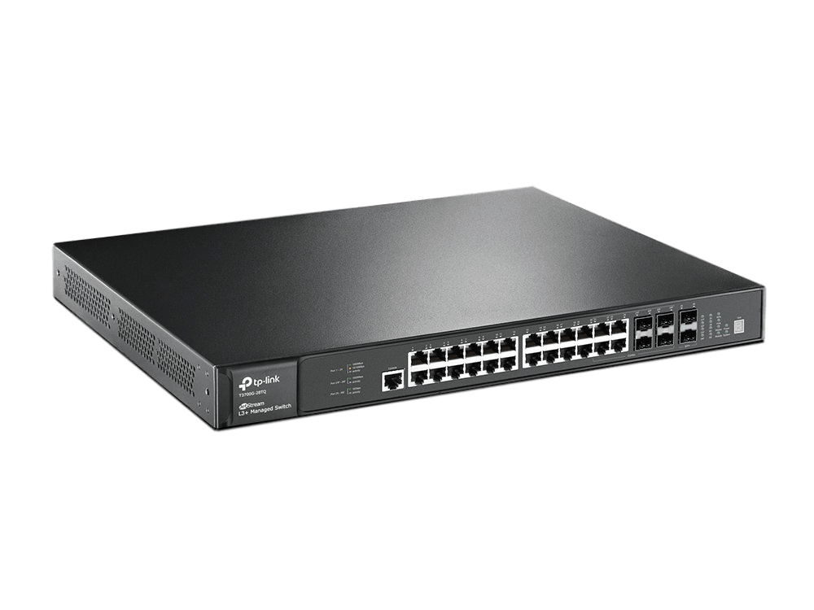
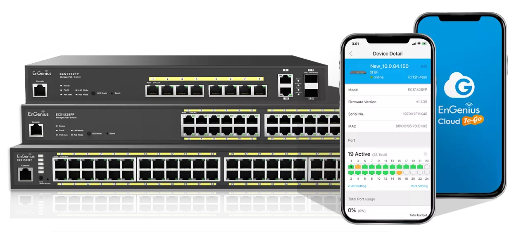
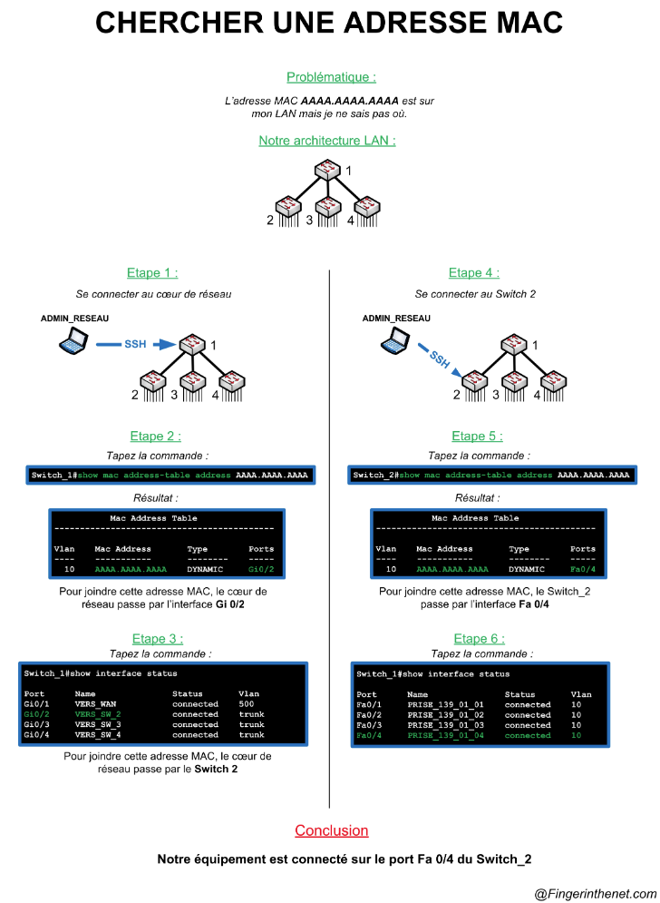
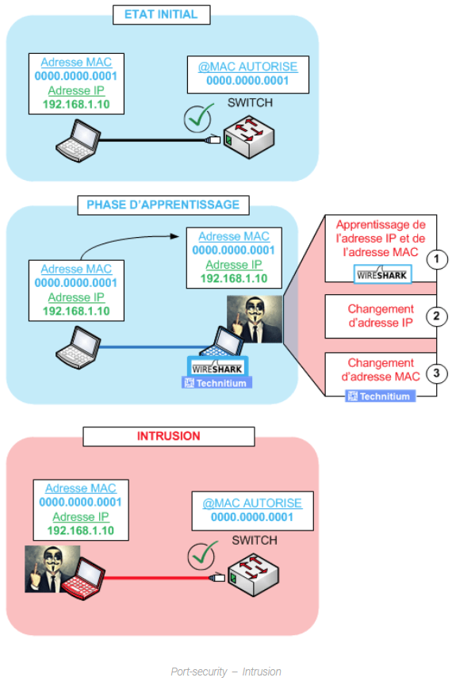

# <span style="color: #3498DB;">Le Switch</span>

<figure markdown="1">
{width=400}
</figure>

### <span style="color: #1ABC9C;">Principe</span>

Un switch est un composant essentiel d'un réseau informatique.  
Il permet de connecter plusieurs appareils (ordinateurs, imprimantes, des serveurs, etc.) au sein d'un réseau local (LAN - Local Area Network) afin de les faires communiquer entre eux.  
Le switch contibue à la sécurité du réseau (en contrôlant les intrusions) et à la protection des données via le réseau.  
Une fois paramètré, un switch ne distribue l'information qu'aux utilisateurs prédéfinis en fonction de la typologie de collaborateurs et/ou de certaines restrictions.  

### <span style="color: #1ABC9C;">Les différents types de switches</span>

- <u>Type "différé" (store and forward)</u> : modèle de switch standard, il stocke les données réseau pour les analyser, permettant de détecter d'éventuelles erreurs avant des les transmettres.
- <u>Type "direct" (cut through)</u> : lit l'adresse de destinations et transmet sans analyser les données.
- <u>Type "fragment free"</u> : Il s'agit d'un mélange entre les 2 méthodes précedente, il effectuent une détection d'erreur sans stocké les données cela permet d'améliorer la rapidité de transmission.
- <u>Type "adaptive and through"</u> : Il selectionne automatiquement un des modes cités précédemment, en fonction des erreurs constatées.

A cela s'ajoute les différents niveau de switch :  

{align=right width=100}  
!!! note "Switch niveau 1"
    ***Non-paramétrables*** : Ce type de switch ne dispose pas d'interface de paramétrage, ils se contentent uniquement de diffuser les données sur les différents ports présent.  

----

{align=left width=150}  
!!! note "Switch niveau 2"
    ***Paramétrables*** via une interface web ou en ligne de commande  

----

{align=right width=150}
!!! note "Switch de niveau 3"
    ***Paramétrables*** Ils permettent de mettre en place un routage interne selon les adresses IP et les adresses MAC

----

{align=left width=150}
!!! note "Switch Cloud"
    ***Paramétrables*** Ils permettent de réaliser les mêmes actions que les autres switches mais l'interface est consultable à distance sur tous types d'appareil. Fonctionne via un système de cloud sécurisé.

## <span style="color: #F39C12;"><u>La Table CAM</u></span>

C.A.M : Content-Addressable Memory  

La table CAM est la base de référence d'un switch en terme de commutation de trame.  

**Commutation d'une trame** = Switch = Niveau 2 = **Table CAM via adresse MAC**  
**Routage d'un paquet** = Routeur = Niveau 3 = **Table de routage via adresse IP**  

Cela lui permet de savoir quelle adresse MAC va sur quel port.  

!!! warning "Il ne faut pas confondre"
    === "Table ARP"
        Relation entre adresse IP et une adresse MAC
    === "Table CAM"
        Relation entre adresse MAC et un numéro de port !

### <span style="color: #1ABC9C;">Présentation de la table CAM</span>

Principe de fonctionnement :  

Un Switch recoit une trame d'un périphériques :  

- Il regarde l'adresse MAC de destination dans la trame  
- Il regarde dans sa table CAM et trouve :
  - XXXX:XXXX:XXXX:XXXX via FastEthernet 0/1
- Il sait donc que l'adresse MAC xxxx.xxxx.xxxx.xxxx est sur le port Fa0/1
- Il transfère la trame sur le port Fa0/1

Voyons comment la table CAM se remplit.  

#### <span style="color: #0C76F5;">Entrée Statique</span>

Une solution à mettre en place avec prudence et uniquement lorsque aucun autres choix n'est possible.  

```ios
Sw(config)# mac address-table static xxxx.xxxx.xxxx.xxxx vlan 10 int Fa0/1
```

#### <span style="color: #0C76F5;">Entrée Dynamique</span>

!!! warning inline end ""
    Par défaut les switchs Cisco remplissent leur table dynamiquement.

Un switch utilise sa table CAM pour distribuer les trames qu'il reçoit uniquement aux destinataires concernés.  
Il enregistrera l'*adresse MAC source* de toutes les trames dans la table CAM  
Pour désactiver le remplissage automatique de la table CAM de votre équipement, utilisez la commande suivante:  

```IOS
Switch(config)# mac address-table learning vlan
```

#### <span style="color: #0C76F5;">Expiration des entrées</span>

Par défaut l'expiration des entrées est reglée sur :  

- 300s pour un switch
- 14400s pour un routeur

Pour le changer :  

```IOS
Switch(config)# mac adress-table aging-time 300
```

### <span style="color: #1ABC9C;">Chercher une adresse mac sur un réseau LAN</span>

<figure markdown="1">
{width=600}
</figure>

## <span style="color: #F39C12;"><u>Les ports</u></span>

### <span style="color: #1ABC9C;">Mode</span>

Sur un port de switch Cisco on rencontre deux modes pour les ports:  
Voir fiche [VLAN](./VLAN.md)

- Access : port qui ne transporte des informations que d'un seul VLAN. A priori, ce type de port connectera un hôte terminal, une station de travail ou un serveur.  
- [Trunk](VLAN.md) : Il s'agit d'un port qui transporte des informations de plusieurs VLANs. On y connectera un autre switch , un routeur ou un serveur possédant une 
  carte réseau IEEE 802.1q (configuré en port "Trunk").  
  Un port "Trunk" ajoute des étiquettes au trafic puisqu'il est destiné à un autre switch.  
  Le VLAN natif est celui pour lequel il n'y aura pas d'étiquette ajoutée.  
  Ce paramètre se définit sur le port "Trunk"  

### <span style="color: #1ABC9C;">Sécurité</span>

En plus des méthodes, detaillé après, des gestes simples peuvent augmenter rapidement la sécurité :  

- Mettre un mot de passe sur toutes les lignes d'accès et les différents modes du switch.
- Utiliser le protocole SSH
- Sortir les ports du VLAN 1 Natif
- Désactiver les ports non utilisés du switch

Afin de sécuriser l'accès physique à notre réseau, nous pouvons utiliser deux méthodes :

- Port-Security : Sécurisation de nos ports via adresse MAC
- Port-based authentication : Sécurisation de nos ports via le protocole 802.1x

#### <span style="color: #0C76F5;">Le Port-Security</span>

Les adresses MAC permettent d'identifier une carte réseau.  
le Port-security se base sur ces adresses pour autoriser ou non une connexion sur un port.  

Le port-security comporte 2 modes de fonctionnements: 

- le mode statique
- le mode dynamique

Il existe 3 types de réactions si une connexion se présente avec une MAC non autorisée via l'option `violation`:

!!! note ""
    === "Shutdown"
        Le port va se mettre en mode `ERR-DISABLE`. Une action humaine sera nécessaire pour remettre le port en état de fonctionner.  
        Le switch garde une trace de cette violation.
    === "Restrict"
        Le port va dropper toutes les trames reçues par cette adresse MAC. Il traitera toujours les trames possédant une adresse MAC autorisée.  
        Le switch garde une trace de cette violation.
    === "Protect"
        Identique au mode "restrict"  
        Le switch ne garde pas de trace des violations.

##### <u>La configuration</u>

La configuration des différents mode est expliqué sur la page [Cisco](./)

##### <u>La faiblesse du port-security</u>

Pour une personne malveillante, un changement d'adresse MAC peut-être facilement faisable.  
Pour prouver cela je vais reprendre l'exemple posté sur le site [fingerinthenet](https://www.fingerinthenet.com/port-security/)  

Exemple: Une personne malveillante veut se connecter à notre réseau.  
Il va donc devoir prendre la place de quelqu'un afin d'être sûr que le port soit ouvert et d'être dans un vlan fonctionnel.  
Pour ce faire il va débrancher un client du réseau afin de faire un point à point avec ce dernier.  

1. Grâce au logiciel Wireshark&reg;, il va apprendre l'adresse IP et l'adresse MAC du client.
2. Il va s'attribuer l'adresse IP du client
3. Il va s'attribuer l'adresse MAC du client via un logiciel (Technitium)
4. Il ne lui reste plus qu'à se connecter au réseau et le tour est joué !

<figure markdown="1">
{width=360}
</figure>

##### <u>Conclusion</u>

Le port-security est une méthode permettant de sécuriser l'accès au réseau.  
Cette solution est facile à mettre en à mettre en place et bloquera une personne lambda souhaitant se connecter au réseau.  

#### <span style="color: #0C76F5;">Port-Based Authentification</span>

Il s'agit d'un protocole plus fiable que le port-security.  

!!! inline end success ""
    <u>Client:</u> doit exécuter le protocole 802.1x afin de pouvoir s'authentifier  
    <u>Switch:</u> sers de lien entre le Serveur Radius et le client EAPoL  
    <u>Serveur:</u> Authentifie le Client  

- Avant l'authentification le protocole 802.1x ne laissant passer que les trames [EAPoL](./img/Extensible%20Authentication%20Protocol%20—%20Wikipédia.pdf) (Extensible Authentification Protocol Over LAN)
- Après l'authentification le protocole 802.1x laissera passer tout le trafic.  

##### <u>Configuration</u>

La configuration est expliqué sur la page [Cisco](./)

## <span style="color: #F39C12;"><u>Accès à distance sécurisé</u></span>

Afin de ce connecter à distance, le Telnet (23) étant non chiffré, le protocole SSH (22) sera à privilégier plutot que le Telnet.  

Pour la connexion à distance via SSH ce reporter à la page [Cisco](./)  

