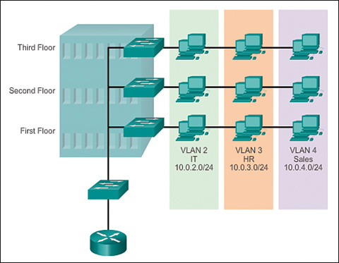
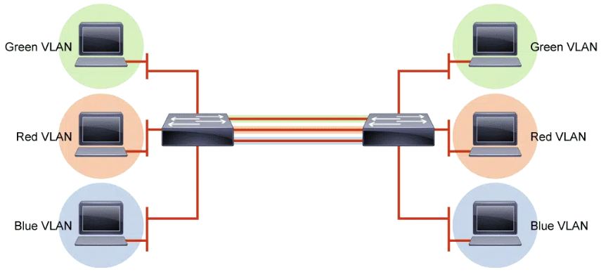
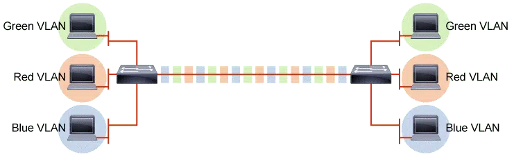
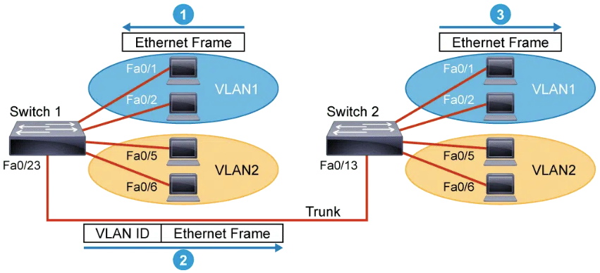
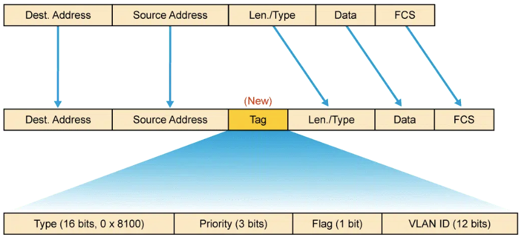

# VLAN: Virtual Local Area Network

<figure markdown="1">

</figure>

## <u>Présentation des VLANs</u>

Les VLANs permettent de créer des réseaux logiques isolés dans un réseau physique possédant leurs propre plage d'IP unique, limitant les diffusions de broadcast, optimisant la gestion de la bande passante et réduisant les risques de collisions.  
Ils sont défini dans la [RFC 2674](https://www.ietf.org/rfc/rfc2674.txt).  

## Avantages des VLANs

1. Réduction du Broadcast: En isolant les groupes utilisateurs dans des réseaux logiques, un groupe utilisateur ne pourra communiquer qu'avec les machines au sein de son groupe, réduisant ainsi les diffusions de broadcast de niveau 2 (envoi de requête arp sur chaque élément du réseau)
2. Optimisation de la bande passante: En limitant le broadcast les VLAN optimisent la bande passante, ce qui réduit les temps de latence
3. Gestion des utilisateurs par fonction ou service: Ils permettent de regrouper les utilisateurs, facilitant la gestion du réseau. Les administrateurs peuvent donc définir des politiques de sécurité, de qualité de service [QoS](..) ou de bande passante pour chaque VLAN.
4. Amélioration de la sécurité: Chaque VLAN étant considéré comme un réseau distinct il est donc possible de définir des politiques de sécurité spécifique et ainsi de limiter l'accès aux ressources du réseau
5. Réduction des couts: Un switch peut prendre en charge plusieurs VLAN

## Types de VLAN

Il existe différents types de VLAN.  
Certains types de VLAN sont définis par les classes de trafic.  
D'autres types sont définis par leur fonction spécifique.  

### VLAN de données ou utilisateur

Cetype de VLAN est un VLAN "normal", il est celui qui a été configuré pour rendre une segmentation logique du switch.  
La numérotation des VLANs est disponible sur 12 bits.  
Chaque modèle de switch aura ses limites en nombre de VLAN à créer et à gérer.  
Pour connecter des utilisateurs et leurs services, on evite d'utiliser le VLAN 1.  
Un VLAN acheminant du trafic de voix ou de gestion ne peut pas en faire partie, il est d'usage de séparer le trafic de voix et de gestion.  

### VLAN par défaut

!!! info inline end ""
    Chez CISCO le Vlan par défaut est le 1
    Cela n'est pas forcément vrai chez les autres fabricants

Par défaut le VLAN 1 est celui qui est assigné à tous les ports d'un switch tant qu'ils n'ont pas été configurés autrement.  
Cela signifie que tous les autres types de VLANs (utilisateur, gestion et natif, etc.) sont membres du VLAN 1 par défaut.
Cela signifie aussi que tous les ports appartiennent au même domaine de diffusion, cela permet à n'importe quel périphérique connecté de communiquer avec d'autre périphériques eux-même connecté au domaine de diffusion.  
Le VLAN 1 ne peut pas être renommé ni supprimé.  
Par défaut, tout le trafic de contrôle de couche 2 est associé au VLAN 1  

### VLAN Natif

Un vlan natif n'intervient que lorsque l'on configure un port "Trunk".  
Quand un port est un mode "Trunk", le switch insère dans la trame le numéro de VLAN approprié.  

Toutes les trames passant par un "Trunk" sont ainsi "taggé" sauf les trames appartenant au VLAN natif.  
Ce type de VLAN existe pour assurer une inter-opérabilité avec du trafic ne supportant pas les "tag".  
Les VLAN natifs sont définis dans la spécification IEEE 802.1Q pour assurer la compatibilité avec le trafic non taggé.  

!!! inline end warning ""
    Il est recommandé de changer le numéro du VLAN natif

### VLAN de gestion

C'est un VLAN spécifique attribué aux switchs afin d'être accessibles via une IP (ICMP,Telnet, SNMP, HTTP).  

Qu'il y est ou non une interface physique appartenant au VLAN de gestion, on joindra le switch en IP via une interface virtuelle de type VLANx.  
Tous ports "access" associés au VLANxrépondent en IP pour l'interface virtuelle VLANx.

En bonne pratique de configuration, on distinguera des autres VLAN en changeant donc le numéro du VLAN de gestion.  

Dans le cas d'une tempête de broadcast ou d'un souci de spanning-tree, l'administrateur doit toujours avoir accès au matériel pour résoudre les eventuelles problèmes via ce VLAN.  

Une autre bonne raison de séparer le VLAN de gestion est de séparer logiquement les périphériques "dignes de confiance" des autres.  
Il s'agit alors d'appliquer les règles de sécurité nécessaires pour éviter que des utilisateurs classiques ou tout simplement "non-autorisés" accèdent au matériel.  

### VLAN Voix (Voice)

Afin d'assurer la QoS (Qualité de Service) des communications vocales, le VLAN Voice se configure sur un port Access et crée une sorte de mini-Trunk vers un téléphone IP.  
Un VLAN distinct est requis car un le trafic voix nécessite:  

- La bande passante consolidée
- La priorité de QoS élevée
- La capacité d'éviter la ongestion
- Le délai inférieur à 150ms de la source à la destination

<figure markdown="1">
{width=360}
</figure>

## <u>Table d'association aux VLANs</u>

L'association d'un VLAN à un port se fait par une table d'association.  
Ainsi les VLANs doivent être déclarés sur le matériel.  
L'association à un VLAN peut se faire en fonction :  

- du port;
- d'une adresse;
- MAC;
- d'un protocole;
- ou d'un sous-reseau IP.

Un port Trunk sera associé aux VLANs qu'il autorise.

### VLAN par port

C'est le mode d'association par défaut.  

L'association des trames à un VLAN se fait en fonction du PVID du port Access sur lesquels sont branchées les stations.  
Cette solution permet d'affecter précisément un VLAN en fonction du port sur lequel est branché une machine.  
Un pirate ne pourra donc avoir accès à un VLAN spécifique au niveau 2 du modèle OSI que si il se branche sur un port  correspondant au VLAN visé.  

L'inconvénient de ce mode d'affectation est principalement sa lourdeur d'administration. En effet dans le cas ou un périphérique est déplacé et que l'on souhaite qu'il soit toujours dans le même VLAN il faudra configurer le nouveau port.  
Cependant il est possible de simplifier l'administration des ports en couplant cette solution avec de l'authentification 802.1x afin que le nouveau port se configure dynamiquement en fonction de la personne authentifiée.  

### VLAN par adresse MAC

Ce mode est situé sur la couche 2 ([couche liaison](./../../Reseaux/Module-Couche_OSI/2_Couche_Liaison.md)).  
L'association s'effectue en fonction de la tables d'adresse MAC. Ainsi la trame sera "tag" en fonction de l'adresse MAC source de la trame.  
Dans le cas ou une adresse MAC n'est pas déclarée elle peut être :

- associé au VLAN correspondant au PVID du port d'entrée
- associé à un VLAN par défaut
- soit refusée

Ce mode permet d'avoir une gestion plus modulable et centralisée de l'affectation des VLAN.  
L'architecture est sensible au spoofing MAC  

### VLAN par protocole

Les trames sont associées aux différents VLANs en fonction du protocole de niveau 3 utilisé pour les transmettre.  
La désencapsulation des paquêts entrainant une lourdeur de traitement et donc une baisse d'efficacité, ce mode est très peu utilisé dans les entreprises.  

### VLAN par sous-réseau ou VLAN IP

Les trames sont associées en fonction du sous réseau IP auquel appartient l'adresse IP source.  
Cette solution permet une gestion centralisée de l'affectation des VLANs.  
La désencapsulation des paquets entraîne une lourdeur de traitement et donc une efficacité moindre que la gestion par adresse MAC ou par port.  
Elle est sensible aux attaques par spooffing IP.  
De par ses défauts elle est peu employée dans les entreprises.

## Numérotation des VLAN

- VLAN standard : numéroté de 1 à 1001
- VLAN réservés : numéroté de 1002 à 1005
- VLAN étendus : numéroté de 1006 à 4094

## Trunk

### Principe

<figure markdown="1">
{width=560}
</figure>

En théorie pour faire passer les flux d'un VLAN d'un switch à l'autre il faudrait un câble pour chaque VLAN créé entre les 2 switchs.  
Plus il y'a de VLAN plus il y aura de câble, ce qui n'est pas le plus économique ni le plus rentable.  

Pour éviter de gâcher des ressources sur les switchs on utilise un lien "Trunk", permettant de faire passer plusieurs VLAN sur un même lien.  
Cela permet également d'étendre le VLAN sur l'ensemble du réseau.  

<figure markdown="1">
{width=600}
</figure>

Chaque trame qui passe sur ce lien est "tag" par un numéro correspondant à son VLAN.  
Le switch transmettra les trames au vlan correspondant en fonction de ses tags.  
Un "Tag" est une étiquette qu'on colle au paquet pour savoir à quel groupe il appartient.  

### VLAN dans un environnement à plusieurs switch

<figure markdown="1">
{width=550}
</figure>

Sur un réseau de plusieurs VLAN, qui ont plusieurs switches interconnectés, il faut utiliser un lien Trunk entre les switchs.  
Le Trunk marque le VLAN sur l'en-tête du paquet, avant de l'envoyer sur l'autre switch.  

<figure markdown="1">
{width=550}
</figure>

## Trunk & VLAN - Configuration et vérification de la configuration

Afin de faire et verifier la bonne configuration ce reférer à la [Cisco](./)  

## <u>QoS : Quality of Service</u>

Ce reporter à la page [QoS](./)