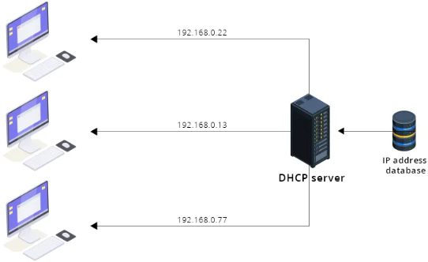

# Le Service DHCP

## Définition du service DHCP (Dynamic Host Configuration Protocol) 

La fonction Dynamic Host Configuration Protocol (DHCP) est un protocole client/serveur qui fournit automatiquement une adresse Internet Protocol (IP) et d’autres informations de configuration pertinentes à un hôte IP (par exemple, masque de sous-réseau et passerelle par défaut).     
Chaque appareil sur un réseau TCP/IP doit avoir une adresse IP unique pour accéder au réseau et à ses ressources. Sans DHCP, les adresses IP des nouveaux ordinateurs ou ordinateurs qui sont déplacés d’un sous-réseau à un autre doivent être configurées manuellement ; les adresses IP des ordinateurs supprimés du réseau doivent être récupérées manuellement.  
Avec DHCP, l’ensemble de ce processus est automatisé et géré de manière centralisée. Le serveur DHCP gère un pool d’adresses IP et loue une adresse à n’importe quel client avec DHCP lorsqu’il démarre sur le réseau.  

<figure markdown=1>

</figure>

## La notion de bail

Lorsqu'un client demande au serveur DHCP une adresse IP, le serveur DHCP fournit l'adresse IP et les paramètres de configuration du réseau tels que le masque de sous-réseau et les passerelles par défaut pour une période donnée - appelée bail. La période pour laquelle le client se voit attribuer l'adresse IP est appelée la période de location. Le client peut utiliser tous les paramètres réseau alloués pendant cette période et est identifié de manière unique dans le réseau à l'aide de l'adresse IP allouée.  
Pendant ou à la fin de la période de location, si le client souhaite continuer à utiliser les mêmes paramètres réseau, y compris l'adresse IP, un renouvellement de bail via le serveur DHCP peut être demandé. Le serveur DHCP, à la réception de ce message, renouvelle la période de location du client et le client peut continuer à utiliser l'adresse IP pendant une période prolongée.  
À la fin de la période de location, si un client n'a pas demandé de renouvellement, ou si le serveur n'a pas reçu de demande de renouvellement, le bail de l'IP allouée expire. Cela amène le DHCP à récupérer l'adresse IP et les configurations réseau associées, et à les rajouter à son pool d'adresses IP.  

<figure markdown=1>

</figure>

### L’obtention d’un bail DORA (Discover, Offer, Request, Ack)

Le processus d'attribution d'une adresse IP et d'autres paramètres de configuration réseau par le serveur DHCP au périphérique réseau se déroule en quatre étapes:  

!!! Success ""
    === "Etape 1 : Le client DHCP Découvre le serveur DHCP"
        Pour qu'un appareil communique au sein d'un réseau, il nécessite une adresse IP. Un périphérique client DHCP acquiert l'adresse IP et les paramètres réseau en diffusant un paquet UDP appelé DHCPDISCOVER au sein du réseau.  
        Lors de la réception de la diffusion DHCPDISCOVER, tous les serveurs qui ne font pas autorité rejettent ou ignorent le message. Les serveurs DHCP au sein des réseaux reçoivent et traitent le paquet de diffusion.  
        Le message DHCP Discover contient des détails tels que:  
        
        - Port source: UDP 68  
        - Port de destination: UDP 67  
        - IP source: 0.0.0.0  
        - IP de destination: 255.255.255.255  
        
        Ici, l'adresse IP source du paquet de diffusion est 0.0.0, car le périphérique client n'a pas encore reçu d'adresse IP. Avec l'adresse IP de destination 255.255.255.255, le paquet de diffusion est envoyé à tous les périphériques du réseau, via un processus appelé diffusion limitée. L'adresse IP de destination peut être définie sur un ID de sous-réseau particulier pour permettre une diffusion dirigée.  
    === "Étape 2: Le serveur DHCP offre les paramètres de configuration IP et réseau au client."
        Lorsqu'un serveur DHCP valide reçoit le message de diffusion DHCPDISCOVER, il réserve une adresse IP dans son pool d'adresses IP et offre cette adresse IP en location au client demandeur. Il transmet son offre de bail IP, le masque de sous-réseau et les passerelles par défaut au client demandeur via un message DHCPOFFER .  
        
        - Port source UDP 68  
        - Port de destination UDP 67  
        - IP source	192.168.31.9  
        - IP de destination	255.255.255.255  
        
        Ici 192.168.31.9 est le serveur DHCP qui propose une adresse IP de son pool. Traditionnellement, ce message d'offre est envoyé au client en spécifiant le matériel ou l'adresse MAC du client.
    === "Étape 3: Le client reconnaît l'offre DHCP requise et demande le bail IP."
        À la réception d'un message DHCPOFFER, le client demande l'attribution de l'adresse IP proposée via le message DHCPOFFER en envoyant un message DHCPREQUEST au serveur. Ce message signale au serveur DHCP d'attribuer l'adresse IP proposée en location au client.
        À la réception de plusieurs messages DHCPOFFER des serveurs du réseau, le client envoie un message DHCPREQ (requête DHCP) uniquement au serveur DHCP dont le message a été reçu en premier par le client. Les autres offres sont rejetées ou ignorées.  
        
        - Port source UDP 68  
        - Port de destination UDP 67  
        - IP source	0.0.0.0  
        - IP de destination	255.255.255.255  

    === "Étape 4: Le serveur DHCP accuse réception de la demande de bail IP des clients."
        À la réception du message DHCPREQUEST, le serveur DHCP attribue l'adresse IP au client et l'enregistre dans son magasin de données. Le serveur confirme l'adresse IP allouée, le masque de sous-réseau et les détails de la passerelle par défaut en envoyant un message DHCPACK (accusé de réception DHCP).  
        Le client peut maintenant commencer à utiliser les paramètres d'allocation IP et réseau.  
        
        - Port source UDP 68  
        - Port de destination UDP 67  
        - IP source	0.0.0.0  
        - IP de destination	255.255.255.255  
        
        Le client DHCP se configure avec les paramètres réseau reçus.  

<figure markdown=1>

</figure>

### Le renouvellement du bail

Les adresses IP dynamiques sont octroyées pour une durée limitée (durée du bail, ou lease time), qui est transmise au client dans l'accusé de réception qui clôture la transaction DHCP.  
La valeur T1 (par défaut 50% de la durée du bail) qui l'accompagne détermine la durée après laquelle le client commence à demander périodiquement le renouvellement de son bail auprès du serveur qui lui a accordé son adresse (couramment la moitié de la durée du bail). Cette fois la transaction est effectuée par transmission IP classique, d'adresse à adresse.  
Si lorsque le délai fixé par la deuxième valeur, T2 (par défaut 87,5% de la durée du bail), est écoulé, le bail n'a pas pu être renouvelé (par exemple si le serveur DHCP d'origine est hors service), le client demande une nouvelle allocation d'adresse par diffusion.  
Si au terme du bail le client n'a pu ni en obtenir le renouvellement, ni obtenir une nouvelle allocation, l'adresse est désactivée et il perd la faculté d'utiliser le réseau  
De plus, lorsque le serveur DHCP et le client ne figurent pas sur le même brin réseau, les diffusions émises par le client ne peuvent parvenir au serveur DHCP en raison du fait que les routeurs ne transmettent pas les diffusions générales (aussi appelées broadcast). Dans ce genre de situation, il faut alors activer un relais DHCP.  

### La résiliation du bail

Pour mettre fin à un bail DHCP, vous pouvez utiliser la commande ```ipconfig /release``` sous Windows ou la commande ```dhclient -r``` sous Linux. Ces commandes libèrent le bail DHCP en cours et en demandent un nouveau au serveur DHCP. Si vous ne souhaitez pas libérer le bail actuel, vous pouvez attendre qu’il expire et l’appareil demandera automatiquement un nouveau bail au serveur DHCP.  

## Les conteneurs

### Les conteneurs de gestion du serveur DHCP. À la base : l’étendue

L’étendue DHCP spécifie la plage d'adresses IP qu'un serveur DHCP peut fournir à ses clients. L'étendue DHCP doit être configurée pour déterminer le pool d'adresses IP que le serveur DHCP peut louer ou renouveler.  
En règle générale, une étendue s’appuie sur les adresses d’un sous-réseau particulier.  

<figure markdown=1>

</figure>

En ce qui concerne l’attribution des adresses IP des serveurs et des imprimantes, il est conseillé de leur attribuer une adresse IP fixe. Ainsi, les adresses contenues dans une étendue prédéfinie ne seront pas affectées par inadvertance, à un autre périphérique.

### Les conteneurs de gestion du serveur DHCP. Le plus ciblé : la réservation

On parle de réservation d’adresses DHCP lorsqu’une adresse IP, au sein d’une étendue est écartée afin d’être utilisée par un client DHCP spécifique.  

<figure markdown=1>

</figure>

!!! Bug "en ce qui concerne l’attribution des adresses IP des serveurs et des imprimantes, il est conseillé de leur attribuer une adresse IP fixe. Ainsi, les adresses contenues dans une étendue prédéfinie ne seront pas affectées par inadvertance, à un autre périphérique."  
{align=right width=250}Par ailleurs, les périphériques ayant déjà fait l’objet d’une réservation disposeront alors à coup sûr d’une adresse IP, lorsqu’une étendue vient à arriver à court d’adresses. Le fait de configurer des réservations, permet de centraliser la gestion des adresses IP fixes.  
Lorsque l’on configure des étendues DHCP et des options d’étendue, on doit bien évidemment tenir compte du nombre d’adresses IP que l’on doit assigner et de la façon dont on implémentera la tolérance aux pannes. Il est d’ailleurs fortement recommandé de disposer de plusieurs serveurs DHCP, au sein du réseau. Ainsi, en cas de panne, il y aura toujours un serveur de secours pour distribuer les adresses IP.  
<br>
***

## La gestion des options 

### Les options de configuration

Elles complètent la configuration IP des clients DHCP.  
Quelques exemples :  

<figure markdown=1>

</figure>

### Le positionnement des options DHCP

Les options peuvent être définies :  

- Au niveau du serveur : elles concerneront tous les baux distribués par le serveur DHCP.  

- Pour une étendue : elles concerneront les baux de l’étendue.  

- Pour une réservation: Elles ne concerneront que la / les réservation(s) ciblée(s).  
***

## Le DHCP et les réseaux

### Un serveur DHCP pour plusieurs réseaux

Les appareils peuvent envoyer des messages de diffusion uniquement au sein du réseau dont ils font partie. Ils ne peuvent pas diffuser de messages sur les réseaux ou sous-réseaux. Lorsqu'il n'y a pas de serveur DHCP valide dans un réseau, un périphérique de ce réseau ne peut pas acquérir une adresse IP car il ne peut pas diffuser de messages DHCPDISCOVER aux serveurs en dehors de son réseau.  

Ce problème est résolu en utilisant un agent de relais DHCP.

Disons qu'il existe deux réseaux, le réseau A et le réseau B, connectés par un routeur. Il existe un serveur DHCP valide sur le réseau A. Chaque périphérique du réseau A peut acquérir un bail IP via ce serveur. Imaginez qu'il n'y ait pas de serveur DHCP sur le réseau B. Comme les appareils ne peuvent pas diffuser entre les réseaux, les appareils du réseau B ne peuvent pas acquérir de bail IP.  

Les deux façons de résoudre ce problème sont les suivantes:  

- Utilisez un serveur DHCP distinct dans le réseau B.  
- Utilisez un agent de relais DHCP.  

<figure markdown=1>

</figure>

Nous utilisons un agent de relais DHCP en configurant le service de relais DHCP dans l'un des périphériques du réseau B. Ce périphérique reçoit ensuite les messages de diffusion DHCPDISCOVER des clients du réseau B, et les transmet au serveur DHCP du réseau A. Le serveur envoie le DHCPOFFER à l'agent de relais du réseau B, qui diffuse le message au sein de son réseau. De même, les messages DHCPREQ et DHCPACK sont échangés entre le client DHCP dans le réseau B et le serveur DHCP dans le réseau A en les relayant via l'agent DHCP qui peut agir comme l'homme du milieu.  
L'agent de relais peut être un périphérique au sein du réseau, ou le routeur réseau lui-même peut être configuré pour fournir un service de relais DHCP.  

## Le DHCP et les réseaux

### DHCP dans un contexte de domaine

^^La notion d’autorisation^^ :  
Le ou les serveurs DHCP doivent être autorisés pour démarrer les services et fournir le service.  

^^Incidence de la non autorisation^^ :  
Le service DHCP d’un serveur membre non autorisé ne démarrera pas
Le service DHCP d’un serveur autonome présent dans le domaine de diffusion d’un serveur autorisé
s’arrêtera  

!!! Bug "Les serveurs DHCP autres que Microsoft ne prennent pas en compte cette autorisation"  
***

### Les opérations de gestion de la base DHCP
L’ensemble des données de configuration est stocké dans une base.  

Un certain nombre d’opérations peuvent être effectuées :  
- Sauvegardes : Synchrone ou Asynchrone
- Restaurations  
- Contrôle de la cohérence de la base  
- Déplacement de la base  
***

### Le fractionnement d’étendues

Le fractionnement d'une étendu DHCP peut augmenter la tolérance aux pannes. Ainsi avec cette
option, si un serveur devient indisponible alors l'autre serveur peut prendre sa place et continuer à louer de nouvelles adresses IP ou à renouveler des clients existants. Il permet d’automatiser la création d’une étendue sur deux serveurs ayant la charge de la
plage correspondante.  

{align=right width=350}  
Les modifications pouvant être apportées  
après création ne sont pas répliquées  
entre les deux serveurs ayant la charge de  
l’étendue (elles sont à faire sur les deux).
<br>
<br>
<br>

### Pour aller plus loin

Pour les problématiques de panne et de disponibilité :  
- Configurer un serveur DHCP « de secours » : opérationnel, mais non démarré  
- La solution DHCP failover :  (1)
{ .annotate }

1.  ^^2 modes existent^^ :  

    ^^Actif / Actif (load balanced)^^

    Ce mode est recommande lorsque les 2 serveur DHCP sont situés sur un même site géographique. Il est nécessaire de définir la répartition de charge désirée pour équilibrer (ou non) la distribution d’adresse IP des 2 serveurs. Chaque serveur se verra attribué une plage d’IP a distribué contenue dans l’étendue. Contrairement à un serveur DHCP standalone, les IP distribuée ne seront donc pas séquentielles.

    ^^Actif / Passif (hot standby)^^

    Ce mode est recommandé lorsqu’on dispose de 2 serveurs DHCP répartis sur 2 sites géographiques différents.

Pour améliorer la sécurité :  
- Mettre en place des stratégies de filtrage (sur les adresses)  

Pour la surveillance et le diagnostic :  
- Consulter les journaux d’évènements (source DHCP Server)  
- Consulter le journal d’audit : 1 fichier .log par jour dans le répertoire de la base  
