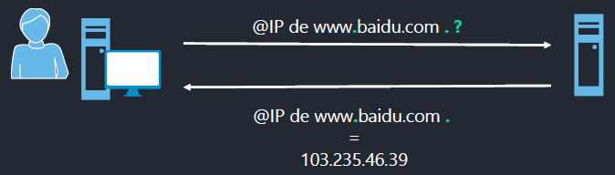
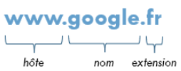
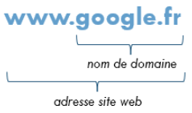
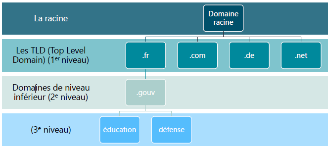
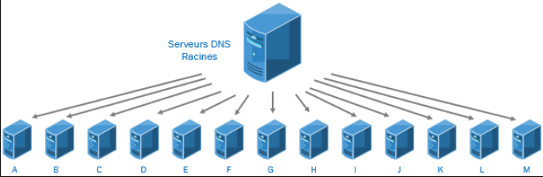

# Le DNS

## Introduction

Le DNS, est un service permettant de résoudre des Adresse IP en noms de domaine.  

<figure markdown=1>

<figcaption>Fonctionnement du DNS</figcaption>
</figure>

### Nom de domaine

Un nom de domaine est l'identifiant d'une "zone" sur internet regroupant des machines membres de cette même zone.  
Cet identifiant est l'équivalent d'une adresse postale définissant une zone géographique, c'est vulgairement une adresse internet.  
Cette adresse permet de trouver des sites internet sur le web, *www.google.fr*, *fr.wikipedia.org* sont des noms de domaine, associés à des sites internet.  

#### Composition d'un nom de domaine

Un nom de domaine est composé de plusieurs parties, séparées les unes des autres par des points.  

Chacune de ces parties sont composé par un **label**.  

<u>Exemple avec l'adresse du site internet Google</u>  

<figure markdown=1>

</figure>

Nous distinguons **3 labels**

- www : hôte
  - représente le nom de machine, d'un "hôte", en l'occurrence le nom du serveur web qui gère le site
- google : nom
  - cette partie représente le **nom de l'entreprise**, Cette chaîne de caractère peut-être, plus ou moins, <u>n'importe quelle chaîne de caractère</u>, votre nom, le nom de société, des mots communs, un thème précis, des chiffres...
- fr : extension
  - **extension du nom de domaine** qui définit si le site est français, allemand, international, si c'est une association, une entreprise bien précise, une organisation...

Les parties 2 et 3 forment le **nom de domaine de Google en France**. Et les 3 labels réunis forment **l'adresse du site web**.  

<figure markdown=1>

</figure>

On déduit donc que l'hôte ***www*** **est une machine qui est membre de la zone** google.fr.  

#### Organisation des noms de domaine

Un nom de domaine est quelque chose de très **structuré**.  
Le nom de domaine a une **organisation hiérarchique**, très souvent **représentée par une arborescence**.  

Le  nom de domaine **www.google.fr** n'est en réalité pas un nom de domaine complet.  
Afin d'avoir un nom de domaine complet **FQDN** (**F**ull **Q**uality **D**omain **N**ame), il faudra <u>obligatoirement</u> qu'il se termine par **<u>un point</u>**.  

Pour reprendre notre exemple précédent **google.fr** est en réalité **google.fr.**  

Ce point est ajouté tacitement par le navigateur internet, voila pourquoi il est invisible pour l'utilisateur.  
Il sert aux machines pour envoyer les requêtes DNS.  
Ce point final est le point de départ du nom de domaine, il représente le domaine racine "root".  

>le terme point de départ est bien choisi car un nom de domaine est lu de droite à gauche.

Prenons l'exemple du site : *fr.wikipedia.org.*  

En partant de la droite :  

Le "." est donc le **domaine racine**

Le 2eme label ".org", il s'agit de l'extension du nom de domaine.  
    L'extension du correspond à ce qu'on appelle un **nom de domaine de 1er niveau, un TLD pour "Top Level Domain"**  

Le 3eme label "wikipedia" correspond au nom de l'organisme.  
    L'extension s'appelle un **nom de domaine de 2nd niveau, un SLD pour "Second Level Domain"**  

La partie "fr" est officiellement un **sous-domaine** du domaine <u>wikipedia.org</u>  
    Tout comme le SLD, un sous-domaine peut-être une **chaîne de caractères diverses**. On peut **incrémenter** autant de sous-domaines que l'on veut.  
    ex: www.moi.fr12.monsite.com

<u>Récapitulatif des niveaux de TLD :</u>  

<figure markdown=1>

</figure>

Au vue de cette organisation, chaque domaine est un sous-domaine du domaine racine.  

- "fr" est un sous-domaine de "wikipedia"
- "wikipedia" est un sous-domaine de "com"
- "com" est un sous-domaine "."

Cela signifie que pour gérer son propre nom de domaine (son propre "SLD"), il va falloir en obtenir la **délégation** auprès du domaine racine et du domaine de 1er niveau.  

#### Délégation des noms de domaine

La **gestion des noms de domaine** est sous la responsabilité d'un autorité mondiale suprême appelée l'ICANN (société pour l'attribution des noms de domaine et des numéros sur Internet).  

Cette autorité a elle-même délégué la gestion des noms de domaine à différents organisme à travers le monde, a commencer par le domaine racine.  
Il existe aujourd'hui 13 entités, ou groupe de serveurs DNS, réparties à travers le monde, qui gèrent le domaine racine ".".  

<figure markdown=1>

</figure>

Chaque entité partage un nom de domaine commun réservé **"root-servers.net"**.  
Seul leurs sous-domaine, representé par une lettre, de A à M les différencie.  

>chaque entité de serveurs DNS partage la même adresse IP.  
La liste des serveurs racines est disponible au lien : [Serveurs domaine racine](https://www.iana.org/domains/root/servers)  

L'intérêt de ces serveurs DNS racines c'est qu'ils contiennent des informations, qu'on appelle des enregistrements, sur les serveurs DNS qui gèrent les domaines de 1er niveau (TLD).  

Ils sont interrogés par les DNS du monde entier pour connaître les noms et adresses IP des serveurs DNS TLD.  

Toutes comme les serveurs DNS Racine, leur gestion a été déléguée à différents organisme dans le monde entier (environ 800 organismes pour plus de 1500 noms de domaine de 1er niveau)  

Un TLD peut prendre 2 formes :  

- Un code de pays, selon une norme de noms nationaux, composés de 2 lettres.  
  - Le TLD  français ".fr" est géré par l'AFNIC  
- Un nom plus générique répresentant un nom d'entreprise, une organisation, un groupe.  

>La liste détaillée des TLD existant est disponible au lien suivant: [Enregistrement TLD](https://www.iana.org/domains/root/db)  

Les TLD contiennent les enregistrements sur les serveurs DNS qui gèrent les noms de domaine de 2nd niveau (SLD), c'est-à-dire les noms de domaine que vous pouvez décider de créer et d'acheter à votre guise.  

Ils sont également interrogés par les srveurs DNS du monde entier pour connaître les noms et adresses IP des serveurs DNS SLD.  
Dans une logique de délégation, **une délégation administrative vous permettra, en tant que titulaire d'un SLD de gérer votre propre DNS.**  
Il vous faudra un (ou plusieurs) serveur DNS, qui fera autorité sur votre zone dans lequel vous mettrez vos propres enregistrements.  
Vous pouvez soit héberger vous-même des serveurs DNS autoritaires, ou en confier la charge à des sociétés tierces hébergeur de domaine (OVH, Gandi...)  

