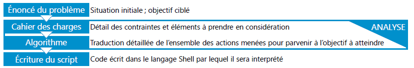

# Script Bash

Un Script Shell est un **fichier texte**, permettant d'automatiser des opérations.  
Il contient une ou plusieurs de commande shell exécutées de manière séquentielle.  

Avant de partir sur l'écriture du script, une phase d'analyse est nécessaire, celle-ci intègre la rédaction :  

- d'un cahier des charges  
- d'un algorithme  

<figure markdown=1>

</figure>

