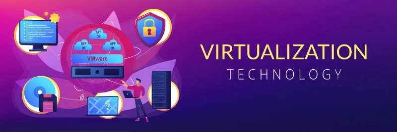
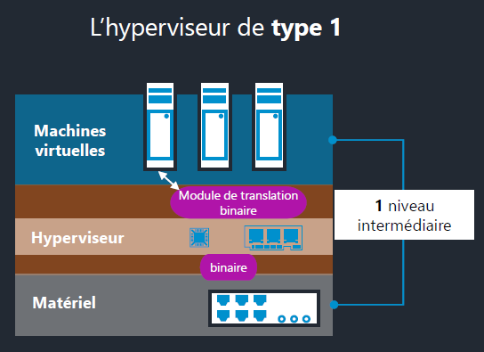
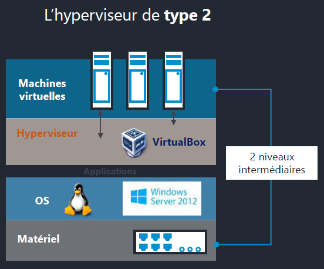
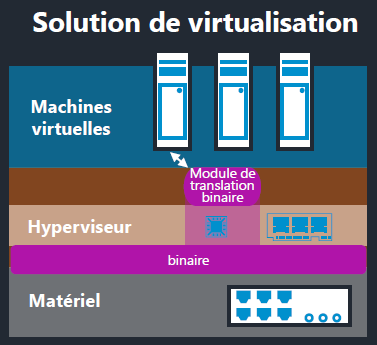
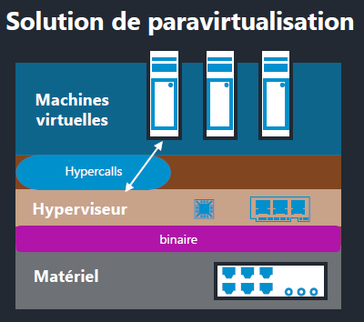

<figure markdown=1>

</figure>

## La Virtualisation en 8 dates

- 1960/70 : Embryons de la virtualisation en test par IBM puis passage en production sur des mainframes.
- Milieu 90's : <u>Les émulateurs</u> font leur apparitions en Micro-informatique, rendant possible l'émulation des machines Atari, Amiga, Amstrad et de consoles.
- Début 2000 : VMware développa et popularisa son système propriétaire de virtualisation logicielle pour les architecture de type x86.
- 2006 : Prise en charge matérielle par le CPU d'instructions de virtualisation.
- 2007 : Rachat de XenSource par Citrix.
- 2007 : KVM est intégré au noyau Linux, permettant la virtualisation de machine sur les OS Linux.
- 2007 : Virtual Desktop Infrastructures VMware.
- 2009 : Plus de serveurs Virtuel que de serveur physique.

## Utilisations de la Virtualisation

### Pour quels usages ?

- Les serveurs d'infrastuctures locaux et distants (le Cloud...),
- Les environnements de test et les problématiques de compatibilité,
    - Permet la création d'un nombre elevé de machine pouvant comporté des versions de logiciel differentes (ou d'OS différent) afin d'effectuer des tests de compatibilité.
- Les scénarios de PRA (Plan de Reprise d'Activité),
    - En ayant une "copie" de son architecture en virtualisation cela permet une reprise plus rapide en cas de crash de l'architecture physique.

### Quels avantage ?

- Optimisation des taux d'utilisation du matériel,
    - Un Os hebergé seul sur une machine physique solicite en moyenne 50% des ressources dispo, en hebergeant plusieurs OS cela permet d'utilisé entre 70 à 100% du taux d'utilisation des ressources de la machine.
- Economies sur les couts matériels et de gestion,
    - Le matériel etant optimisé et pleinement exploité cela permet de baisser les couts matériel et de gestion.
- Economies de gestion et d'energies (green computing),
    - Plusieurs machine étant rassemblée en un seul et unique point.

### Les inconvénients ?

- Concentration et dépendance vis-a-vis d'une solution,
    - Tous les services étant sur la même solution, si défaillance la totalité des services serait HS.
- Mise en oeuvre complexe avec un investissement initial important,
- Contraintes d'administration spécifiques (déploiement, sauvegarde,etc.),

## Les acteurs de la virtualisation

- VMware (Workstation, ESXi...)
- Microsoft (Hyper-V, Azure en cloud computing)
- Citrix
- RedHat
- Oracle
- Proxmox via KVM sur Linux
- Docker permettant de deployer des containers comportant des VM

## Les Secteurs de la Virtualisation

Les ressources d'un data Center physique mais aujourd'hui grâce aux acteurs de la virtualisation.

La virtualisation de Serveur ne s'applique pas uniquement au serveur informatique, en effet la virtualisation aujourd'hui va être utilisée dans nombre de composants d'une infrastructure informatique.À l'origine le serveur a été choisi pour pouvoir mutualiser les ressources d'un data Center physique mais aujourd'hui grâce aux acteurs de la virtualisation et au cloud computing il peut être possible d'effectuer de la virtualisation sur :  

- Environnements sur un poste de travail,
    - Les solutions VDI permettent à un utilisateur de disposer d'un environnement graphique traditionnel (type windows client) sur un poste virtualisé.
- Applications,
   - Via des plateforme de type PaaS, mettant à disposition un environnement applicatif sans avoir la totalité d'un poste physique.
- Serveurs,
    - Permettant la création de cluster ou il sera possible de renforcer la fiabilité et economiser sur les ressources à disposition.
- Stations de travail,
    - Permettant de disposer de matériel plus puissant ou des solutions matérielles spécifiques pour utiliser des applicatifs de création graphique ou de CAO/PAO.

Mais elle peut être également deployée dans des domaines plus ciblés :  

- Le réseau,
    - Notamment chez Cisco.
- Le stockage,
    - Permettant la conservation des données sur le long terme.
- Les services,
    - Via les solutions de contenairisation.

## Les principales solutions

??? tip "Virtualisation de postes de travail"
    === "VMware" 
        - VMPlayer  
        - VMWorkstation.  
        === "Permet la virtualisation"
            - poste de travail,  
            - infrastructures virtuelles,  
            - du réseau,  
            - des applications.  
        Nécessite un système d'exploitation de type Windows ou Linux.
    === "Virtualbox"
        Solution est développée par oracle  
        Elle nécessite également un système d'exploitation uniquement Windows cette fois ci.
    === "Windows"
        - Windows Virtual PC solution embarqué
          - disponible sur les versions professionnelle et entreprise
        - l'hyperviseur hyper-V 
          - disponible sur les solutions Windows Server
          - Ne nécessite pas l'installation d'un OS serveur elle est disponible en mode autonome.
    === "Linux"
        - QEMU nécessite l'installation d'une distribution Linux 
          - exploite l'hyperviseur KVM
          - propose un environnement graphique de création de machines virtuelles et d'exploitations d'infrastructures virtuelles.

??? tip "Virtualisation Serveur"
    === "VMware" 
        - VSphere 
        === "Virtualisation"
            - Serveurs,
            - Applicatif,
            - VDI,
            - Réseau
        Ces solutions là sont toutes dépendantes de la mise en place de la VSphere.
    === "Microsoft"
        - Hyper-V
          - installé en mode autonome sur un serveur
          - mise en place d'une solution de Data Center (via l'intermédiaire d'un active directory)
    === "Citrix" 
        - hyperviseur "Xen" avec la solution "XenServeur"
        === "Virtualisation"
            - Des serveurs,
            - Du réseau,
            - De l'applicatif 
    === "RedHat"
        - KVM
        === "Virtualisation"
            - Des serveurs,
            - Du VDI,
            - Du réseau

## Les machines en Virtualisation

### L'hôte

Pour pouvoir faire de la virtualisation, il faut disposer d'une machine hôte afin de pouvoir installer notre solution de virtualisation.  

L'hôte est la machine disposant des ressources matériel mis à disposition des VM, en effet celle-ci sont "invités" à exploiter ses ressources par le biais de la solution de virtualisation et de l'hyperviseur.  
Un hôte peut heberger plusieurs VM (OS, Poste de travail, Applications).  

### Machines Virtuelle

Les Machines Virtuelles (ou VM) utilisent, comme dit au dessus, les ressources mis à disposition par l'hôte.  
Elles sont définit par un ensemble de fichiers stockés dans un repertoire d'acceuil, c'est même fichiers sont géré par l'hyperviseur.  
Une machine virtuelle est un ordinateur virtuelle certe mais elle à besoin (comme un ordinateur physique) des éléments suivant pour fonctionner :  

- Processeur  
- RAM (mémoire vive)  
- Stockage  
- Carte réseau (optionnel si la VM n'a pas besoin d'accéder au réseau)

### L'hyperviseur

Il s'agit de l'élément central et indispensable à la virtualisation, sans hyperviseur la virtualisation des systèmes ne serait pas possible.  
En effet c'est lui qui fait le lien entre l'hôte et les machines virtuelles installées.  
Il s'occupe de la gestion/partage et il priorise l'accès aux ressources dont les VM ont besoin.  

l'hyperviseur fait le lien entre les ressources matérielles, mises à disposition, et la solution de virtualisation.  

Il existe 2 types d'hyperviseurs :  

#### L'hyperviseur de type 1

Il embarque son propre système d'exploitation, ce système d'exploitation va permettre de faire l'interface entre les ressources matérielles (CPU, RAM, Stockage) et les machines virtuelles et ceux par l'intermédiaire de la solution de virtualisation.  
L'échange sera effectué de manière binaire, nous avons donc un module de translation binaire intégré entre l'hyperviseur et la couche matérielle, les VM ne verront que cette partie binaire.  

Parmi les hyperviseurs de type 1 on peut citer :  

- Microsoft Hyper-V,  
- Linux KVM,  
- Citrix XenServer,  
- VMware ESXi.

<u>En résumé un hyperviseur de type 1</u>

- Implémentation : fait office de système d'exploitation
- Solutions : Hyper-V, KVM, VMware ESXi, XenServer

<figure markdown=1>
{width=300}
</figure>

#### L'hyperviseur de type 2

La principale caractéristique de l'hyperviseur de type 2 est qu'il nécessite un OS tiers pour fonctionner (a l'inverse du type 1).  
Ce Système d'exploitation sera le lien entre le matériel et les VM.  
En effet, c'est le système d'exploitation qui va exploiter, par l'intermédiaire des drivers, la partie matérielle qui sera ensuite mis a disposition des machines virtuelles via la solution de virtualisation.  
Elle même sera hébergée soit par un Os Windows ou un Os Linux.  

Parmi les hyperviseurs de type 2 on peut citer :  

- Oracle VirtualBox
- Windows Virtual PC
- VMware Player
    - Workstation

<u>En résume un hyperviseur de type 2</u>

- L'hyperviseur de type 2..
    - Implémentation : installé en tant qu'application sur un système d'exploitation  
    - Solutions : Virtualbox, VirtualPC, VMware Player et Workstation

<figure markdown=1>
{width=300}
</figure>

## Les Outils de la virtualisation

Une solution de virtualisation est composée d'un ensemble d'éléments.  
Parmi ces éléments on va retrouver l'élément central "l'hyperviseur" puis différentes consoles permettant d'accéder à des éléments spécifiques de la solution:  

- La console de gestion des machines virtuelles, également appelées VMM (Virtual machine manager)  
    - Cette console, en fonction de la solution, va être disponible soit sous forme graphique ou en ligne de commande.
- Les consoles d'accès à la machine virtuelle qui vont renvoyer l'interface graphique propre à chaque machine virtuelle.
    - Cette interface graphique, lorsqu'elle est présente, va se présenter soit sous la forme d'une console unique (comme dans le cas de la solution hyper-V) où d'une interface logicielle avec des Onglets (comme dans le pas de VMware workstation).  

A cela des composants complémentaires s'ajoute, ils vont permettre de modifier les paramétrages matériels comme :  

- L'architecture,  
- Le bios,  
- Le type de processeur,  
- Les quantités de mémoire,  
- Les différents disques.  

Nous aurons aussi la possibilité de lier des périphériques de type :  

- DVD pour associer des images ISO,  
- USB,  
- Lecteurs de disquette au format FLP ou IMG (lorsqu'ils sont encore supportés)  

Un autre composant important va être le réseau virtuel des profils différents vont exister en fonction du service souhaité sur la machine virtuelle.  Un réseau interne ou de type pont sera différent dans l'utilisation.  

Chaque solution dispose ,également, de format de disques différents.  
Ces formats de disques vont être soit de type:  

- VHD pour hyper-V
- VMDK pour VMware Workstation  

Les solutions de virtualisation proposeront des outils pour manipuler ces fichiers en fonction du besoin (étendre ou réduire le volume d'un fichier).  

Chaque machine virtuelle est déterminée par un fichier de configuration.  
Ce fichier de configuration va adopter un format spécifique en fonction de la solution de virtualisation 
- XML pour hyper-V,
- Vmix pour VMware,
- Vbox pour Virtual box.

En résumé, chaque solution héberge ses propres outils permettant à la fois d'administrer l'hyperviseur, l'élément central ou l'ensemble des machines virtuelles ou au cas par cas.  
Chaque machine virtuelle est la configuration matérielle de chaque machine virtuelle.  

## Virtualisation et Paravirtualisation

Il existe 2 différences majeures dans la virtualisation:  

<u>**La première va être la virtualisation dite "native"**</u>
les machines virtuelles ne verront pas la couche intermédiaire de l'hyperviseur.  
En effet en virtualisation les données binaires vont être transmises directement des machines virtuelles au matérielles.  
L'hyperviseur dans ces solutions là va être totalement transparent.  

<figure markdown=1>
{width=300}
</figure>

<u>**La deuxième partie qui est la paravirtualisation**</u>
La Paravirtualisation est une technique de virtualisation dans laquelles les machines virtuelles vont être préparées pour faire appel à l'hyperviseur.  Par cet intermédiaire elles vont avoir l'impression d'être connectées au matériel.  
L'hyperviseur va simplement servir d'intermédiaire et va transférer au matériel les demandes des machines virtuelles.  

<figure markdown=1>
{width=300}
</figure>

<u>En résumé</u>  

Dans un contexte de virtualisation, les machines virtuelles s'addressent au *matériel présenté* par l'hyperviseur.  
Elles n'ont pas connaissance de sa présence.  
Dans la **Virtualisation**, la solution de virtualisation va traduire les demandes des VM directement au matériel.  
Dans la **Paravirtualisation**, les VM sont préparées pour faire appel à un hyperviseur, les appels sont alors rédirigés et non traduits.  
(Dans le cas d'un hyperviseur de type 2 cela passera également par l'OS hebergeant la solution).  

Dans les 2 cas les machines virtuelles ne verront que la partie matérielle et ne verront jamais l'hyperviseur.  

