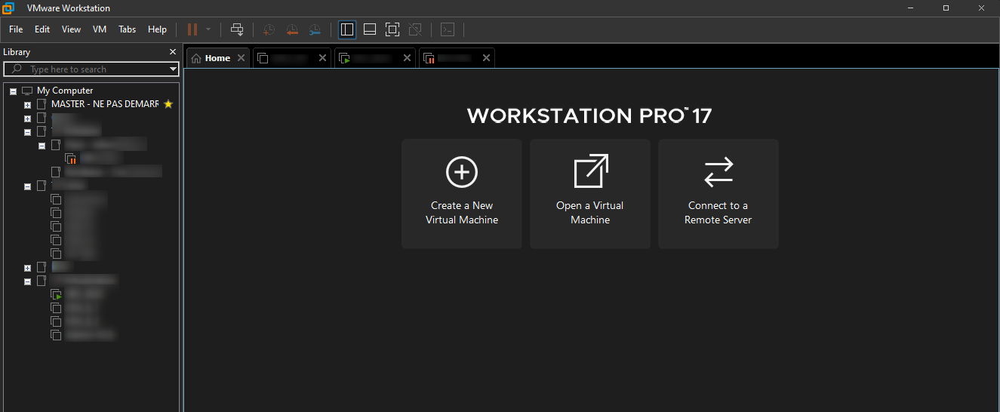
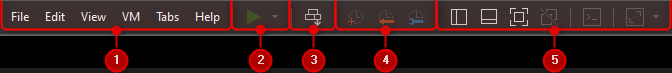
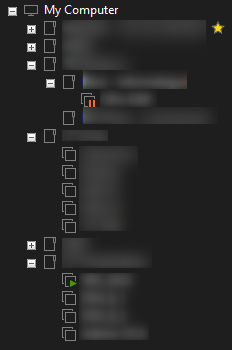
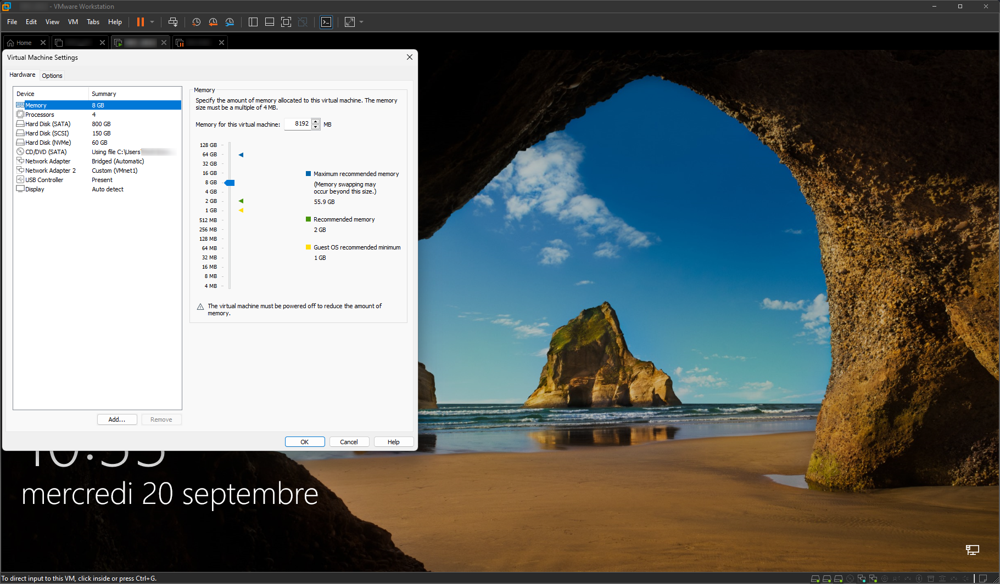
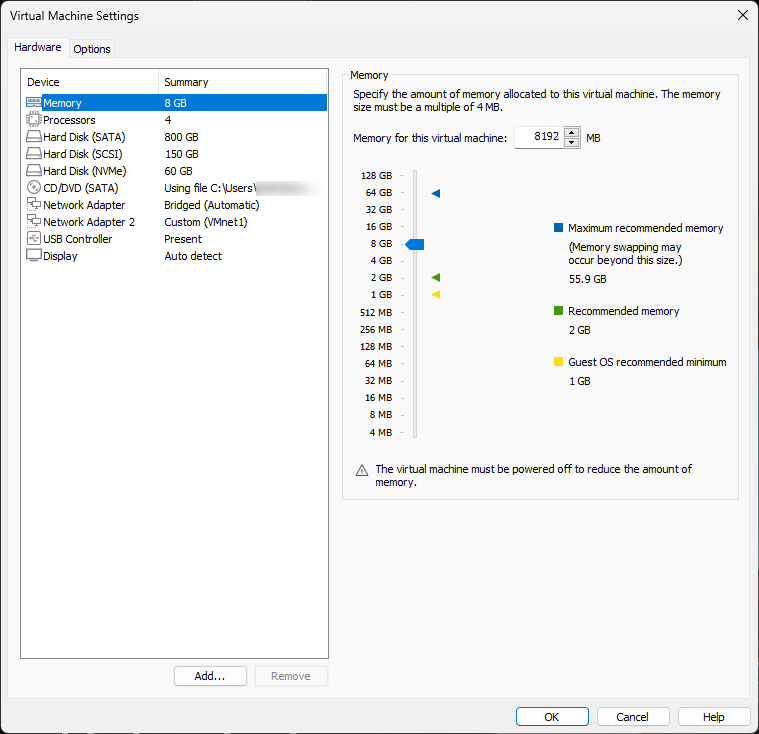
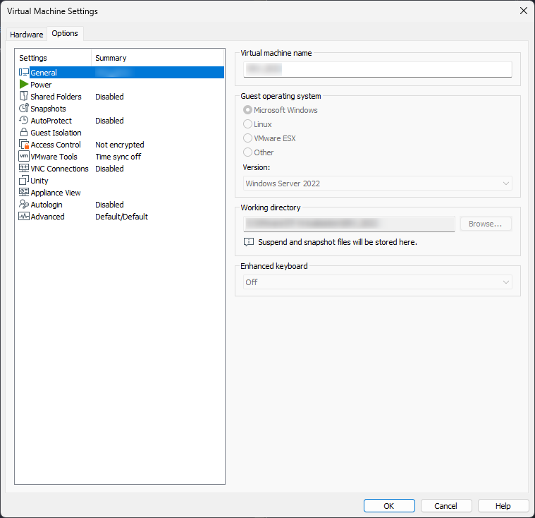

<figure markdown=1>

</figure>

## Prérequis et installation

La solution de virtualisation VMware Workstation nécessite un certain nombre de prérequis.  
En effet, la solution VMware workstation est un hyperviseur de type 2, elle nécessite donc l'utilisation d'un système d'exploitation tier (Windows ou Linux).  
Elle nécessite que la machine dispose d'un CPU disposant, pour la famille de processeurs Intel, des solutions VT-x ou, pour les processeurs AMD, de la fonctionnalité AMD-V (ces fonctionnalités doivent être activées dans le bios de la machine physique).  
Cette fonctionnalité active les instructions de virtualisation matérielle au niveau du CPU de la machine hôte.  
La machine hôte doit également disposer d'une quantité importante de RAM, Pour rappel la RAM sera partagé entre l'OS de l'hôte et les VM herbergée sur celle-ci.  
Il faut également disposer d'un espace disque suffisamment important pour pouvoir stocker les disques durs virtuels nécessaires ou machines virtuelles.  A noter qu'il est préférable d'utiliser des disques de type SSD, afin d'apporter un gain de rapidité au VM.  

### Les outils et composants

VMware WorkStation met à disposition un environnement graphique de virtualisation.  

<figure markdown="1">

</figure>

Dans cette console graphique nous allons trouver tous les éléments nécessaires à la gestion non seulement d'une machine virtuelle, mais également à son intégration dans une infrastructure virtuelle.  

La console de gestion permet d'afficher, dans la librairie du logiciel, la liste des machines virtuelles à disposition sur l'hôte et intégrer à la solution de virtualisation.  

Elle permet de gérer la liaison entre les VM mais également l'État des VM, il sera possible de les demarrer, les mettre en pause, les arrêter ou les redémarrer.  

WorkStation offre également la possibilité d'effectuer des clones et des templates dans le but de pouvoir les exploiter et/ou les exporter par la suite au format .ovf ou .ova, permettant d'intégrer des VM récuperer sur d'autre plateforme de type VMware mais également sur internet.  

La console WorkStation permet également de modifier les réglages matériel des machines virtuelles une fois que celle-ci sont en production.  

Les différentes parties du logiciel seront détaillées par la suite.  

#### Gestion de base

<figure markdown=1>

</figure>

1. Permet l'édition des parametre logiciel  
2. La gestion d'alimentation des VM  
3. Permet de selectionner une séquence de touche à envoyer  
4. Gestionnaire de Snapshot  
   (Permet la capture d'une "image" à un instant T et de retourner à celle-ci en cas de défaillance de la VM)  
   également la mise en pause de la machine virtuelle , la création d'un instantané , ce que l'on appelle un Snapshot , puis le retour en arrière à partir des Snapshot créer précédemment ces Snapshot vont permettre de prendre un instantané de l'état d'une matière virtuelle , de l enregistrer puis de revenir à cet état d instantané plus tard.  
5. Parametre d'affichage des vues librairie, etc.  

#### Librairie de VM

<figure markdown=1>

</figure>

Cette console permet de visualiser les VM intégrer à WorkStation, de les organiser par dossier, ainsi que de vérifier leurs état d'alimentation.  

#### VM Selectionnées

<figure markdown=1>

</figure>

Cette vue met en avant les VM selectionnées dans l'interface de travail.  
Elles sont disponible sous forme d'onglet détaillant leurs état d'alimentation.  

- La 1ere est non alimentée (aucun logo à coté de son nom)  
- La 2eme est en fonctionnement (présence du logo ++play++)  
- La 3eme est en pause (présence du logo ++pause++)  

:thumbup: A noter que les logos d'état de VM est également visible dans la partie **Librairie**  

Une VM peut être alimentée mais non selectionnée, elle n'apparaitra donc pas dans les onglets de selection :wink:

### Interaction avec l'hôte

#### Périphériques

VMware WorkStation capture, par défaut, les mouvements de la souris ainsi que les frappes clavier celles-ci seront donc automatiquement appliqués à la machine virtuelle.  
La combinaison de touche par défaut ++ctrl+alt++ permet de récupérer la main sur la machine hôte et ainsi "séparer" souris/clavier de la machine virtuelle, la combinaison de touche peut-être modifié dans les paramêtres de WorkStation

VMware Workstation offre la possibilité de lier un lecteur CD ou un lecteur DVD mais également de lier les périphériques USB de la machine physique à la machine virtuelle.  
A noter qu'il est également possible d'émuler un lecteur de disquette :man_shrugging_medium_light_skin_tone:

Il est également possible de rendre disponible un dossier présent sur la machine hôte directement dans la machine virtuelle cette fonction s'appelle <u>share folder (dossier partagé)</u>.  
Cette fonctionnalitée permet de rendre disponible une ressource locale, de la machine physique, directement dans la machine virtuelle.  
Cette fonction est très utile notamment pour pouvoir faire passer des fichiers de configuration entre l'infrastructure virtuelle et la machine physique.  

Beaucoup de machine virtuelle comme les machines serveurs, ou Windows, nécessitent une ouverture de session via la combinaison de touches :  

- ++ctrl+alt+del++.  

Malheureusement avec WorkStation cette combinaison de touche s'applique directement à la machine hôte, ainsi pour une VM il faudra utiliser la combinaison :  

- ++ctrl+alt+insert++.  
L'utilisation de cette combinaison de touches contrôle+alt+insert, c'est la combinaison contrôle alt suppr qui va être vu par la machine virtuelle et qui va permettre de déverrouiller une session sur une serveur de type Windows ou de faire apparaître le gestionnaire des tâches sur une machine de type Windows.  

#### Réseau

l'interaction entre l'hôte et la machine virtuelle va également se faire au niveau du réseau.  
Le réseau disponible sur la machine physique sera également mis à disposition des machines virtuelles.  
Il existe plusieurs méthodes pour relier une machine directe au réseau :  

- Le mode <u>**Host-Only**</u>: 
    - La machine virtuelle n'aura accès uniquement que à l'hôte ainsi qu'à toutes les machines virtuelles configurées sur ce mode.  
    - Permet aux machines virtuelles de communiquer uniquement entre elles.  
    - Permet d'accéder à certaines ressources hébergées sur la machine physique.  
    - En aucun cas les machines virtuelles ne pourront dépasser la machine physique.
- Le mode <u>**NAT**</u>:
    - Réservé  à l'accès à internet.  
    - Le mode NAT va créer un réseau secondaire dédié aux machines virtuelles,  
    - L'avantage sera l'accès à l'internet sur un réseau de type **NAT**,  
    - Ce qui va permettre de protéger le réseau physique de la machine en utilisant un réseau secondaire pour les machines virtuelles.  
    - Il est nécessaire d'avoir un adressage différent du réseau physique pour les VM.  

!!! inline end danger ""
    Dans le cas d'une virtualisation de service DHCP,  
    Le service DHCP VMware peut venir contrer le service deployer.  
    Il faudra désactiver ce service de DHCP VMware.  

WorkStation propose également un service de **DHCP**.  
Cet adressage va être géré et distribué par la solution VMware WorkStation et va employer un service de DHCP pour adresser les machines virtuelles.  

## Création d'une VM

Pour la création d'une machine virtuelle sur VMware WorkStation plusieurs bonne pratique sont à privilégier :  
!!! danger ""
    Toutes ces informations sont détaillé dans la procédure d'installation d'une machine virtuelle sur WorkStation

1. Choisir "I will install ... later" cela permet de selectionner l'OS apres le set-up de la VM, et ainsi d'éviter que Workstation sélectionne des parametres non adapté à notre machine,  
2. Selection du type de système (Microsoft, Linux, VMware ESX, Other) ce choix sera fait en fonction dy type d'OS à installer sur la VM,  
3. Ensuite le choix du nom de la machine,  
- L'emplacement du stockage de la machine,  
    - Ces cette emplacement qui contiendra les fichiers de configuration mais également le/les disque dur de la VM (au format VMDK).  
    - Il est préférable de choisir un dossier ou un disque dédié au stockage des VM.
    - Il est également préférable de **créer un dossier** par **machine virtuelle**, afin d'éviter que plusieurs VM ne se retrouve dans le même dossier (grand risque de baisse de performance et de stabilité).  
    - :stop_sign: Par défaut VMware selectionnera l'emplacement "Mes Docuements" de l'utilisateur actuel de l'hôte.  
- Choisir la taille de l'espace de stockage  
    - 2 choix sont disponible il est préférable de choisir "Store virtual disk in a single file"  
    - Cela evite la fragmentation (et donc la baisse de performance)  
    - VMware choisira par défaut "Split virtual...file" cela va fragmenter le disque en fichier de 2giga (Peu recommandé)
    - Par defaut la taille du Disque Dur est dynamique, plus on peuple le Disque Dur Virtuel plus le fichier grandit, cela permet de moins ce soucier du dimensionnement de l'espace disque de l'hote.  
    On peut également faire du surdimensionnement, allouer plus d'espace que l'on en a sur l'hote tant que tous cette espace n'est pas reellement utilisé.  
    Attention une VM possedant une taille max. de 20Go ne pourra pas depasser 20Go.
- Pour finir le paramétrage matériel, en cliquant sur "Customize Hardware..." permet de :  
    - Choisir le nombre de CPU ou de cœur de CPU  
    - Choisir la quantité de RAM allouer à la VM  
- Suite à cela il sera nécessaire de gérer le média d'installation  
    - Soit par un lecteur CD/DVD dans le cas d'une image .iso  
    - Soit par un partage réseau si le .iso est stocké sur un emplacement distant  

!!! tip ""
    VMware recommande de ne pas creer de VM trop gourmande.
    En effet plus on attribue de ressources CPU de l'hote, plus il y a de chance que les instructions de la VM soit mise en file d'attente,
    car d'autre VM ou l'OS de l'hote peut être prioritaire, ce qui peut etre nefaste sur les performances.
    >les recommandation vmware sont dispo sur le bouton help.!

## Gestion de la VM

Une fois la machine virtuelle installée, VMware WorkStation permet la modification des composants matérielles définit durant la phase d'installation.  

Les modifications seront effectuées via l'interface "Settings" de la VM.  

<figure markdown=1>

</figure>

Certaines modifications matérielles pourront être effectuées "a chaud" (avec la machine en fonctionnement) et d'autre "a froid" (machine éteinte).  

<figure markdown=1>
{width=400}
</figure>

Comme le montre l'image du dessus, il est possible de gérer directement le matérielle de la VM soit en ajoutant des composants via la touche `Add...` ou, au contraire, de retirer des composants via la touche `Remove`.  

Il sera donc possible d'ajouter :  

- Des disques durs supplémentaire,  
- De la RAM,  
- Des écrans, afin de simuler une machine ayant 2,3,4 écrans,
- Des cartes réseaux possédant des caractéristiques différentes pour chacune d'entre elles.  

<figure markdown=1>
{width=400}
</figure>

L'onglet "Options" permet quant a lui de renommer la VM, de changer le type de plateforme (passer de Microsoft à Linux) etc.

En bas à Droite se situe le statut des composants de la VM.  

<figure markdown=1>

</figure>

Cette barre de status reprend les éléments suivant (de gauche à droite) :  

- Disques Durs,  
- Lecteur CD/DVD,  
- Carte Réseau,  
- et les divers composant usb ou bluetooth installé sur la machine hôte.  

Le status des composants est défini par 3 couleurs : 

- Gris : Le composant est inactif  
- Vert : Le composant est actif  
- Bleu : Le composant est solicité  

WorkStation offre la possibilité de quitter le logiciel de virtualisation tout en laissant les machines virtuelles allumée.  
En effet au moment de quitter le logiciel une option vous demandera si vous souhaitez couper les VM ou les laisser tourner en arrière-plan.  

<figure markdown=1>

</figure>

Les machines virtuelles lancées crée leurs propre processus,  
Elles ne sont plus "liée" au processus VMware Workstation, ce qui leurs permets de fonctionner même avec l'hyperviseur coupé.  

## Paramétrages Réseau

Comme pour une machine physique une VM peut communiquer sur different reseau, si celle-ci respecte les regles de communication de base.  

Pour respecter les regles elle doit etre connecté a un switch, pour etre relié a un switch elle doit avoir une carte reseau virtuel.  

Workstation propose plusieurs possibilité grace a ses switch virtuel:  

- **Host-only** :  
    - Permet une interconnexion et donc de communiquer avec d'autre VM hebergé sur l'hôte, si elle sont connecté au meme reseau virtuel host-only.  
    - Permet aussi de communiquer avec l'hôte, cela nécessite que toutes les machines soient dans le meme reseau IP, il faut donc les configurer en ce sens.  
    - Les VM ne pourront en aucun cas dépasser l'hôte et son réseau,  
    - Pour l'addressage de l'hote il faudra configurer l'IP sur la carte VMWare network VMnet1.  
- **VMnet** :  
    - Meme principe que host-only a la différence qu'ils sont personnalisable et multipliable (numeroté de 0 à 19)  
    - VMNet 1 est reservé pour le reseau host-only  
    - VMnet8 reservé au NAT.  
    - Permet egalement de communiquer avec l'hote si vous activez et configurer une carte reseau depuis le menu Virtual network editor de Workstation.  
- **Lan Segment** :  
    - Permet de creer des commutateurs totalement virtuel pour les VM.  
        - Permet de cloissoner les réseaux virtuels,
        - Possibilité de nommer les reseaux pour rendre la maquette plus facile a gérer,  
        - On peut les faire communiquer ensemble via un routeur virtuel.  
        - On ne peut pas communiquer directement avec l'hote.  
- **Bridge** (Mode Pont) :  
    - Permet de communiquer & de faire communiquer,  
    - De connecter les VM au reseau physique, c'est a dire au switch physique auquel est connecté l'hote, les communications passe par le cable qui relie l'hote au reseau,  
    - On peut donc beneficier des services du reseau (DNS, DHCP, acceder au reste du monde) comme n'importe quelle machine physique.  
    - Le mode Bridge présente un risque de sécurité puisque la machine virtuelle est pleinement exposée.  
- **Reseau NAT** (Network Address Translation) :  
    - Isole les VM dans un réseau spécifique,  
    - Le mode NAT est totalement géré par VMware,  
    - Permet d'accéder à des réseaux distants et à internet tout en bénéficiant d'une protection due au NAT, via l'adresse IP de la carte ethernet de l'hôte,  
    - La VM peut communiquer avec les autres VM connecté au reseau nat, ainsi qu'avec l'hote, par l'intermediaire de sa carte virtuel VMware Network adapter VMnet8.  

Chacun de ces mode est indépendant, ils agissent comme des commutateurs permettant de renseigner ou de délimiter les périmètre réseau de chaque machine virtuelle.  

## Troubleshooting VMware WorkStation

1. Démarrer sur un média CD/DVD une fois le système installé  
      - S'assurer que la VM a bien "capturé" le clavier et redémarrer  
      - Appuyer <u>1 fois</u> sur la touche ++escape++ lorsque le logo VMware s'affiche pour accéder au BIOS de la VM  
      - Possibilité de passer par les options de la VM via "Power On To Firmware"  
      - Il est possible de paramétrer la séquence de démarrage dans le BIOS de la VM,  
      - Les lecteurs CD/DVD se deconnecte automatiquement après chaque installation, il s'agit d'une sécurité afin de ne pas reboot sur un média d'installation  
2. Fonctionnement du réseau aléatoire  
      - Le fonctionnement du réseau est un point sensible, notamment lors de paramétrages fréquents  
      - **Désactivez et réactivez** les cartes réseau de votre machine physique  
3. Espace disque hôte insuffisant  
      - Vérifier l'emplacement du dossier de la VM et le déplacer si nécessaire  
      - Surveillez l'espace disponible dans le volume de données, un disque arrivant à saturation peut cesser de fonctionner  
4. Espace disque invité insuffisant  
      - Un OS, bien que virtualisé, nécessite la même quantité d'espace disque qu'un OS physique  
      - Une VM arrivant a saturation se fige et s'arrête  
      - Ajouter un disque depuis les paramétrages de la VM ou redimensionner (plus fastidieux)  
      - **Le dimensionnement initial est important !**  
