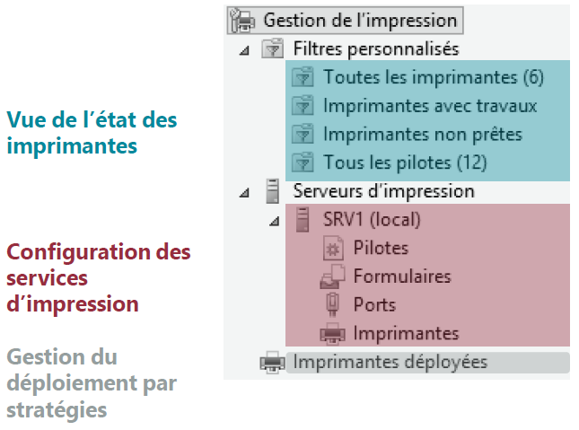
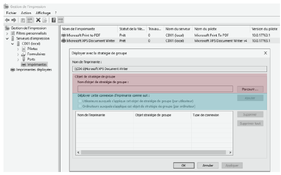

# Gestion des impressions

## Le service d'impression

Les imprimantes sont des ressources généralement raccordées au réseau de l'entreprises.  

<figure markdown=1>

</figure>

L'ajout du service de rôle **Serveur d'impression** permet de partager des imprimantes, de centraliser et de simplifier la gestion de l'impression.  

<figure markdown=1>

</figure>

### Point de Vocabulaire

- Port d'impression : Lien permettant la communication entre le périphérique d'impression et le serveur (ou à un poste client)
- File d'attente : Liste des documents en attente de traitement par l'imprimante
- Imprimante locale : Imprimante directement (physiquement) connectée à un serveur ou à un poste client
- Imprimante partagée : Imprimante accessible sur le réseau
      - Elle peut être du type imprimante réseau
      - Elle peut être du type imprimante locale mais raccordée a un poste ou un serveur qui la partage (celui-ci devrat etre allumé pour qu'elle soit accessible)
- Imprimante réseau : Imprimante indépendante qui possède sa propre carte réseau, disposant d'un écran et/ou d'un serveur web embarqué permettant l'administration à distance

## La gestion des impressions

### Les tâches de gestion et outils

L'ajout du service de rôle **Serveur d'impression** fournit la console de gestion **Gestionnaire d'impression**.  
Cette console rassemble les composants nécessaire :  

<figure markdown=1>

</figure>

## La gestion des périphériques

Comme pour des ressources disque, une imprimante doit être partagée pour être accessible via le réseau.  
L'attribution des privilèges se configure depuis les paramètres de sécurité :  

<figure markdown=1>

</figure>

### La gestion du déploiement

Plusieurs méthodes peuvent être utilisées pour déployer les imprimantes.  

- Le déploiement manuel : l'utilisateur va taper sur l'explorateur, l'ad du serveur sur lequel est installé le role impression, double clic sur l'imprimante pour l'installer.
- L'utilisation de scripts : automatise l'installtion et simplifie l'utilisation
- Le déploiement par stratégies de groupe : Si un utilisateur est renseigné dans une UO, il aura l'imprimante correspondant à son groupe

### Déploiement par GPO

Depuis le **Gestionnaire d'impression**, il est possible de deployer des imprimantes par GPO.  

Les informations à renseigner seront : 

- La stratégie **existante** ou **nouvelle** à utiliser
- Le **type d'objet** ciblé par le déploiement>

<figure markdown=1>

</figure>