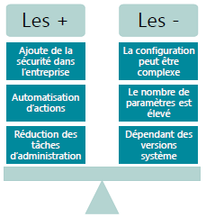
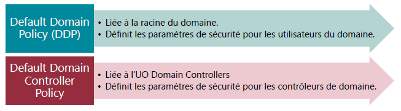
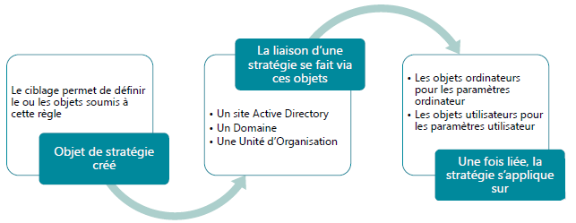
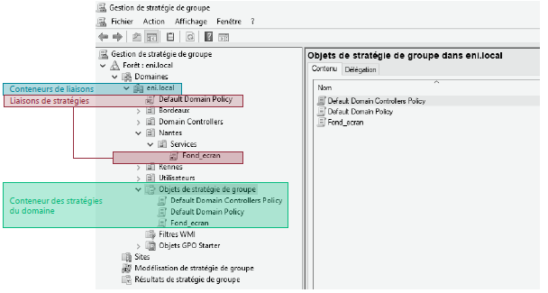
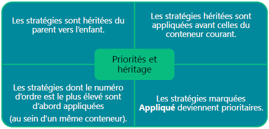
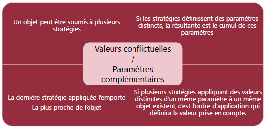
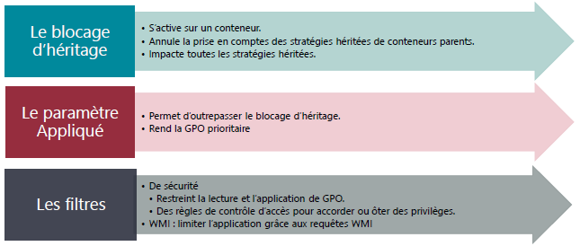
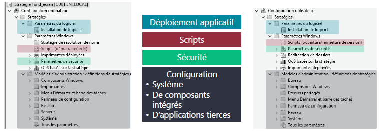
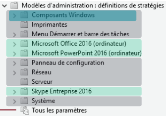
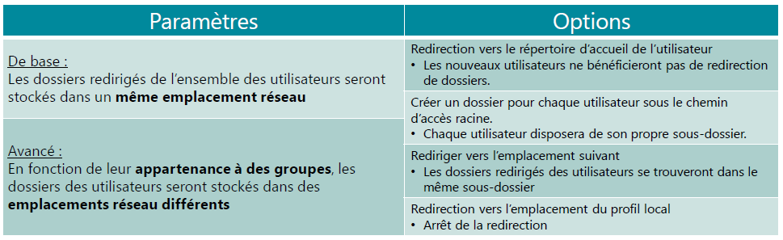

# Les Stratégies de Groupe

## Le fonctionnement des GPO

<u>Descriptif</u>  

Les **GPO** (Group Policy Objetc) ou **stratégies de groupe** sont utilisés dans un domaine AD pour paramétrer les **ordinateurs** et les **utilisateurs**  

<figure markdown=1>

</figure>

### Les types de stratégie

Les conditons d'utilisation et d'application varient selon le type de stratégie.  

- La stratégie de groupe : 
  - Nécessite un contexte de domaine.
  - S'applique sur un ou des ensembles d'éléments
  - En cas de conflits, elle l'emporte sur la stratégie locale
- La stratégie locale
  - Est utilisable dans et hors contexte de domaine.
  - **Se configure poste par poste**

### Du registre aux stratégies

Pour configurer des GPO il existe 2 manière de faire :  

Via le registre, manière plus complexe, il oblige de passer systématiquement poste par poste pour les mettres en place.  
Cependant il n'impactera qu'un poste configuré et non un ensemble de poste.  

Via la console mmc des stratégies de groupe, celle-ci permet d'appliquer des regles sur un ensemble de poste, cela amene un gain de temps.

### Application des stratégies

<figure markdown=1>

</figure>

Côté client on parlera d'extensions, de CSE, il s'agit de composants permettant :  

- Récuperer les stratégies mises à disposition par le contrôleur de domaine.
- Intègrer et appliquer les paramétrages s'y trouvant

### Stratégies par défaut

Après l'installation d'un domaine, 2 stratégies sont configurées par défaut :  

<figure markdown=1>

</figure>

## Le Ciblage des stratégies

!!! inline end danger ""
    Les GPO ne s'appliquent pas aux membres des groupes présents sur un conteneur auquel elles sont liées.  
    Une GPO ne peut pas être appliquée à un groupe.  

<figure markdown=1>

</figure>

### La console de gestion

<figure markdown=1>

</figure>

Il s'agit d'une console mmc, ressemblant à la console mmc de l'active directory.  

Celle-ci comporte : 

- des **Conteneurs de liaison 
- des **Liaisons de stratégies** : Répertorie les stratégies et ou elles sont mises en place
- **Conteneur des stratégies du domaine** : Répertorie l'ensemble des stratégies de groupe, permettant une visualisation simplifié.

### Application et ordre de traitement

=== "Priorités et Héritage"
    <figure markdown=1>
    
    </figure>
=== "Valeurs Conflictuelles"
    <figure markdown=1>
    
    </figure>

### Les possibilités de restrictions

<figure markdown=1>

</figure>

## La mise en oeuvre des stratégies

### Les domaines impactés

Les domaines impactés sont représentés ci-dessous :  

<figure markdown=1>

</figure>

### Les modèles d'administration

Il s'agit de fichier .admx, la plupart des logiciels propriétaire microsoft dispose de ce type de fichier.  

Il permettent de configurer :  

!!! inline end tip ""
    

- Le système d'exploitation
- Des composants système
- Des outils Microsoft

A noter que les fichiers .admx sont stockées dans le partage **"SYSVOL"**

## Redirection des dossiers

### Principe de redirection
Les dossiers du profil utilisateur sont stockés sur un emplacement réseau.  

<figure markdown=1>

</figure>

!!! inline end tip "Paramètres du dossier partagé:"
    - <u>Partage</u>: Contrôle total pour les utilisateurs redirigés.  
    - <u>Permissions NTFS</u>: Liste du dossier et création de dossiers dans ce dossier seulement

### Stratégie de redirection des dossiers

Les redirections s'appliquent aux objets utilisateurs.  

<figure markdown=1>

</figure>
