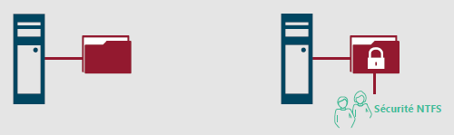
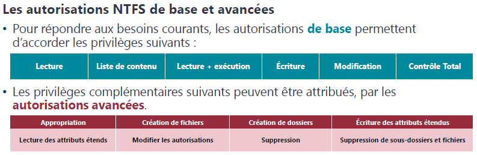
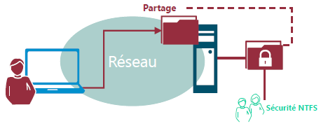
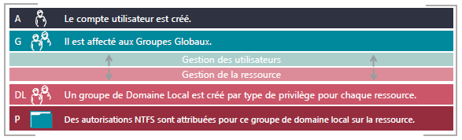

# Partage de Ressource

Le partage de ressource est un service nécessaire aux utilisateurs  
Une ressource partagée peuvent être des dossiers mais également des imprimantes partagée.  
Il s'agit d'un service permettant une utilisation spécifique aux utilisateurs.  

leus mise en oeuvre et leurs gestion incombent aux administrateur système qui doivent respecter les exigences de disponibilités et de sécurité.  
En effet, ils doivent veiller a ce que les données critique de l'entreprise ne soient accessible qu'à certaines personnes ou groupes autorisés.  
Typiquement des données RH, ne doivent pas être accessible a n'importe qui.  

## Utilité des autorisations NTFS

<figure markdown=1>

</figure>

les autorisations NTFS sont soumises pour l'ensemble des éléments, tout dossiers ou fichiers d'un volume formaté y sont soumis.  
Ces autorisations permettent d'oter ou de mettre en place un certain nombre de priviege d'acces (visible depuis l'onglet sécurité de l'élement).  

### Caractéristique des autorisations NTFS

Elles offrent 2 niveaux de gestions : 

- Autorisations de base
- Autorisations avancées

La gestion des permissions est basée sur des règles explicites.  
Plusieurs règle d'accès peuvent etre appliquer à un même utilisateur.  
Chaque règle peut accorder ou ôter des privilèges.  
Le mécanisme d'héritage s'applique aux autorisations positionnées sur des dossiers et s'appliquent aux objets enfants.  
Une règle de refus peut-être explicite ou implicite.  

### Autorisation de base et avancées

<figure markdown=1>

</figure>

### Cumul d'autorisations

Chaque autorisation s’applique à un objet **utilisateur** ou **groupe de sécurité**.  
Il est cependant préférable de n’appliquer des autorisations qu’aux **groupes**.  

Pour chaque entrée de contrôle d’accès, l’autorisation peut être appliquée:  

- **Autoriser** afin d’**accorder le privilège** correspondant  
- **Refuser** afin d’**ôter le privilège** correspondant  

À défaut de règle d’autorisation (explicite) le concernant, l’utilisateur est soumis à un **refus implicite**.  
Les autorisations sont **cumulatives**, la résultante des autorisations affectant un utilisateur correspond au cumul des autorisations le concernant.  
En cas de conflit, **le refus l’emporte**.  

### L'héritage des autorisations NTFS

L'héritage s"applique par défaut aux autorisations NTFS positionnées sur des dossiers.  
Il est conseillé d'affecter ces autorisations **en partant de la racine** d'un arborescence afin de bénéficier de l'héritage et ainsi profité d'une propagation plus rapide et efficace.  
L'héritage peut être rompu sur un point d'arborescence ou repropagé à partir d'un élément.  

Il existe néanmoins des contraintes :  

<figure markdown=1>

</figure>

## Partage de fichiers

Le partage vient en **complément** des autorisations NTFS  

Un poste disposant de partage joue le rôle de serveur de fichiers, ca peut etre un poste client mais plus généralement il s'agira d'un serveur.  

L'utilisateur vas essayer de ce connecter au partage, il passera par l'accès sécrurité NTFS.  

<figure markdown=1>

</figure>

Avant d'arriver sur l'aspect sécurité NTFS, l'utilisateur passera par ...

### Les autorisations de partage

Les autorisations permettent de définir :  

- Quels seront les privilèges
- S'ils autoriseront ou interdiront l'accès au partage
- Pour qui ? est-ce que l'utilisateur est autorisé à y accéder

Les 3 types de privilèges de partage sont les suivants :  

- Lecture
- Modification
- Contrôle Total

Pour chaque niveau, les privilèges correspondants pourront être :  

- Autorisé
- Refusé

Chaque règle cible une ou plusieurs entités.  
Les règles de contrôles d'accès sont cumulatives et les **refus prioritaires**.  

### Autorisations Résultantes

Quand l'utilisateur accède depuis son poste de travail à une ressource partagée :  

- Il est d'abord soumis aux autorisations du partage (acces en lecture, modification ou controle total)
- Puis aux autorisations NTFS (droit de lecture, execution, controle total)

<figure markdown=1>

</figure>

!!! note ""
    Les privilèges les plus restrictifs prévalent.

### Les publications de partage

Pour des questions d'administration et de recherche, la publication des partages est indispensable.  
La publication de partage facilite la recherche pour les utlitisateurs depuis leur poste client avec la fonction **Rechercher dans Active Directory**

Une fois créé, il est possible de les publier dans l'AD.  
Une fois publier l'objet **Partage** est soit lié à :  

- **L'objet Ordinateur** auquel il est associé.
- **Indépendant** et peut être déplacé dans une UO dédié.

### Stratégie d'imbrication des groupes AGDLP

Afin de gérer efficacement l'accès aux ressources partagés, Microsoft préconise l'imbrication des **Groupes Globaux** et de **domaines Locaux**.  

<figure markdown=1>

</figure>

