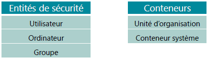
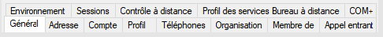
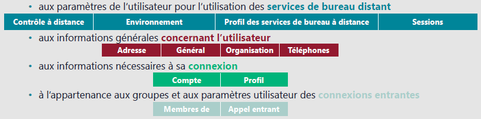
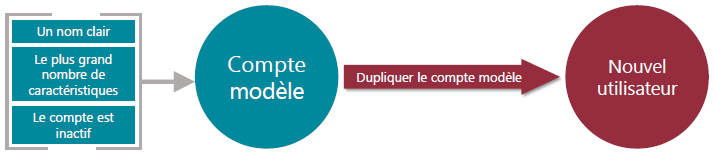
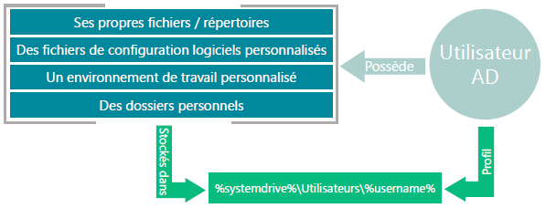
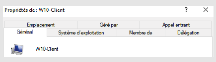
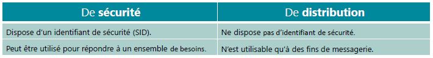
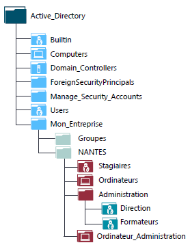

# Base de Gestion d'un Domaine

## Objets de l'annuaire et outils de gestion

Dans un contexte de domaine AD, un certain nombre de tâches courantes seront effectuées, comme l'administration de compte utilisateur, l'administration de conteneur pour nos objets présent dans l'annuaire.  

Les objets sont regroupés en 2 familles :  

<figure markdown=1>

</figure>

- Ordinateurs : ordinateurs clients intégrés au domaine, mais aussi 

La gestion de ces objets peut être faite :  

- Depuis la console Utilisateurs et ordinateurs Active Directory (console mmc)
- Depuis le Centre d'administration Active Directory
- En Powershell

### Objet Utilisateur

#### Caractéristique Utilisateur

Dans un contexte AD à la création d'un utilisateur, un certain nombre de propriété seront disponible pour l'objet utilisateur.  
Ces propriétés sont regroupés en plusieurs famille.  

<figure markdown=1>

</figure>

Elles sont relatives :  

<figure markdown=1>

</figure>

#### Modèles Utilisateurs

Selon les recommandations Microsoft, il est conseillé d'utiliser des modèles de comptes pour simplifier la création de nouveaux comptes utilisateurs.  
Il s'agit de compte générique,  
Il est conseillé de leurs donner des noms clair (ex. *Modele_utilisateur*),  
Ils doivent comporter de nombreuses caractéristiques afin d'eviter de le refaire manuellement à l'entrée de nouveau entrant,  
ils doivent être desactivé afin d'eviter les mauvaise manipulation.  

<figure markdown=1>

</figure>

#### Profil Utilisateur

Par défaut, les utilisateurs du domaine seront sauvegardé dans l'active directory et stocké au même endroit pour l'ensemble des utilisateurs qui ouvriront une session sur des ordinateurs du domaine.  

Un utilisateur AD possede :  

<figure markdown=1>

</figure>

#### Profil Itinérant

Ils sont principalement utilisé quand les utilisateur on des besoin d'accès à leurs profil depuis n'importe quel ordinateur.  
Ils ne disposent pas de poste référent, ils doivent ce connecter a differente machine au sein de l'entreprise.  

- Le profil est copié du partage vers l'ordinateur  
- synchronisation du profil à chaque fermeture de session  

    1. Le profil est chargé sur l'ordinateur, cela induit que le profil de chaque utilisateur, disposant un profil itinérant, sera stocké sur un serveur de l'entreprise, situé dans le domaine
    2. L'utilisateur pourra travaillé, sur n'importe quelle pc avec son environnement qu'il avait sur une autre machine
    3. A la fermeture de session, le profil est synchronisé sur le serveur

### Objet Ordinateur

Dans un contexte AD, les membres s'authentifient afin de disposer d'un ***jeton d'accès*** permettant l'accès aux ressources du domaine.  
Ce processus est commun aux utilisateurs et aux ordinateurs.  
Voila pourquoi les ordinateurs doivent, eux aussi, disposer d'un compte dans le domaine.  

#### Caractéristique Ordinateur

Comme l'objet Utilisateur, l'objet ordinateur dispose de caractéristiques qui lui sont propres.  

<figure markdown=1>

</figure>

Parmi les caractéristiques, le nom et la description sont peut-être les plus importantes.  
Un bon nommage et une bonne description permet une meilleure administration de l'AD et donc du parc informatique.  
C'est également dans les propriétés de l'objet ordinateur que les groupes auquel il appartient seront mentionné.  

## Les Groupes

Un groupe permet de regrouper plusieurs objets au sein d'un même objet.  

Les groupes permettent de simplifier les listes d'autorisations sur les répertoires mais ils permettent également de simplifier l'administration,  
ex. Si un utilisateur change de service il suffira de changer l'appartenance au groupe et non de passer sur chaque partage pour changer ses autorisations.  

Il existe différent type de groupe et différentes étendues de groupe.  

<figure markdown=1>
{width=450}
</figure>

### l'étendue du groupe

Les étendues sont dépendantes du niveau de la forêt et du domaine.  
En effet crée des groupes à étendue universelle si aucun autre domaine ou aucune autre forêt n'est présente n'as pas franchement d'interet.  

#### Domaine local

Un groupe disposant d'une étendue "domaine local" peut-être utilisé uniquement dans le domaine dans lequel il est créé.  
Il peut être défini pour contrôler l'accès aux ressources uniquement au niveau du domaine local.  

#### Globale

Un groupe disposant d'une étendue "globale" pourra être utilisé dans le domaine local, mais également dans tous les domaines approuvés par le domaine de base.  
Un groupe global pourra contenir d'autre objets du domaine, et être utilisé pour contrôler l'accès aux ressources sur le domaine local et tous les domaines approuvés.  

#### Universelle

Un groupe disposant de l'étendue "Universelle" aura une portée sur l'ensemble de la forêt.  
Un groupe universel peut contenir des groupes et objets de n'importe quel domaine de la forêt.  
Il est possible de l'utiliser pour consolider plusieurs groupes devant avoir une portée sur l'ensemble du système.  
Ce groupe est défini au sein d'un catalogue global.  

### Type du Groupe

#### Sécurité

Il s'agit des plus utilisés et les plus manipulés, ils permettent d'utiliser les groupes pour gérer les autorisations d'accès aux ressources.  

Ces groupes sont utilisés pour le contrôle d'accès, ce qui implique que chaque groupe de ce type dispose d'un identifiant "SID"

#### Distribution

L'objectif de ce groupe est principalement de faire des listes de distribution, par ex. créer une liste de distribution d'e-mail en ajoutant des contacts.  

N'ayant aucune notion de sécurité, ce type de groupe ne dispose pas de "SID"  

### Les conteneurs système

A la création d'un domaine, différents objets par défaut sont présent.  
Parmi eux :  

- "Built-in" : Element présent dans la base SAM des CD avant leurs promotion. Une fois la promotion faite, ces derniers sont déplacés dans ce conteneur
               Ce sont des groupes permettant d'assigner des autorisations d'administration de façon général ou précises afin de gérer la sécurité.  
               Leur étendue est toujours de type local.  
- Computers : Emplacement de stockage par défaut des comptes ordinateurs
- System : Emplacement de stockage des éléments nécessaires aux fonctionnement de l'AD et aux composants associés.
- Users : Emplacement de stockage des groupes et utilisateurs existant par défaut dans un AD

!!! danger ""
    Il n'est pas conseillé de conserver les comptes ordinateur et utilisateur dans les conteneurs Computer & users

## Les UO (Unités d'Organisation)

<figure markdown=1>

</figure>

Les UO permettent de grouper les objets suivant les besoins.  
Une UO est un groupe d'objets, similaire à un dossier, contenant des fichiers.  
Il s'agit en réalité d'un conteneur où l'on va placer des objets.  

Les UO vont aider à représenter la structure de l'entreprise.  

Elles vont regrouper des utilisateurs et/ou des ordinateurs en fonction de leur zone géographique, leur service, leur fonction, etc.  

L'élaboration d'une structure organisationnelle doit prendre en compte les points suivants :  

- Les GPO **G**roup **P**olicy **O**bject (stratégie de groupe)
- Les délégations administratives
- L'organisation des objets dans l'arborescence

A noter qu'il est impossible de dédoubler un objet, il peut être copié !

!!! danger ""
    Sur les CD, les UO sont protégées contre toute suppression accidentelle !