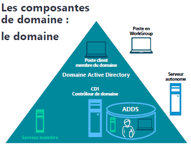
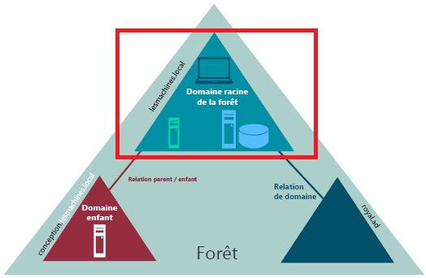
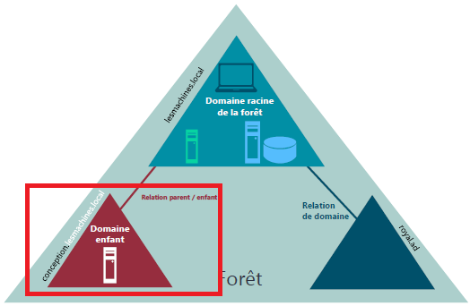
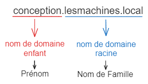
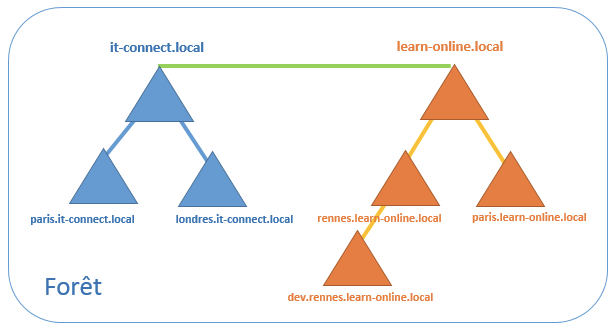
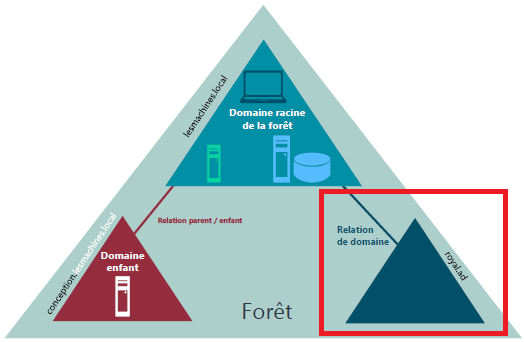
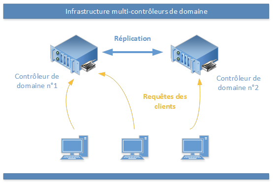

<figure markdown="1">


</figure>

# Active Directory

L'Active Directory, service propriétaire Microsoft&copy;, est un annuaire LDAP (Lightweight Directory Protocol Access) pour les systèmes d'exploitation Windows.  

Ce protocole permet de définir la méthode utilisée pour l'interrogation de la base de données permettant aux utilisateurs de ce connecter/deconnecter au sein du ***Domaine***.  

Cet annuaire contient des élements, appelés ***Objets***, de différents **types** tel que des **utilisateurs**, des **machines** (imprimantes, postes clients, serveurs).  

Ces **Objets** sont stockés (virtuellement) dans une base de données, cela permet de centraliser les informations relatives aux élements cités plus haut et de créer le **schéma Active Directory** (la structure de la base de donnés).  

Son objectif est de centraliser 2 fonctionnalités essentielles :  
- **l'identification**  
- **l'authentification**  

Il utilise 3 protocoles standardisés:  

- **DNS**: Résolution de noms de machines et localisation de services.
- **LDAP**: Norme pour les systèmes d'annuaires avec une structure de base de données arborescente.
- **Kerberos**: Protocole d'authentification reposant sur un mécanisme de clés secrètes et l'utilisation de tickets.  

## Intérêts d'un annuaire Active Directory

1. <u>Administration centralisée et simplifié</u>  
   Tout étant centralisé dans l'annuaire Active Directory La gestion des **objets**, utilisateurs et ordinateurs, est simplifiée.  
   L'annuaire permet également le déploiement de stratégie de groupe (notion développé plus tard)  
2. <u>Faciliter l'authentification</u>  
   Un utilisateur s'authentifiant sur une machine, elle même authentifiée, pourra accéder, sous couvert d'avoir les autorisations, à l'ensemble des ressources stockées sur d'autres machine du réseau.  
   De nombreuses applications s'appuyant sur l'Active Directory pour l'authentification, un seul compte peut permettre un accès à tout un système d'information, ce qui est intéressant au sein d'une entreprise.  
3. <u>Identifier les **objets** sur le réseau</u>  
   Chaque objet enregistré dasn l'annuaire est unique, ce qui permet d'identifier facilement un objet sur le réseau et de le retrouver ensuite dans l'annuaire.  
4. <u>Référencer les utilisateurs et les ordinateurs</u>  
   La "base de donnée" de l'Active Directory référence les utilisateurs, les groupes, et les ordinateurs, il est donc possible via cette "base de donnée" de réaliser de l'authentification, de l'identification, des stratégies de groupe, du déploiement de logiciel, etc.  

## Qu'est-ce qu'un Domaine ?

!!! inline end tip ""
    Sur un schéma il sera toujours  
    représenté par un triangle  

<figure markdown=1>

<figcaption>Poste Workgroup et Serveur autonome ne font pas partit de l'AD</figcaption>
</figure>

!!! quote " Définition d'un domaine "
    Un domaine est une "entité", un ***ensemble d'objets*** partageant le même annuaire, une base de donnée commune.  
    Un domaine est administré comme un ensemble, régi par des règles et procédures communes.  

### Prérequis pour un contexte de domaine

Avant de promouvoir un serveur en contrôleur de Domaine, ces prérequis doivent être respectés :  

- Nom d'hôte du poste : Le nom d'hôte et le suffixe DNS doivent être correctement définis.  
- Configuration réseau et adressage IP : Un plan d'adressage correct et un IP statique.  
- Composants Windows : Les composants relatifs aux services ADDS doivent être installés.  
- Prise en compte de l'existant : Analyser l'infrastructure existante et déterminer les points essentiels.  
- Préparation de l'AD : La forêt ou le domaine peut-être préparé lors de l'ajout d'un CD.  

### Domaine Racine

<figure markdown=1>

</figure>

Le premier domaine créé dans une entreprise sera le domaine **"racine"** d'une **"forêt"**.  
Ce domaine sera le point de départ de toute l'infrastructure.  
Sur le 1er Schéma il s'agit du domaine **lesmachines.local**.

Un domaine sera nommer de la même manière qu'un nom de domaine sur internet.  
On y ajoutera **l'extension du domaine** (.fr, .lan, .com, etc.) ainsi que le **nom du domaine** (monentreprise.lan, mondomaine.com, etc.)  
Pour que cela soit faisable il faudra faire appel à un service de résolution de noms : ***DNS*** qui gerera la zone du domaine.  

### Domaine enfant

<figure markdown=1>

</figure>

C'est a ce domaine racine que les **domaines enfants** seront rattaché.  
Dans le schéma il s'agit du triangle rouge **"conception.lesmachines.local"**.  

!!! inline end tip ""
    Un domaine enfant aura toujours  
    son nom de domaine rattaché au nom de domaine racine.  

- conception. : nom du domaine enfant  
- lesmachines.local : nom du domaine racine de la forêt  

Au niveau du nommage cela peut etre représenté de cette manière :  

<figure markdown=1>

</figure>

### Arbre

Un arbre est un regroupement hiérarchique de plusieurs domaines.  

Des qu'un domaine principal (racine) contient plusieurs sous-domaines on parle alors d'arbre, ou chaque sous-domaine au domaine racine représente une branche de l'arbre

### Forêt

<figure markdown=1>

</figure>

A l'installation du service Active Directory, une demande de création de forêt sera obligatoirement faite par le service AD.  

La forêt est le point de départ du contexte active directory.  
C'est dans cette forêt que sera crée le domaine racine **"lesmachines.local"**.  
Ce domaine sera le point de départ de toute l'infrastructure.  

Une **forêt** est également le regroupement d'un ou plusieurs arbres, notion expliquée plus bas.  

<figure markdown=1>
{width=400}
<figcaption>source: it-connect.fr</figcaption>
</figure>

La création d'une ***forêt*** et le regroupement des arbres apporte :  

- Un schéma d'annuaire commun  
- Un *catalogue global* commun  
- Une facilité de communication entre les domaines, bien que chaque domaine de la forêt fonctionnent de manière indépendante  
- Création de relations entre les différents domaines  
- Simplifie l'administration et la flexibilité. un utilisateur pourra, si les autorisatiation le permettent, ce connecter ou acceder a des ressources sur une autre foret.  
  (Dans notre schéma un utilisateur du domaine *"paris.it-connect.local"* peut acceder a des ressources dans le domaine *"rennes.learn-online.local"* ou ce connecter sur une machine du domaine *"paris.learn-online.local"*)  

### Relation de domaine

<figure markdown=1>

</figure>

Les domaines d'une même foret sont liés par une **relation d'approbation** transitive bidirectionnelle.  
Cela permet la transmission de l'authentification d'un domaine à n'importe quel autre domaine dans la même forêt.  

## Niveau fonctionnel

Un niveau fonctionnel détermine les fonctionnalités des services AD, disponibles dans un domaine ou une forêt.  

A la création d'un domaine, un niveau fonctionnel est défini, il correspond à la version du système avec lequel on crée le domaine.  
Si le domaine est crée avec un Windows Serveur 2019, le niveau fonctionnel sera Windows Server 2019.  

Le niveau fonctionnel permet de limiter les fonctionnalités de l'annuaire afin d'assurer la compatibilité avec les versions plus anciennes des contrôleurs de domaine.  

## Contrôleur de domaine

A la création d'un domaine, le serveur sur lequel est effectué l'opération est promue "contrôleur de domaine" du domaine crée.  
Il s'agit des serveurs qui assurent la gestion du domaine.  
Ils assurent les tâches d'hébergement et de gestion de la base Active Directory.  
Cela signifie qu'il devra vérifier les objets, gérer les demandes d'authentification, appliquer les stratégies de groupe et stocker une copie de l'annuaire Active Directory.  

Un contrôleur de domaine est indispensable au fonctionnement du domaine, si celui vient à etre corrompu ou éteint le domaine sera inutilisable.  

### Rétrograder/Promouvoir un Contrôleur de domaine

A savoir qu'un contrôleur de domaine n'est pas figé.  
Une fois l'AD installé et fonctionnel, il sera quand même possible de les retrograder, en leurs retirant le rôle de controleur de domaine afin de les utiliser comme simple serveur de fichier ou autre.  
Il est également possible de promouvoir un nouveau serveur en contrôleur de domaine.  

Pour cela il faudra respecter quelques règles car l'ajout ou la suppression d'un contrôleur de domaine sont des actions qui impactent l'ensemble de la forêt (ou de l'arbre) et donc les utilisateurs et l'entreprise.  

Avant de rétrograder un contrôleur de domaine, il faudra s'assurer qu'il ne dispose plus de rôles **FSMO**.  

Sous Windows 2016 et ultérieur pour retrograder, il faut utiliser la commande :  

```pws
C:\Windows\System32> Uninstall-AddsDomainController
```
### Les Rôles FSMO

Les **FSMO** (**F**lexible **S**ingle **M**aster **O**peration) permettent de delimiter les responsabilités de chaque serveur "contrôleur de domaine" et donc d'en améliorer la sécurité.  

Les rôles **FSMO** assument certaines tâches au sein d'un domaine ou d'une forêt.  

Le premier contrôleur de domaine détiendra par défaut les 5 rôle. Il sera cependant possible de transférer les rôles sur d'autre controleur de domaine afin de les répartir.  

!!! important ""
    Il ne peut y avoir plusieurs Maîtres d'opération pour le même rôles **FSMO** ou sein d'un domaine ou d'une forêt.

Les 5 rôles sont séparés en 2 catégories :  

- Les rôles Forêt
    - Maitre de nom de domaine : Chargé de l'unicité des noms de domaine au niveau de la forêt.  
      Egalement en charge de la création et/ou suppression de relations avec les domaines externes.  
      Si il n'est pas disponible aucun ajout ou suppression de domaine n'est possible.  
      <span style="color:red">Unique au sein de la Forêt</span>  
    - Maitre de schéma : Chargé de l'unicité au sein de la forêt.  
      Il sera le seul à pouvoir initier des changements au nivea ude la structure de l'annuaire.  
      Il assure la réplications sur l'ensemble des contrôleurs de domaine.  
      <span style="color:red">Unique au sein de la forêt</span>  
- Les rôles Domaine
    - Maitre RID : Il attribue à chaque objet (utilistauer, machine, groupe, etc.) un identifiant unique 
      de sécurité (SID).  
      Les SID sont structurés de la manière suivante:
        - Un numéro de révision
        - Un identificateur de sécurité du domaine (une suite de numéro propre et unique à chaque domaine)
        - Un RID (Relative Identifier), une plage de chiffre (un POOL) incrémentable qui suit le SID du    
        domaine et donne l'id final d'un objet.  
        <span style="color:red">S-1-5-21-2401410526-1208469522-549608361</span><span style="color:green">-500</span>  
        La partie rouge représente le SID domaine, le vert le RID objet.  
        <span style="color:red">Unique au sein du Domaine</span>
    - Maitre d'infrastructure : Chargé d'assurer la propagation des objets ou des modifications apportés 
      sur un objet (supprimé, renommé) au travers de tous les domaines de la forêt.  
      <span style="color:red">Unique au sein du Domaine</span>  
    - Maitre émulateur PDC : Chargé de s'assurer de la sécurité telles que la gestion des mots de passe, 
      Verrouillage des comptes, modifications des stratégies de groupe (afin d'éviter les conflits et écrasements).  
      Il joue également le rôle de serveur de temps pour l'ensemble du domaine.  
      <span style="color:red">Unique au sein du Domaine</span>

### Réplication

Il est intéressant, voir même indispensable, de disposer de 2 contrôleurs de domaine sur le même réseau.  
Cela permet la disponibilité et la continuité de service en cas de problème.  
Depuis 2008 le mécanisme **DFSR** (**D**istributed **F**ile **S**ystem **R**eplication) est pris en charge par Windows Server.  
Grâce à ce systeme les CD (1) répliquent les informations à intervalles régulier entre eux, afin d'avoir un annuaire Active Directory identique.
Un numéro de version est géré par les CD afin de savoir si ils sont à jour par rapport à la version la plus récente de l'annuaire.  
{ .annotate }

1. :bulb: Contrôleur de domaine

!!! inline end tip ""
      Le dossier "SYSVOL" utilisé pour les GPO 
      est également répliqué  

{width=400}
