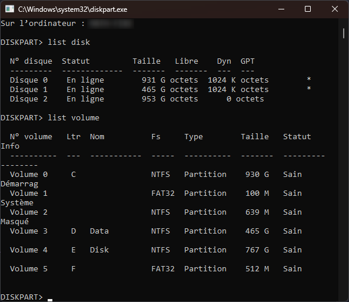
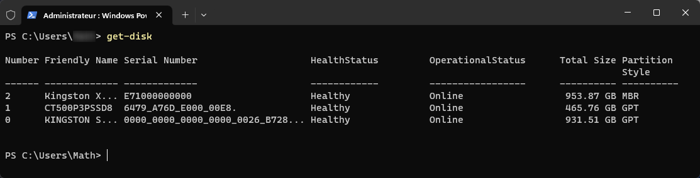

# Administration Windows

## <u>Windows Serveur</u>

<figure markdown="1">
{width=600}
{width=600}

</figure>

Au même titre que la version client, les éditions serveur recoivent des releases permettant l'amélioration de l'OS en matière de sécurité, de performances etc.  

## <u>Les différentes éditions</u>

<figure markdown="1">
{width=600}
</figure>

## <u>Les services pris en charge</u>

L'installation d'un serveur en entreprise permet d'allouer des services spécifiques facilitant la gestion de l'infrastructure de cette même entreprise.  
Un ensemble de services est nativement pris en charge par les systèmes d'exploitation Windows Server:  

Les services de domaine :  

- Services de domaine Active Directory (AD DS) : Fournit la gestion de contextes de domaine Active Directory;
- Service de fédération AD (AD FS) : Services fédérés de gestion des identités;
- Services de gestion des droits AD (AD RMS) : Protection des ressources contre une utilisation non autorisée, basée sur des certificats ( permettant notamment d'interdire la copie ou l'impression d'un fichier);
- Service de certificat AD (AD CS) : Service de gestion d'une autorité de certification (fournit une infrastructure à clef publique);

Autres services pris en charge :  

- DNS : Service de résolution de noms d'hôtes;
- DHCP : Service de gestion de l'adressage IP;
- Hyper-V : Service de virtualisation Microsoft;
- WDS : Service de déploiement d'OS Windows à travers le réseau;
- WSUS : Service de prise en charge de mise à jour de produit Microsoft;
- Service d'impression et de numérisation : Service permettant la gestion centralisée des périphériques d'impressions et de numérisations.

D'autre solutions, outils, applications peuvent être pris en charge et mis en oeuvre comme par exemple un serveur de messagerie EXchange, un serveur de base de données Microsoft SQL etc.  

## <u>Installation du système et composants</u>

### Installation

#### Standard

Il s'agit de l'installation avec environnement graphique (GUI : Graphic User Interface)  

#### Minimale / Server Core

Il s'agit du mode d'installation par défaut et demandant le moins de ressource.  
Ce mode d'installation est disponible depuis Windows Server 2008.  
Cette installation sera en "Core" sans interface graphique et exclusivement en commande Powershell

### <u>Les composants</u>

#### Rôle et Fonctionnalités

Une fois le serveur installé, des composants peuvent être ajoutés par :  

- Le gestionnaire de Serveur (ou DashBoard)
- En commandes Powershell (exclusivement utilisé si le serveur est installé sans GUI)

Il existe 2 types de composants : 

- Les rôles : correspond généralement à un **service que l'on fournit à des clients**
- Les fonctionnalités : correspond généralement à un outil/composant **utile sur l'élément sur lequel on l'ajoute**

#### Outils de gestion

les différents outils sont :  

- Le gestionnaire de serveur : élément central d'administration du ou des serveurs

Via ce gestionnaire des services (vu précédemment) pourront être installés.

- Les consoles de gestion des services (Console MMC):
    - Disponibles suite à l'ajout d'un rôle sur le serveur
    - Peuvent être ajoutées sur un poste d'administration ne disposant pas du rôle à gérer
- Elle peuvent être utilisable et administrable
    - via CMD
    - via Powershell, propose des éléments plus complexe que l'interface graphique

## <u>Gestion du Stockage</u>

### Format de table de partition

!!! note ""
    === "MBR (historique)"
        - Cette table faisait partie des informations stockées sur le premier secteur adressable du disque
        - Le BIOS recherche un secteur d'amorçage sur les médias bootable.
        === "Caractéristiques"
            - Plus faible tolérance aux pannes
            - Nom donnée au premier secteur physique d'un disque
    === "GPT"
        - A ce jour, la majorité des machines disposent d'un UEFI
        - Les SSD sont, généralement, préconfigurés de cette manière
        - Meilleure performance avec les cartes mères UEFI
        - Optimiser pour les systèmes d'exploitation en 64 bits
        === "Caractéristiques"
            - Meilleure tolérance aux pannes
            - Les données sont dupliquées sur plusieurs secteurs
                - Possibilité de reconstruction
=== "Possibilité de conversion"
    La conversion MBR --> GPT en s'assurant que le disque ne contiennent pas de données

### Types de configuration des disques

Il existe 2 types de configurations des disques  

=== "Configuration de base"
    - Simplifie la gestion du disque
    - Toutes les données sont inscrites dans des partitions
    - Sur un seul disque physique
        - Partition C: --> Système
        - Partition D: --> Données
=== "Configuration Dynamique"
    - Gestion faite par ensemble de disques
    - Les données sont inscrites dans des volumes
    - Nécessaire pour le RAID logiciel  
 
=== "Conversion Base --> Dynamique"
    Sans incidence pour les données
=== "Conversion Dynamique --> Base"
    Nécessite la suppression préalable des volumes

### Partitionnement et RAID

#### Disque de Base

<figure markdown="1">

</figure>

Sur un disque de base, on peut créer au maximum soit :  

- 4 partitions principales
- 3 partitions principales et 1 partition étendue pouvant contenir des lecteurs logique
  - Les lecteurs logiques seront formatés et il sera impossible d'installer un système d'exploitation sur ces lecteurs logiques

Les partitions peuvent être étendues ou réduites sur l'espace contigu du même disque.  
Le lancement d'un OS à partir d'un lecteur logique n'est pas possible !  

#### Disque Dynamique

Il est composé de volumes qui peuvent être de plusieurs type:  
- Volume Simple
- Volume Fractionné
- Volume agrégé par bandes
- Volume en miroir
- Volume agrégé par bandes de parité

Nous parlerons pour ces volumes de RAID (**R**edundancy **A**rray of **I**nexpensive **D**isk)  

##### Volume Simple

On parlera d'espace de disque.  

Il s'agit du seul type de volume qui utilise un seul disque physique.  

<figure markdown=1>

</figure>

Il peut être étendu au sein du même disque  

<figure markdown=1>

</figure>

##### Volume Fractionné

Un volume fractionné utilise plusieurs espaces sur plusieurs disques physiques.  
Pour le mettre en place il faudra au <u>minimum</u> 2 disques.  

**Situation Initiale** : 2 disques installés, Seulement 1 d'utilisé

**Extension du volume simple 2 sur le disque dynamique 2**

#### RAID-0 - Volume agrégé par bandes

<figure markdown=1>

</figure>

!!! inline end failure ":no_entry:"
    Aucune tolérance de panne !

- La taille des bandes doit être identique sur chaque disque  
- Réparti sur 2 à "x" disques  
- Rapidité décriture accrue
- Tout l'espace disque alloué est utilisable
      - Volume utile = Nombre de disque totale
      - Pour 2 disques de 200Go, on aurait 400Go de volume utile

<figure markdown=1>
{width=300}
</figure>

#### RAID-1 - Volume en miroir

<figure markdown=1>

</figure>

!!! inline end success ":+1:"
    Tolérance aux pannes accrues  
    Un des disques peut-être perdu sans  
    impact sur les données

- Réparti sur 2 disques
- L'espace alloué sur les 2 disques doit être identique
- Les mêmes données sont écrites simultanément sur les 2 disques
- La moitié de l'espace disque alloué n'est pas directement utilisable
      - Volume utile = Nombre de disque / 2
      - Pour 2 disques de 200Go, on aurait 200Go de volume utile

<figure markdown=1>
{width=300}
</figure>

#### RAID-5 - Volume agrégé par bandes avec parité

<figure markdown=1>

</figure>

!!! inline end tip ":+1:"
    Tolérance de panne d'un seul disque

- 3 disques <u>minimum</u>
- 1 disque (espace d'une bande) est alloué à la tolérance de panne
      - Volume utile = Nombre de disque -1 x capacité d'un disque
      - Pour 3 disques de 200Go, on aurait 3-1 x 200 = 400Go de volume utile
- Bon compromis tolérance panne/coûts

<figure markdown=1>
{width=350}
</figure>

### Formatage

Premièrement les disques doivent être initialisé et en ligne pour pouvoir être formaté.  
Les partitions principales, lecteurs logiques et volumes  doivent être formatés pour être utilisables.  

Le formatage est l'installation d'un système de fichier (hébergement de données).  

Les systèmes de fichiers disponibles sont :  
- **FAT32** - Depuis windows 9x
  - Taille max de fichier = 4Go
  - Taille max de partition = 2To
- **NTFS** - Depuis windows NT (norma actuelle pour la plupart des systèmes)
  - Taille max fichier et partition = 256To
- **ReFS** - Depuis Windows 2012 (pour les espaces de stockage)

<figure markdown=1>

</figure>

#### Les outils

Les outils permettant la gestion des disques et le formatage sont :  

=== "La console de **gestion des disques**"  
    **diskmgmt.msc** via ++win+r++ - console mmc"  
    <figure markdown=1>
    {width=450}  
    </figure>
=== "La commande **diskpart** utilisable en cmd"  
    <figure markdown=1>
    {width=450}  
    </figure>
=== "Les commandes **PowerShell**"  
    <figure markdown=1>
    {width=450}  
    </figure>  
