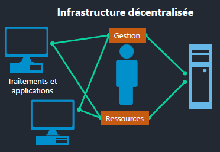
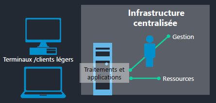
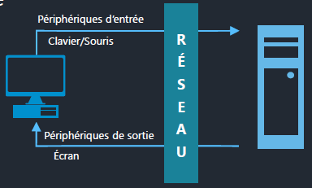
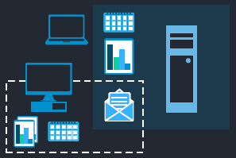
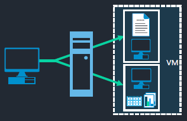
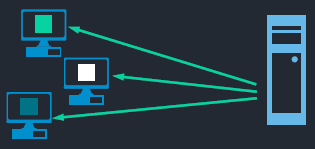
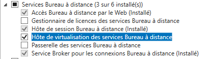
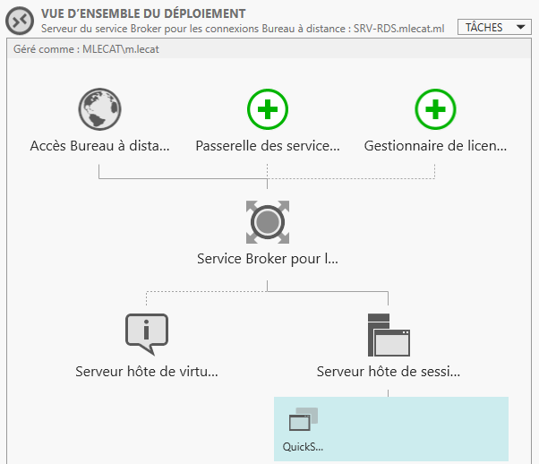

# RDS - Remote Desktop Services

## Principe de fonctionnement

### Client Lourd

Dans le modèle **client lourd**, les applications sont installées sur les postes de travail des utilisateurs.  

- La puissance de ceux-ci impacte le fonctionnement de l'application  
- La gestion des applications est à faire sur les postes  

<figure markdown=1>

</figure>

### Client Léger

Dans le modèle **client léger**, les utilisateurs peuvent travailler depuis de simples terminaux  

- La puissance nécessaire est fournie par les serveurs  
- L'installation, configuration et gestions des applications est réalisée sur les serveurs les hébergeant  

<figure markdown=1>

</figure>

#### Echanges de flux

Dans une infrastrucure de **client léger** :  

Une partie et/ou la totalité des outils sont déportées vers les serveurs.  
Le réseau est utilisé comme support de transmission.  
Le protocole utilisé pour les échanges de flux dépend de la solution choisie.  

<figure markdown=1>

</figure>

#### Avantages du client léger

Le client léger présente plusieurs avantage telle que :  

- La réduction des coûts :  
    - Coût d'acquisition du matériel et de maintenance, Consommation énergétique.  
- Un meilleur service :  
    - Simplification du support et du déploiement.  
- Réponse à des contraintes spécifiques :  
    - Desserte réseau limitée, milieux hostiles.  
- Sécurité de l'infrastructure :  
    - Limite les données locales et la propagation des virus.  

### Limite d'une infrastructure centralisée

<!--- Vidéo à regarder pour compléter le PDF --->

## Services apportés par RDS

Le service RDS permet de mettre à disposition des utilisateurs un environnement de bureau complet ou des applications déportées.  

<figure markdown=1>

</figure>

Mais également une ou plusieurs machines virtuelles hébergées (VDI)  

<figure markdown=1>

</figure>

### Caractéristiques du service

Le service RDS est un service :  

{align=right}

- Multisession  
- Multi-utilisateurs  

Il permet des accès multiples à des environnements dédiés :  

=== "RDS : Remote Desktop Service"
    **Rôle** à installer sur un serveur Microsoft afin de fournir à de multiples utilisateurs des environnements de travail.
=== "RDP : Remote Desktop Protocol"
    **Protocole** utilisé afin de véhiculer via le réseau des informations entre un serveur d'accès distant et ses clients.

### Principales solutions

Suite à la décision de mise en place d'une architecture client léger, il reste à déterminer sur quels outils celle-ci s'appuiera  
Voici une liste des solutions les plus présente sur le marché :  

|              Solution               |  Editeur  |
| :---------------------------------: | :-------: |
|  Citrix Virtual Apps and Desktops   |  Citrix   |
|       Remote Desktop Services       | Microsoft |
| Parallels Remote Application Server | Parallels |
|           VMware Horizon            |  VMware   |

Avant de procéder à l'installation du service, la connaissance des étapes et éléments prenant part au processus est indispensable  
Avant tout déploiements vous devez avori déterminé quels serveurs RDS fourniront quels services  

#### Type et scénario de déploiement

<u>Le type de déploiement</u>  

- Déploiement standard : Utilisé pour déployer le service RDS sur un ensemble de serveurs (permet le ciblage des services de rôle sur les serveurs souhaités).  
- Démarrage rapide : Utilisé pour déployer les services RDS sur un serveur unique.  

<u>Le scénario de déploiement</u>  

- Déploiement de bureaux basés sur une session : Le service RDS ainsi configuré permettra l'utilisation de bureaux virtuels publié et d'applications publiées  
- Déploiement de bureaux basés sur un ordinateur virtuel : Permet de mettre en place une solution de VDI afin de mettre à disposition des utilisateurs des machines virtuelles complètes via le service RDS.  

#### Services de rôle RDS

Le rôle RDS est répartie sur six services  

1. Remote Desktop Connection Broker  
2. Remote Desktop Gateway  
3. Remote Desktop Licensing  
4. Remote Desktop Session Host  
5. Remote Desktop Virtualization Host  
6. Remote Desktop Web Access  

Ces services de rôles peuvent être assurés par un même serveur RDS ou répartis sur plusieurs serveurs RDS.  
Les quatres fonctions suivantes sont nécessaires au fonctionnement d'une infrastructures RDS de bureaux virtuels et d'applications.  

{align=right}  

* Remote Desktop Connection Broker  
* Remote Desktop Licensing  
* Remote Desktop Session Host  
* Remote Desktop Web Access  

#### Outils de gestion du service

Depuis la version Serveur 2012, les composants graphiques de gestion du rôle sont intégrés au gestionnaire de serveur  

<figure markdown=1>
{width=400}
</figure>

Le module RemoteDesktop permet la gestion exhaustive du service RDS dans l'environnement PowerShell  
Pour cela les principales `cmdlets` pour le déploiement et la configuration du service sont les suivantes :  

```ps1  
New-RDSessionDeployment # Déploiement et configuration des services de rôle RDS pour les bureaux basés sur une session  
New-RDSessionCollection # Création d'une collection  
New-RDRemoteAPP         # Publication d'une application RemoteAPP  
```  

#### Création d'une collection

La création d'une collection, à l'issue du processus d'installation, permet de regrouper un ensemble de serveurs fournissant des services ciblés  
Cela sera nécessaire pour :  

- La fourniture du service de bureaux distants  
- La publication d'applications  

Elle peut être configurer depuis le **Gestionnaire de serveur**  

<!--- ajout screen collection RDS --->

#### Client d'accès

RDS propose différents mode de connexion au session de bureau à distance.  

- Via l'outil **Connexion Bureau à Distance**  
- Via le navigateur web **http://*nom_dns_ou_ip_du_serveur*/rdweb**  

L'outils **Connexion Bureau à Distance** offre l'avantage d'être directement intégré aux systèmes Microsoft  
Il permet, notamment via le bouton ***Afficher les options*** de configurer l'utilisation de ressources locales, l'utilisation d'écrans multiples, etc.  

#### Gestion des connexions

Les **Gestionnaire de serveur** offre la possibilité de gérer et visualiser les utlisateurs connectés.  
Différente action son réalisable en effectuant un clic droit sur un utilisateurs  

- Envoyer un message,  
- Prendre un cliché (A noter que cette fonction permet la prise en main à distance de la session de l'utilisateur),  
- Fermer la session,  
- La déconnexion à distance  

## Publication d'applications