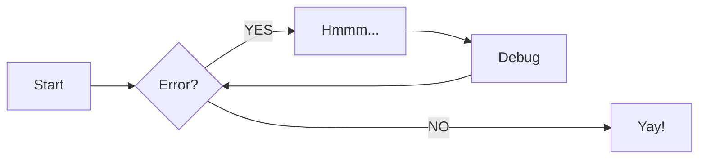

# Page test syntaxe

## Syntaxe

*italique* mettre `*` ou `_` de chaque coté du mot

**gras** mettre `**` ou `__` de chaque coté du mot

***gras et italique*** mettre `***` ou `___` de chaque coté du mot

Pour un retour a la ligne enchainer 2 espaces et touche entrée.

## ligne horizontale

ajout de 3 `_` en dessous d'un titre (ou paragraphe) pour faire une ligne horizontale separatrice  

Exemple 1
___


l'ajout de `>` au début d'un bloc de texte permet de creer une citation

> ceci est une citation  
> et elle continue ici

****

## Titre

rajouter autant de `#` avant les titres pour hierarchiser les titres

****

## Ajout d'image

``  
l'ajout de `./` entre les parentheses ouvre un menu de selection de documents.

****

## Bloc de note

Pour les mises en pages suivante il faut installer l'extension mkdocs-material

```shell
pip install mkdocs-material
```

et l'ajouter au fichier `mkdocs.yml`

``` yml
site_name: My Docs ENI
theme: 
  name: material
  features:
  - navigation.tabs
  - nativation.top
```

****

### block statique

!!! note "Titre 1"
    avec l'ajout de `!!!`  
    cela crée une note statique  
    la syntaxe du texte doit etre faite via  
    des tabulations afin que le texte soit  
    indenté

!!! abstract "titre 2"

!!! info "titre 3"

!!! tip "titre 4"

!!! success "titre 5"

!!! question "titre 6"

!!! warning "titre 7"

!!! failure "Titre 8"

!!! danger "Titre 9"

!!! bug "Titre 10"

!!! example "Titre 11"

!!! quote "Titre 12"

### bloc dynamique

??? note "titre 1"
    avec l'ajout de `???`
    cela crée une note etendu  
    celle-ci sera refermé de base  
    (meme synatxe que pour le block statique)

??? abstract "Titre 2"

??? info "Titre 3"

??? tip "Titre 4"

??? success "Titre 5"

??? question "Titre 6"

??? warning "Titre 7"

??? failure "Titre 8"

??? danger "Titre 9"

??? bug "Titre 10"

??? example "Titre 11"

??? quote "Titre 12"

### bloc dynamique etendu de base

???+ note "Titre 1"
    avec l'ajout d'un `+` juste apres  
    les `???` ceci permet  
    d'étendre directement la note  
    (meme syntaxe que les autres blocs)

## onglets

=== "Exemple 1"
    Test 1
=== "Exemple 2"
    Test 2

****

### bloc avec onglets

!!! note "Titre 1"
    === "Exemple 1"
        Test 1
    === "Exemple 2"
        Test 2

### bloc dynamique avec onglet

??? note "Titre 1"
    === "Exemple 1"
        Test 1
    === "Exemple 2"
        Test 2

### inline block

!!! note inline "Titre 1"
    Ceci est une note  
    pour test  
    (meme syntaxe que les autres blocs)

<p align="right">
    
    <p align="right">
     possibilité d'integrer du texte sous l'image
    </p>
</p>

### endline block

!!! note inline end "Titre 1"
    Ceci est une note  
    pour test  
    (meme syntaxe que les autres blocs)

<p align="left">
    
    <p align="left">
     possibilité d'integrer du texte sous l'image
    </p>
</p>

## Tableaux

| A   | B   | C   |
| --- | --- | --- |
| A   | B   | C   |
| 1   | 2   | 3   |
|     |     |     |

|  A  |  B  |  C  |
| :-: | :-: | :-: |
|  1  |  2  |  3  |
|     |     |     |

| A   | B   | C   |
| --- | --- | --- |
|     |     |     |

## Diagram



```ios
routeur> en
!---- Permet de choisir une interface de vlan
routeur# interface vlan 20
```

<span style="color: #3498DB;">T1</span>

<span style="color: #27AE60;">T2</span>

!!! note "exemple"
    === "Titre 1"
        test test test
    === "Test 2"  
    === "Test 3"

    titre


[Default](#){.btn .btn-default}
[Primary](#){.btn .btn-primary}
[Info](#){.btn .btn-info}
[Success](#){.btn .btn-success}
[Warning](#){.btn .btn-warning}
[Danger](#){.btn .btn-danger}
[Link](#){.btn .btn-link}


