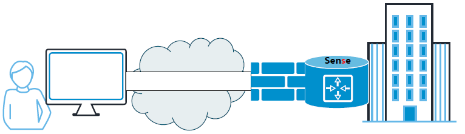
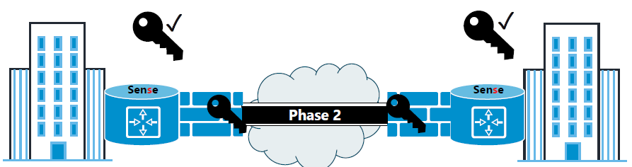

# VPN
...

Un VPN (Virtual PRivate Network) est un tunnel chiffré qui permet de garantir la confidentialité des données qui y transitent  
La plupart du temps mis en oeuvre sur le pare-feu et utilisé dans deux cas de figure :  

- VPN site à site (entre deux sites d'une société)  
- VPN nomade (entre un utilisateur distant et l'entreprise)  

## VPN Nomade

Le VPN nomade est utilisé pour permettre à un utilisateur itinérant de se connecter aux services de l'entreprise en toute sécurité.  
Dans le cadre de connexion sur des Hotspot (Wifi public), c'est la bonne pratique pour éviter que les communications soient interceptées par un tiers.  
Une fois la connexion VPN établie, l'ordinateur se retrouve directement connecté au réseau interne de l'entreprise.  
L'utilisateur a accès aux ressources.  

<figure markdown=1>

</figure>

A ce jour, on retrouve majoritairement 3 technologies :  

- VPN PPTP  
- VPN SSL  
- VPN L2TP/IPSec  

### VPN PPTP (Point to Point Tunneling Protocol)

<u>Le VPN PPTP :</u>  

- Protocole développé par Microsoft  
- Utilise le port TCP 1723  
- Authentification uniquement par un mot de passe  
- Facile à configurer  
- Multiplateformes (Windows, macOS, Linux, OS mobiles)  
- Fonctionne sur la couche 2 du modèle OSI  
- Protocole non chiffré donc une sécurité assez faible (sûrement déjà craqué par la NSA)  

<u>Le VPN SSL :</u>  

- Utilise le port 443  
- Ouvert par défaut sur tous les réseaux publics  
- Aucun logiciel supplémentaire à installer (le client est en général le navigateur )  
- Facile à configurer  
- Multiples méthodes d'authentification  
- Utilise la couche session du modèle OSI  

<u>Le VPN L2TP/IPsec :</u>  
(Layer 2 Tunneling Protocol / Internet Protocol Security)  

- Protocole développé par Cisco  
- Utilise des ports spécifiques qui peuvent être bloqués par les réseaux publics  
    - UDP 1701 pour le service  
    - UDP 500 pour léchange de clé  
    - 50 pour le chiffrement par IPSec  
- L2TP utilise la couche liaison et IPSec la couche réseau de modèle OSI

## VPN Site à Site

Utilisé pour relier deux sites distants géographiquement  
Utilise généralement le protocole IPSec établi en couche 3 du modèle OSI  
4 aspects sont mis en avant sur IPSec :  

- Confidentialité (chiffrement)  
- Authentification  
- Intégrité  
- Anti-rejet

Un tunnel IPSec est établi en 2 phases qui seront à configurer  
Phase 1 :  

- Correspond à l'établissement d'un canal permettant l'authentification des partenaires au travers d'un échange de clés  
- Aucune donnée ne peut encore transiter  
- Le mode "Main" est utilisé pour le site à site (entre deux adresses IP publiques)  

Phase 2 :  

- Etablissement du tunnel chiffré qui sera utilisé pour le transport des données  
<figure markdown=1>

</figure>

Echange bidirectionnel de clés prépartagées pour authentifier les partenaires  
Echange bidirectionnel des clés dans le canal  
Etablissement du VPN chiffré  

## Paramétrage pfSense

<u>Ajout d'une AC sur pfSense</u>  

- Permet de sécuriser la communication dans le VPN  
- Utilisation de certificats  

<u>Ajout d'une authentification LDAP</u>  

- Ajout d'une connexion entre pfSense et Active Directory  
- Permet une double authentification  

### Ajout de l'authentification LDAP

- Systeme  
    - Gestionnaire d'usagers  
        - Serveurs d'authentification  
        - Ajouter  
- Paramètres du serveur  
    - Nom descriptif  
        - Nommer le serveur d'authentification  
            - Nom du domaine AD  
    - Type  
        - LDAP  

- Paramètres serveur LDAP  
    - Nom d'hôte ou adresse IP  
        - Indiquer le FQDN ou @IP du Contrôleur de domaine  
    - Valeur du port  
        - 389 (port LDAP)  
    - Transport  
        - Transport TCP (par défaut)  
    - Autorité de certification du pair  
        - Choisir l'AC créée précédemment  
    - Version du protocole  
        - 3 (par défaut)  
    - Délai de connexion au serveur  
        - 25 (par défaut)  
    - Champ de recherche  
        - Level  
            - Sous-arbre entier (toute l'arborescence LDAP)  
            - Niveau unique (une OU)  
        - Base DN  
            - Nom du domaine au format LDAP  
            - dc=domaine,dc=tld  
    - Conteneurs d'authentification  
        - OU(s) ou conteneur contenant les comptes utilisateurs utilisant le VPN  
    - Requêtes étendues  
        - Ne pas cocher "Activer les requêtes étendues"  
    - Lier anonyme  
        - Décocher pour indiquer le compte de liaison avec AD  
    - Lier les informations d'identification  
        - Renseigner le DN et son MDP du compte AD  
    - Modèle initial  
        - Microsoft AD  
    - Attribut de nommage utilisateur  
        - SamAccountName (en fonction du modèle)  
    - Attribut de nommage de groupe  
        - cn (en fonction du modèle)  
    - Attribut de membre du groupe  
        - memberOf (en fonctione du modèle)  
    - Les autres paramètres 
        - Paramètres par défaut  

### Vérification

Serveur d'authentification créé  
<!--- inserer capture pfsense --->

Test de la configuration  

- Diagnostics/Authentification  

Test d'authentification  

- Serveur d'authentification  
    - Choix du serveur  
- Nom d'utilisateur  
- Mot de passe  

Réussite du test  

### Paramétrage DNS pfSense

Résolution DNS  

- Lier pfSense avec le DNS  
- Système/Configuration générale  

Système  

- Domaine  
    - Rajouter le suffixe DNS  

Paramètre du serveur DNS  

- Serveur DNS  
    - Ajouter l'adresse IP du serveur DNS  
- Remplacer le serveur DNS  
    - Décocher la case  
- DNS Resolution Behavior  
    - Use remote DNS Servers, ignore local DNS  

### Paramétrage OpenVPN

- VPN  
    - OpenVPN  
        - Assitants  

- Assistant  
    - OpenVPN Remote Acces Server Setup  
        - Select an Authentification Backend Type  
            - Choisir le type d'authentification  
                - Local User Access  
                - LDAP  
                - RADIUS  
        - LDAP Server Selection  
            - LDAP Authentification Server List  
                - Choisir le serveur LDAP  
        - Certificate Authority Selection  
            - Choose a Certificate Authority (CA)  
                - CA-OpenVPN  
        - Server Certificate Selection  
            - Choose a Server Certificate  
                - OpenVPN-Cert-Srv  
        - Server Setup  
            - General OpenVPN Server Information  
                - Interface (Interface écoutant pour les connexions VPN)  
                - Protocole (Protocole utilisé pour les connexions VPN)  
                - Local Port (Port d'écoute pour les connexions VPN)  
                - Description (Information pour différencier les serveurs VPN)  
            - Paramètres cryptographiques  
                - Laisser les paramètres par défaut  
            - Paramètres du tunnel  
                - Réseau Tunnel  
                    - Indiquez l'adresse du réseau du VPN  
                - Passerelle de redirection  
                    - Cochez si tout trafic du client doit passer par le VPN  
                - Local Network
                    - Liste des réseaux accessibles à travers le VPN  
                - Concurrent Connections  
                    - Nbre de connexions VPN simultané (Nbre de clients)  
            - Paramètres du client  
                - IP dynamique  
                    - Cocher, les clients gardent la connexion même s'ils changent d'@IP  
                - Topologie  
                    - Sous-réseau : une @IP par client (même sous-réseau)  
                    - Net30 : un réseau par client (sous-réseaux différents)  
                - Domaine DNS par défaut  
                    - Renseigner le(s) serveur(s) DNS  
                - Idem par les serveurs de temps et les serveurs WINS  
            - Traffic from clients to server
                - Création de la règle de connexions au serveur VPN  
            - Traffic from clients through VPN  
                - Création de la règle de communication à travers du VPN  