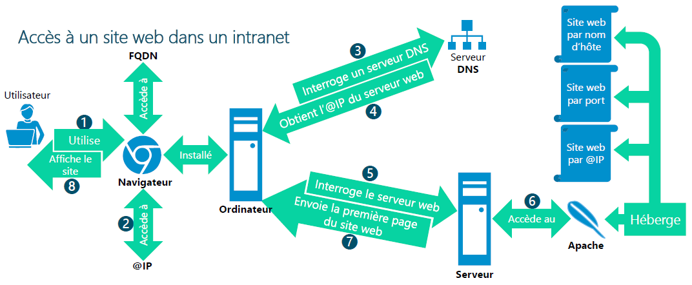
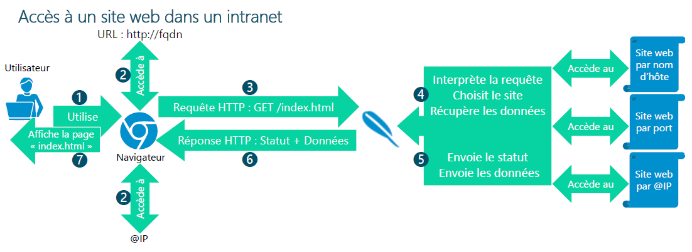
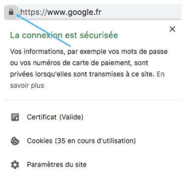
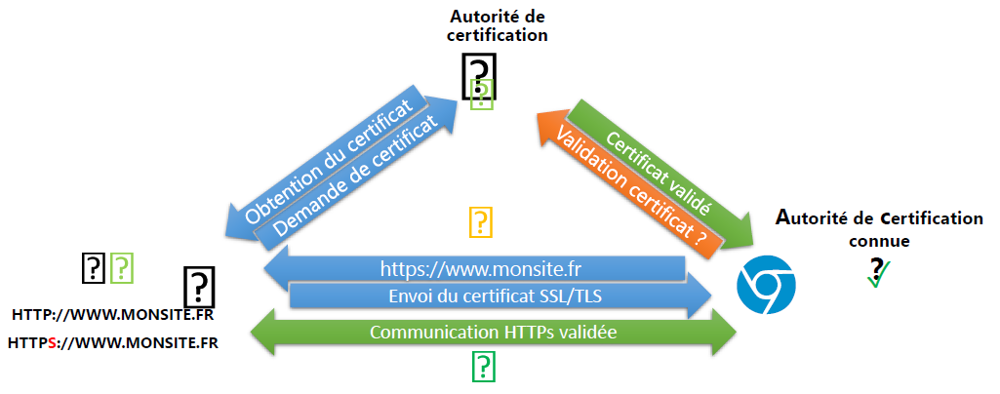

# Serveur Web

## Q'est-ce qu'un serveur web ?

Un **serveur web** est un serveur dans un réseau privé (intranet) ou un réseau public (internet)  
Hébergeant du contenu web (page HTML/CSS)  
Répondant à des requêtes HTTP (port 80) ou HTTPS (port 443) au sein d'un navigateur internet.  
Les serveurs web les plus répandus sont :  

- Apache  
- Ngynx (engineX)  
- IIS  

### Fonctionnement d'un serveur Web

<figure markdown=1>

</figure>

<figure markdown=1>

</figure>

## Qu'est ce qu'un certificat ?

Un certificat est comparable à une carte d'identité sécurisée.  

Il contient les informations :  

- Un numéro de série  
- L'autorité de certification émettrice  
- La période de validité  
- Le nom du titulaire de la clé publique  
- L'algorithme de chiffrement (la clé publique)  
- L'algorithme de signature (signature numérique)  

Il permet **d'authentifier** une connexion et de garantir que le serveur contacté est bien celui qu'il prétend être.  

Dans le cas d'une connexion HTTPS, l'utilisation d'un certificat **SSL** est obligatoire.  
La présence du cadenas permet de confirmer l'identité du serveur web qui répond à la requête.  
On peut donc désormais naviguer en toute confiance, ce site Internet est bien celui qui était ciblé.  

<figure markdown=1>

</figure>

### Comment l'identité du serveur web est-elle validée ?

Utilisation d'une chaîne de certification  

- **Un client (navigateur)**
    - Demande l'accès à des ressources de façon sécurisée  
- **Un serveur (site web)**
    - Héberge des ressources sécurisées  
    - Possède et utilise un certificat pour garantir la communication  
- **Un valideur (autorité de certification)**
    - A émis et garantit le certificat stocké par le serveur  
    - Déchiffre et valide le certificat reçu par le client  

<figure markdown=1>

</figure>

### Comment obtenir un certificat ?

Il existe 3 possibilités pour obtenir un certificat :  

- Générer et utiliser un certificat autosigné  
- Utiliser un certificat provenant d'une autorité de certification interne  
- Obtenir/Acheter un certificat auprès d'une autorité de certification publique  

Parmi ces possibilités, chacune à ses avantages et ses inconvénients.  

## Les protocoles SSL/TLS

Protocole SSL (Secure Socket Layer)  

- 1994: SSL 1.0  
- 1995: SSL 2.0  
- 1996: SSL 3.0  

Passé sous la responsabilité de l'IETF (Internet Engineering Task Force)  

- Renommé TLS (Transport Layer Secure)  
- 1999: TLS 1.0 proche de SSL 3.0  
- 2006: TLS 1.1  
- 2008: TLS 1.2  
- 2018: TLS 1.3  

TLS est chargé de 3 fonctions  

- L'authentification: vérification de l'identité du serveur (certificat numérique)  
- La confidentialité: chiffrement des données sur le média  
- L'intégrité: garantie de la validité des données (algorithme de hashage)  

### SSL (Secure Socket Layer)

Protocole SSL :  

- Chiffre les données  
- Authentifie une connexion lors du transfert de données sur internet  
- Protocole déprécié  
- ex: sécurise vos données bancaire lors d'un achat sur un site web  

### TLS (Transport Layer Security)

Protocole TLS :  

- Version plus récente de SSL  
- corrige certaines vulnérabilités de sécurité vis-à-vis des anciens protocole SSL  
- A prioriser sur du SSL  

