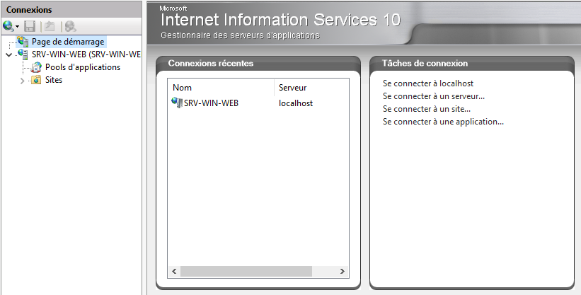

# Serveur Web IIS

**IIS** : acronyme pour **I**nternet **I**nformation **S**ervices  

Les versions d'**IIS**  

<figure markdown=1>

</figure>

## Installation du service IIS

A partir du gestionnaire de serveur  

<figure markdown=1>

</figure>

<figure markdown=1>

</figure>

### Vérification de l'installation de IIS

Afin de vérifier l'installation du serveur IIS :  

Depuis un OS Windows dans un navigateur :  

- http://@IP_du_serveur  
- http://127.0.0.1  
- http://localhost  

<figure markdown=1>
{width=400}
</figure>

### Répertoire d'installation de IIS

Répertoire de travail : c:\inetpub\  
- Répertoire contenant le site web par défaut : c:\inetpub\wwwroot

Administration de IIS s'effectue via :  

- La console Gestionnaire des services Internet (IIS)  

- En PowerShell  

## Console Gestionnaire des services Internet

Paramétrage du serveur  

{ align=right width=350 }

- Document par défaut  
    - Liste des fichiers de démarrage des sites  
- Authentification  
    - Gestion des différentes authentifications  
- Certificats de serveur  
    - Gestion des différents certificats  
- Exploration de répertoire  
    - Gestion de l'affichage du contenu du répertoire  

{ align=left width=450 }

- Sites  
    - Liste des sites hébergés par le serveur  
    - Le site web par défaut  
        - Default web site  
- Documents par défaut  
    - Liste des fichiers de démarrage des sites  

## Stockage des sites

Stocker les sites sur un autre disque ou un autre serveur  

- Créer un répertoire de stockage global  
- Créer un répertoire individuel par site  
- Ex: intranet.mydocs.lcl  
    - Créer le répertoire d:\sites_web  
    - Créer le répertoire d:\sites_web\intranet.mydocs.lcl  
    - Copier les fichiers du site dans le répertoire  
        - ex: fichier de démarrage "index.html"  

## Déclaration du site web

Dans le gestionnaire des services Internet  

1. Ajoutez un site web  

<figure markdown=1>

</figure>

2. Définissez le site  

<figure markdown=1>
{width=350}
</figure>

## Gestion des accès

Règles d'autorisation  

- Gérer les personnes pouvant au site ou au serveur  
    - Autoriser  
    - Bloquer  

Restrictions par adresse IP et domaine  

- Gérer les @IP pouvant accéder au site ou au serveur  
    - Autoriser une @IP ou une tranche d'@IP  
    - Bloquer une @IP ou une tranche d'@IP  

## Certificat autosigné sous IIS

Création d'un certificat autosigné sous IIS  

- Création à partir de la configuration globale  
- Certificats de serveur  
<figure markdown=1>
{width=500}
</figure>

Puis suite à cela cliquer sur "Créer un certificat auto-signé..."  
<figure markdown=1>
{width=500}
</figure>

Il faudra ensuite indiquer le nom du site (www.mydocs.lcl) ainsi que le magasin de certificat (Hébergement Web dans notre cas)  
<figure markdown=1>
{width=500}
</figure>

Suite à cela le certificat est crée.  
<figure markdown=1>
{width=500}
</figure>