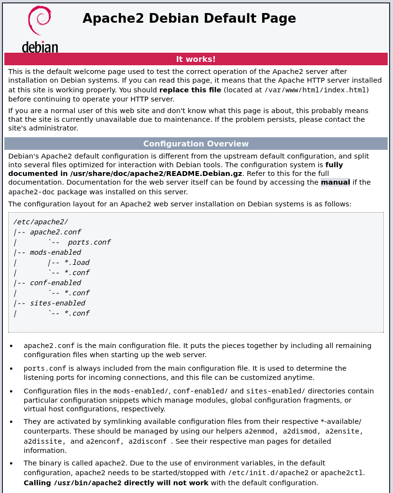
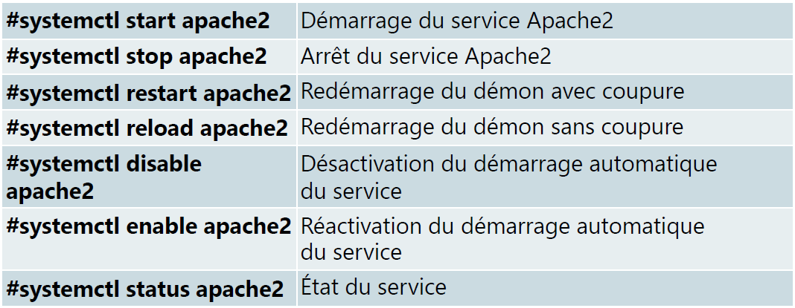
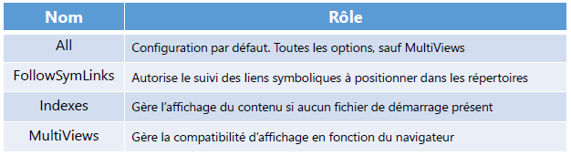
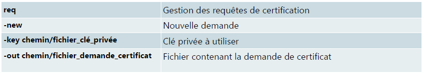
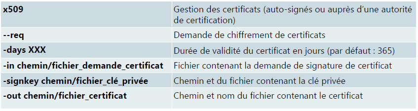

# Serveur Apache

## Historique Apache

Issus du serveur HTTPD  
Regroupant des correctifs développés par différents Webmasters se sont réunis et on formé le "Apache Foundations"  
Le nom "Apache Server" proviendrait de "A Patchy Server"  
La première version "Apache Server 0.62" date d'avril 1995  
Serveur web le plus ppopulaire  

## Installation Apache

l'installation d'Apache2 s'effectue via la commande :  

```bash
apt install apache2
```

### Vérification installation

<u>Machine avec interface graphique :</u>  

<figure markdown=1>
{width=300}
</figure>

Afin de verifier l'installation du serveur il suffit d'ouvrir un navigateur et de taper :

=== "Depuis un poste client"
    http://[@l'ip_du_srv_web]
=== "Depuis le serveur"
    http://[localhost]


<u>Machine sans interface graphique :</u>  

<figure markdown=1>
{width=300}
</figure>

afin de verifier si l'arborescence apache est bien présente en ouvrant le répertoire `/etc/apache2`.  
Celui-ci contient plusieurs fichiers :  

=== "Configuration principale"  
    <u>apache2.conf :</u>  
    Celui-ci contient le fichier principal de configuration  
    Il charge les autres fichiers grâce aux directives "Include"  
=== "Configuration complémentaire"
    <u>conf-available :</u>  
    Contient les fichiers de configuration complémentaires  
    <<u>conf-enabled :</u>  
    Liens symboliques des fichiers de configuration chargés au démarrage pointant vers le répertoire "conf.available"  
=== "Variables d'environnement"  
    <u>envvars :</u>  
    Contient les variables d'environnement pour l'exécution des commandes `apache2ctl`  
=== "Fichier contenant les ports d'écoute"
    <u>ports.conf :</u>  
    Fichier contenant les ports d'écoute d'Apache  
    - 80 : Port HTTP (par défaut)  
    - 443 : Port HTTPs  

=== "Modules Complémentaire"
    <u>Mods-available :</u>>  
    Contient les fichiers de configuration des modules d'Apache  
    <u>Mods-enabled :</u>  
    Liens symboliques des fichiers de modules chargés au démarrage pointant vers le répertoire "mods-available"  
=== "Sites hébergés"
    <u>Sites-available :</u>  
    Contient les fichiers de configuration des sites web hébergés  
    <u>Sites-enabled :</u>  
    Liens symboliques des fichiers de configuration publiés pointant vers le répertoire "sites-availables"  

### Instruction "listen"

Celle-ci se trouve dans le fichier **ports.conf**  
Présente plusieurs fois (80 & 443)  
Définit les ports et les adresses sur lesquels le serveur écoute  
Structure de l'instruction :  

   - Listen *[adresse IP:]*port*[protocole]*  

<u>Exemple :</u>  

- **Listen 80** écoute sur toutes les interfaces sur le port 80  
- **Listen 443** écoute sur toutes les interfaces sur le port 443  
- **Listen 80.10.12.13:80** écoute sur l'interface 80.10.12.13 sur le port 80  
- **Listen 80.10.20.30:443** écoute sur l'interface 80.10.20.30 sur le port 443  

### Instruction "DirectoryIndex"

Présente dans le fichier `/etc/apache2/mods-enabled/dir.conf`  
Liste le nom du fichier à envoyer au navigateur lors de l'accès à un site  
Fichier "dir.conf"  

```bash
<IfModule mod_dir.c>
    DirectoryIndex index.html index.cgi index.pl index.php index.xhtml index.htm
</IfModule>
# vim: syntax=apache ts=4 sw=4 sts=4 sr noet
```

### Gestion du service Apache2

#### Commande `systemctl`

`systemctl {start | stop | restart | reload | enable | disable | status} apache2`  

<figure markdown=1>
{width=400}
</figure>

#### Commande `apache2ctl`

```bash
apache2ctl start         # Démarre le démon Apache
apache2ctl stop          # Arrête le démon Apache
apache2ctl restart       # Redémarre ou démarre le démon Apache
                         # Vérification automatique des fichiers de conf avant de lancer le redémarrage
apache2ctl fullstatus    # Affiche le rapport d'état complet
                         # Le module "mod_status" doit être activé et vous devez disposer d'un navigateur en mode texte tel que lynx
apache2ctl status        # Affiche un rapport d'état succinct
apache2ctl graceful      # Redémarre ou démarre le démon en douceur
                         # Les connexions en cours ne sont pas fermées
                         # Cette option vérifie automatiquement les fichiers de configuration
apache2ctl graceful-stop # Arrête le démon quand disponible
                         # Les connexions en cours ne sont pas fermées
apache2ctl configtest    # Effectue une vérification de la syntaxe
apache2ctl -S            # Affichage des sites publiés
apache2ctl -l            # Affichage des modules compilés avec Apache
                         # - Module statique : chargé au démarrage
                         # - Module partagé : chargé à la demande
apache2ctl -?            # Affichage des options disponibles
```

#### Autres commandes

<u>Gestion des modules :</u>  

- `a2enmod` *nom_module*: active le module  
- `a2dismod` *nom_module*: désactive le module  

<u>Gestion des sites :</u>  

- `a2ensite` *nom_fichier.conf*: publie le site  
- `a2dissite` *nom_fichier.conf*: stoppe la publication du site  

### Structure du fichier de configuration

Les fichiers de configuration des sites sont stockés dans :  

- `/etc/apache2/sites-available`  

Le nom du fichier de configuration est constitué :  

- D'un nom pour identifier chaque site  
- De l'extension `.conf`  
- Le nom du fichier sera `wwww.nom_du_site.conf`  

Définition de l'hôte virtuel :  

- Balise d'ouverture : <Virtualhost ...>  
- Balise de fermeture : </Virtualhost>  

Paramètre de la balise d'ouverture  

- `<Virtualhost *:80>` : l'hôte virtuel est accessible par toutes les adresses IP locales `(*)` sur le port **80**  
- "*" peut être remplacé par :  
    - une adresse IPv4 ou IPv6  
    - un FQDN  
- **80** peut être remplacé par :  
    - N'importe quelle valeur de port **443**,**81**,etc.  
    - "*" pour être accessible à travers n'importe quel port  

Répertoire contenant les données du site :  

- Directive : **DocumentRoot**  
- Chemin par défaut : **/var/www**  
- Un répertoire par site hébergé  

Ex: pour le site **www.mydocs.lcl**  

- Fichier de configuration : `/etc/apache2/sites-available/www.mydocs.lcl.conf`  
- Répertoire du site : `/var/www/www.mydocs.lcl`  

Fichier de configuration  

```bash
<VirtualHost *:80>
        DocumentRoot /var/www/www.mydocs.lcl
        ServerName www.mydocs.lcl
</VirtualHost>
```

**Les Sections de configuration**  

Elles permettent de gérer les accès à des éléments de l'arborescence du site  

- Section **`Directory`** et **`/Directory`** : Pour un répertoire  
- Section **`Files`** et **`/Files`** : Pour un fichier quel que soit son emplacement  

Elles permettent également de gérer less accès à des éléments hors de l'arborescence du site  

- Section **`Location`** et **`/Location`** : Pour gérer l'accès à des éléments utilisés par le site web (Base de données)  

**Ordre de lecture des sections de configuration**  

Les sections sont traitées dans l'ordre où elles apparaissent  

- **`Directory`** et **`/Directory`**  
    - Ces sections sont traitées du répertoire avec le chemin le plus court au plus long  
    - Si plusieurs sections vers le même répertoire, elles sont interprétées dans l'ordre  
- **`Files`** et **`/Files`**  
- **`Location`** et **`/Location`**  

### Gestion des accès  

1. **Gestion des accès simples**  

La directive **Require**  

```Bash
Require all granted                 # l'accès est autorisé pour tous  
Require all denied                  # l'accès est refusé à tous  
Require ip @IP                      
(require ip 192.168.10.200)         # Autorise que pour <u>l'hôte</u> 192.168.10.200  
Require ip adresse_réseau           # Autorise que pour <u>les hôtes</u> du réseau  
(require ip 192.168.10)             # 192.168.10.0 /24  
Require host suffixe_dns            # Autorise que les hôtes dont le nom contient le suffixe dns mdocs.lcl  
(require host mydocs.lcl)           # Recherche DNS inverse (@IP => FQDN) puis une recherche DNS directe (FQDN=>@IP)  
Require forward-dns nom_hôte        # Autorise que l'hôte défini (adresse IP)  
(require forward-dns ad.mydocs.lcl) # Recherche DNS Directe (FQDN => @IP)  
Require local                       # Autorise que les adresses locales  
                                    # Le réseau 172.0.0.0 /8, l'adresse IP ::1, les adresses IP de l'hôte  
```

2. **Gestion des accès multiples**  

La directive **RequireAll** : toutes les directives **require** doivent être validées  

```bash
<RequireAll>  
        Require ip 192.168.10           # Autorise le réseau 192.168.10.0 /24
                                        # ET
        Require not ip 192.168.10.100   # Refuse l'hôte 192.168.10.100
</RequireAll>  
```

La directive **RequireAny** : au moins une directive **require** doit être validée  

```bash
<RequireAny>  
        Require ip 192.168.10           # Autorise le réseau 192.168.10.0/24  
                                        # OU  
        Require ip 192.168.30           # Autorise le réseau 192.168.30.0/24  
                                        # OU
        Require not ip 192.168.20       # Refuse le réseau 192.168.20.0/24  
</RequireAny>  
```

La directive **RequireNone** : aucune directive **require** doit être validée  

```bash
<RequireNone>  
        Require ip 192.168.10       # Refuse le réseau 192.168.10.0/24  
        Require ip 192.168.20       # Refuse le réseau 192.168.20.0/24  
</RequireNone>  
```

La **Directive Options** permet :  

- Ajouter ou de supprimer des fonctionnalités  
- Positionner sur :  
    - la configuration globale du serveur (apache2.conf)  
    - un hôte virtuel (VirtualHost)  
    - un répertoire (Directory)  
- Structure de la directive  
    - Options [+|-] *option* [[+|-]*option*]
<figure markdown=1>

</figure>

## Fichiers du site

<u>Le répertoire du stockage des fichiers du site :</u>  

- Tous les fichiers des sites sont stockés dans `/var/www`  
- Créer un sous-répertoire par site  
    - Pour le site `www.mydocs.lcl` : Il faudra créer un répertoire "www.mydocs.lcl"  
    - ex: `/var/www/www.mydocs.lcl`  

<u>Fichier de démarrage</u>  

- Copier les fichiers du site web dans le répertoire `/var/www/www.mydocs.lcl`  
- Le nom du fichier à envoyer au navigateur dépend de la directive **DirectoryIndex**  
    - ex: fichier de démarrage "index.html"  

### Exemple d'un fichier de configuration

Le fichier sera stocké à l'emplacement :  

`/etc/apache2/sites-available/www.mydocs.lcl.conf`  

Celui-ci contiendra :  

```bash
<VirutalHost *:80>  
        DocumentRoot /var/www/www.tssr.lcl
        ServerName www.mydocs.lcl  
        <directory /var/www/www.mydocs.lcl>  
                Options MultiViews FollowSymlinks  
                AllowOverride None  
                Require all granted  
        </directory>  
</VirtualHost>  
```

## Certificats autosignés sous Apache

<u>Etapes de création des certificats :</u>  

- Création de l'arborescence de stockage des certificats  
- Création d'une clé privée  
- Création d'un fichier de demande de "signature de certificat"  
- Création d'un certificat autosigné  
- Modification du fichier configuration du site  

<u>Arborescence de stockage</u>  

- Les répertoires **certs-auto** et **reqs** sont à créer  

```bash
#tree -d /etc/ssl  

├── certs       #Les autorités de certifications connus  
│    └── java  
├── certs-auto  #Les certificats auto-signés  
├── private     #Les clés privées  
└── reqs        #Les demandes de signatures de certificats  
```
### Création de la clé privée  

`Commande de la créationn de la clé privée`  

```bash
#openssl genrsa -des3 -out /etc/ssl/private/www.mydocs.lcl.key 2048  
Generating RSA private key, 2048 bit long modulus  
......................................................................................  
.+++  
.............+++  
e is 65537 (0x10001)  
Enter pass phrase for /etc/ssl/private/private.key:  
Verifying - Enter pass phrase for /etc/ssl/private/private.key:  
```
<figure markdown=1>

</figure>

### Création de la demande de signature du certificat  

```bash
#openssl req -new -key /etc/ssl/private/www.mydocs.lcl.key -out  
/etc/ssl/reqs/www.mydocs.lcl.request.csr  
Enter pass phrase for /etc/ssl/private/apache.key:  
You are about to be asked to enter information that will be incorporated  
into your certificate request.  
What you are about to enter is what is called a Distinguished Name or a DN.  
There are quite a few fields but you can leave some blank  
For some fields there will be a default value,  
If you enter '.', the field will be left blank.  
-----  
Country Name (2 letter code) [FR]:  
State or Province Name (full name) [Loire_Atlantique]:  
Locality Name (eg, city) [Saint_Herblain]:  
Organization Name (eg, company) [Ecole Informatique]:  
Organizational Unit Name (eg, section) [Srv-Apache]:  
Common Name (e.g. server FQDN or YOUR name) [www.mydocs.lcl]:  
Email Address [admin@mydocs.lcl]:  
Please enter the following 'extra' attributes  
to be sent with your certificate request  
A challenge password []:  
An optional company name []:  
```
<figure markdown=1>

</figure>

Pour en savoir plus `man req`  

### Contenu du fichier de la demande de signature de certificat  

```bash
#cat /etc/ssl/reqs/www.mydocs.lcl.request.csr
-----BEGIN CERTIFICATE REQUEST-----
MIIC7jCCAdYCAQAwgagxCzAJBgNVBAYTAkZSMRkwFwYDVQQIDBBMb2lyZV9BdGxh
bnRpcXVlMRcwFQYDVQQHDA5TYWludF9IZXJibGFpbjESMBAGA1UECgwJRW5pLUVj
b2xlMRMwEQYDVQQLDApTcnYtQXBhY2hlMRkwFwYDVQQDDBB3d3cuZW5pLWVjb2xl
LmZyMSEwHwYJKoZIhvcNAQkBFhJhZG1pbkBlbmktZWNvbGUuZnIwggEiMA0GCSqG
SIb3DQEBAQUAA4IBDwAwggEKAoIBAQC+d4NMzICBeQj+kzd1euI5xeb1Av4mkQbZ
NScXRnlLsufX5j1nIJ2wLLpk3W5l6wKc/VWFUMFODLDYzEfKBVOMmuhZ33s/ZiQe
NvEiObCfXw11k+sA1FmUvWADIuwnpZYOVGNYl5Q/haCCntiYlokdHqsulj1/X6Xc
bbeyKa6BkjawMOUzHm8WIf5xNO0850W3aAae+XkT+TcXvVCd3NaPe2CNxDMUs7pT
v8xBjPzNlCWjBrbCDQJ5zdg3qp7KmSa0CAJPJloSmdnFfC2MMvJgyGcsbSpARibm
pp5A0ig1rvBqj3utOaW9fBKSqh1EO92L/ZGyOfRu5mwh+wOp3OfbAgMBAAGgADAN
BgkqhkiG9w0BAQsFAAOCAQEAuhZWosiQjM5yjR/WUOi9iiE7Rd6j8L54He01fRrR
mVKnFpPpQGje0H4rQ1bhAuUzXbr+fRrCTNww8wVWjWBwUOVv5ZcXKb4mb+/fZYQd
DdKEPMW6e45oDzsLae/XaeNAgqcXK2E7ykOdJhR6cImdvVqvurhbGvLGPHUo4oM9
YLA4ubvP25ieE0dgfCBoNr6AavomxVoSPn2JCUg0+RMFMBObhD91vq7qijzDoVpd
w93ijk3WcAjasKb5igweLIMdGC9Cti4pTPpnZ9EH0WF/DZ4+Dr+3geH2lqS78BAQ
KNlBmWf325XgGy+jPopI5beQNkdEx3bM1174ZhyLv1ZQDA==
-----END CERTIFICATE REQUEST-----
```

### Création de la demande de signature de certificat

La phrase de passe de la clé privée sera demandée si nécessaire.  

```bash
#openssl x509 -req -days 90 -in /etc/ssl/reqs/www.mydocs.lcl.request.csr  
-signkey /etc/ssl/private/www.mydocs.lcl.key -out /etc/ssl/certs-auto/www.mydocs.lcl.cert  
Signature ok  
subject=/C=FR/ST=Loire_Atlantique/L=Saint_Herblain/O=Ecole-Informatique/OU=Srv-  
Apache/CN=www.mydocs.lcl/  
emailAddress=admin@mydocs.lcl  
Getting Private key  
Enter pass phrase for /etc/ssl/private/www.mydocs.lcl.key:  
```

<figure markdown=1>

</figure>

Pour en savoir plus : `man x509`  