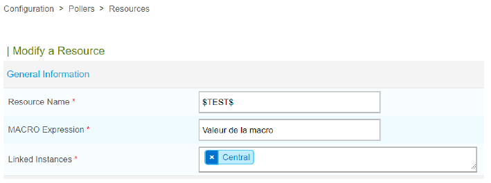

## Bonnes Pratiques

### Variabiliser

Lors de l'écriture des commandes dans Centreon, il sera **très** important de les rendre les plus neutres possibles avec un maximum de parmètres variables.  
Prenons l'exemple de la commande pour vérifier le CPU avec le Centreon-Plugins Windows. Comme paramètre, nous avons :  

- L'adresse IP de la machine hôte afin de vérifier sa consommation CPU  
- La communauté SNMP  
- La version SNMP  
- Un seuil WARNING d'utilisation du CPU  
- Un seuil CRITICAL d'utilisation du CPU  

### Nommer les commandes

Avoir une convention de nommage stricte et cohérente est primordial pour les objets Centreon .  
Nous verrons qu'il en sera de même pour tous les objets que nous créerons par la suite pour l'implémentation d'une supervision.  
Le plus souvent, ce seront des commandes de vérification, on pourra donc utiliser le mot clé **"CHECK"** pour les identifier.  
Ensuite, en fonction des commandes, il peut y avoir un protocole sous-jacent utilisé comme SNMP,WMI.  
Ainsi, dans le cas des CPU, le protocole utilsé sera SNMP.  
Le nommage final de notre commande pourrait donner `check_snmp_cpu`.

## Macros

Les macros seront utilisées lors de l'écriture des commandes afin de pouvoir variabiliser nos paramètres.  
Elles respectent uen nomenclature particulière permettant leurs identifications dans les commandes.  
Les macros commencent et se terminent toujours par le caractère `$`.  
Elles pourront prendre leurs valeurs à plusieurs endroits dans la configuration de Centreon et elles s'utilisent dans l'écriture des commandes.  
Au moment de l'appel système (effectué par Centreon-Engine) par leur valeur  
5 types de macros existe, certaines etant moins utilisées que les autres :  

- Les macros standards  
- Les macros de type ressource  
- Les macros personnalisées  
- Les macros à la demande  
- Les macros arguments  

### Macros Standards

Il s'agit des macros historiques héritées du moteur Nagios.  
Elles sont préexistantes, intégrées au code source du moteur de supervision.  
Il n'est pas possible d'ajouter ni de modifier des macros standards.  
Elles sont utilisées à plusieurs endroits dans centreon (Contrôles des hôtes et services, notifications, gestionnaires d'évènements, etc.).  

Il est possible de retrouver l'ensemble de ces macros avec leurs validités et visibilités dans la documentation officielle Nagios à l'emplacement suivant :  
[liste macros](https://assets.nagios.com/downloads/nagioscore/docs/nagioscore/3/en/macrolist.html)  

Le macro standard la plus utilisée dans la définition des commandes est `$HOSTADDRESS$` qui permet de récupérer l'adresse IP de l'hôte pour lequel la commande est exécutée.  

### Macros ressources

Ce sont des macros que l'on va définir en avance qui ont une visibilité globale dans Centreon et qui peuvent être utilisées dans n'importe quel type de commande.  
Elles respectent la nomenclature `$USERn$` où `n` est un nombre compris entre 1 et 256. Il est donc possible de déclarer 256 macros de ressources par serveur de supervision.  
Ces macros sont propres à chaque serveur de supervision.  

Ces macros sont utilisées pour faire référence aux chemins locaux contenant les sondes sur chaque serveur de supervision par exemple.  
Sont ainsi créées par défaut les macros suivantes :  

- `$CENTREONPLUGINS$` avec comme valeur `/usr/lib/Centreon/plugins`  
- `$USER1$` avec comme valeur `/usr/lib64/nagios/plugins`  

Ici, `$CENTREONPLUGINS$` ne respecte pas la règle de nommage des macros ressources. En effet, depuis Centreon 18.10, il est possible de les appeler comme on veut.  
La création de ces macros s'effectue depuis le menu :  
**Configuration - Pollers - Ressources**  

<figure markdown=1>

</figure>

### Macros à la demande

Aussi appelées macros d'environnement, elles permettent de récupérer des informations à un instant "t" sur n'importe quel objet de Centreon (hôtes,service,etc.) autre que celui concerné au moment de l'exécution de la commande.  
il faut les écrire de cette manière :  

- `$HOSTSTATE:serveurbdd2$`  

Attention, l'utilisation de ces macros est consommateur en termes de ressources.  

### Macros Arguments

Elles permettent de rendre les commandes génériques, en variabilisant les arguments des commandes.  
Leur nomenclature est sous la forme `$ARGn$` où `n` représente un nombre entier.  
Dans une commande, le nombre d'arguments est limité à 32 (atteindre 32 variables dans une commande faut le faire...).  

Dans le cas de notre commande de vérification du CPU, nous pourrions très bien les utiliser pour variabiliser le seuil WARNING et CRITICAL sous la forme `--warning-average=$ARG1$ --critical-average=$ARG2$`  
De plus en plus remplacées par les macros personnalisées.  

### Macros personnalisées

Comparé aux macros arguments, elles vont permettre la même chose, mais en mieux : **variabiliser** l'écriture de ses commandes pour les rendres les plus génériques possibles.  
Nous distinguons deu types de macros personnalisées :  

- les macros d'hôtes et les macros de services.  

Les macros d'hôtes personnalisées commenceront obligatoirement par `$_HOST` et les amcros de services par `$_SERVICE`. S'en suivra ensuite le nom souhaité de la macro puis un `$` pour indiquer la fin.  

- `$_HOSTSNMPVERSION$` permet de déclarer une macro d'hôte personnalisée qui s'appelle **SNMPVERSION**  
- `$_SERVICEWARNING$` permet de déclarer une macro personnalisée qui s'appelle **WARNING**  

Par rapport à l'utilisation des arguments, elles permettront de donner un nom plus explicite à nos variables.  
De plus, elles pourront être redéfinies de manière individuelle dans l'ensemble de notre configuration des services et hôtes. Enfin, nous ne sommes pas limités à 32 valeurs.  

## Ecriture de la commande

Pour rappel, avant toute écriture d'une commande dans Centreon, celle-ci aura d'abord été testée en Shell sous l"utilisateur Centreon-Engine.  

- **configuration => Commands => Checks**  

<!--- voir démo écriture commande -->

## Modèles de services

### Service

Un service est un point de contrôle rattaché à un hôte.  
On parlera aussi de mesure ou indicateur.  
il peut se situer sur plusieurs couches : matériel, système, logiciel, applicatif, processus, etc.  
Centreon sera ensuite en charge de contrôler la performance du service grâce à des indicateurs tels que les seuils warning et critique.  

Pour qu'un service soit cohérent aux yeux du moteur de supervision, il y a un ensemble de paramètres qui devront être renseignés.  
Ces paramètres pourront très bien être récupérés dans la définition du service lui-même ou bien par l'intermédiaire des modèles de services desquels il hérite.  

### Eléments obligatoires

- Son nom, le service doit avoir un nom : **Description**  
- L'hôte associé au service : **Linked with Hosts**  
- Une période de vérification : **Check Period**  
- Un intervalle de vérification : **normal Check Interval**
- Le nombre de vérifications pour confirmation d'un statut non OK : **Max Check Attempts**  
- L'intervalle des vérifications pour confirmation d'un statut non OK : **Retry Check Interval**  
- Service actif ou passif : **Active/Passive Checks Enabled**  
- La commande associée pour la vérification du service : **Check Comma**  

### Période de vérification - Check Period

Ce sont des objets Centreon que l'on va créer (**Configuration => Users => Time Periods**) qui vont permettre de définir des périodes de temps bien définies.  
Par exemple, la période **24x7** prédéfinie englobe tout (24h/24, 7j/7)  
Appliquées à un service, elles vont permettre d'indiquer au moteur de supervision quand le service devra être supervisé, et quand il ne le devra pas.  

### Intervalle de vérification - Normal Check Interval

On va définir un intervalle de vérification pour chaque service : **Normal Check Interval**  
Ainsi, configuré à **5** par exemple, le moteur devra donc vérifier ce service toutes les 5 minutes sur la **Check Period** renseignée.  
Cet intervalle de vérification n'est valable que pour les statuts confirmés. Le bon fonctionnement sera différent pour les statuts non confirmés.  

### Status - Etat Hard et Soft

Il y a 2 types d'états : **HARD** et **SOFT**. Ils sont utilisés pour différencier les status d'erreurs confirmés de ceux non confirmés.  
Durant l'intervalle normal de vérification, lorsuq'un statut d'erreur survient (DOWN pour un hôte et WARNING, CRITIQUE ou UNKNOWN pour une service), Centreon le confirmera à l'aide de plusieurs contrôles successifs qu'on déterminera à l'aide du **Max Check Attempts** et du **Retry Check Interval**.  

Tant qu'un statut ne sera pas confirmé, donc en état SOFT, aucune notification ne sera envoyée.  
Une fois le statut confirmé, donc en état HARD, les notifications seront envoyées.  

A savoir : le statut **UP** pour un hôte et **OK** pour un service est automatiquement confirmé.  
Pour confirmer un statut SOFT en HARD, le nouvel intervalle de vérification sera la valeur renseignée dans **Retry Check Interval** et le nombre de vérifications sera le **Max Check Attempts**.  

<figure markdown=1>

</figure>

### Modèles de services

Il est tout à fait possible de créer des services associés à un hôte sans modèle de service (Services Templates).  
Néanmoins, créer un service sans modèle peut devenir très long si nous en avons plusieurs et être une source d'erreur de configuration.  
De plus, l'utilisation d'un modèle devient obligatoire si nous souhaitons que des services se déploient automatiquement selon un modèle d'hôte.  

Il existe 2 types de modèles de services :  

<u>Les modèles de services de configuration</u>  
Ces modèles ne serviront pas à déployer un service. Ils n'auront aucune **Check Command** renseignée.  
En revanche, ils vont apporter toute la partie configuration du service qui pourra s'avérer répétitive entre les services.  
Quand nous créerons un service pour un hôte, nous ne l'utiliserons jamais directement.  

<u>Les modèles de service fonctionnels</u>  
Ces modèles permettront le déploiement d'un service. Ils devront absolument avoir une **Check Command** associée avec les macros renseignées si nécessaire.  
En revanche, tous les paramètres de vérification du service seront hérités d'un modèle de configuration.  

### Règle de nommage

Afin de distinguer les types de modèles de services et le service associé, il est important d'opter pour une bonne convention de nommage.  

Un modèle de service par défaut pour les checks actifs : 

- **STC_DEFAULT**  

Un modèle de service auquel nous aurions rattaché la commande **CHECK_SNMP_CPU_WINDOWS** pourrait être nommé :  
STF_SNMP_CPU_WINDOWS  

### Héritage de modèles de services

Admettons que nous avons le modèle d'hôte de configuration **STC_DEFAULT** avec la valeur **Normal Check Interval** à 5 minutes.  
Nous créons ensuite le modèle **STF_SNMP_CPU_WINDOWS**,  
Nous lui attachons la commande **CHECK_SNMP_CPU_WINDOWS** et nous mettons en place un héritage avec le **STC_DEFAULT**.  
tous les paramètres définis dans le **STC** n'auront pas besoin d'être réinscrits dans le **STF**. Il est néanmoins possible de redéfinir des paramètres, qui écraseront ceux hérités.  

<!--- démo modèles de services --->

## Modèles d'hôtes

### Un hôte

Un hôte est une entité IP qu'on pourra appeler ressource.  
Derrière cette entité peut se cacher un serveur virtuel, physique, un switch, un routeur, une imprimante, une caméra IP, etc...  
Il est tout à fait possible de créer directement ces hôtes sans passer par des modèles, mais comme pour les services, cela nécessitera un paramétrages qu'il sera intéressant d'envoyer dans un ou pluseurs modèles d'hôtes pour nous faciliter le travail et automatiser le déploiement de services.  

Un hôte est cosntitué de :  

- Son nom : tel qu'il apparaîtra dans la console de supervision  
- Son IP ou nom DNS : **IP Address/DNS**  
- une période de vérification : **Check Period**  
- un intervalle de vérification : **Normal Check Interval**  
- le nombre de vérifications pour confirmation d'un hôte non UP : **Max Check Attempts**  
- L'intervalle des vérification pour confirmation d'un hôte non UP : **Retry Check Interval**
- Check actif ou passif : **Active/Passive Checks Enabled**  
- La commande de vérification de l'hôte : **Check Command**  

### Commande de vérification

Il s'agit de la commande que le superviseur lancera à intervalle régulier pour vérifier le statut de l'hôte.  
Cette commande sera le plus souvent un `ping`.  
Ce ping ne doit absolument pas être qualitatif.  
En effet, elle ne doit pas être retournée en critique, si le ping met trop de temps à répondre elle sera interprété en **DOWN**  

L'hôte peut très bien fonctionner, correctement fournir tous ses services, mais va dépendre de la qualité du réseau d'interconnexion qui le sépare de son serveur de supervision.  
Dans la pratique, on va créer une commande **CHECK_HOST_ALIVE** par exemple qui, en dur, dans la commande, va envoyer 1 paquet icmp avec des seuils WARNING et CRITICAL relativement élevés pour qu'ils ne soient jamais validés.  

### Modèles d'hôtes

Comme pour les modèles de services, les modèles d'hôte vont permettre de structurer la configuration.  
Dans un modèle d'hôte, on rajoutera les modèles de services.  

<u>Les modèles d'hôtes de configuration :</u>  

- Ils permettent une configuration générique qui sera héritée par tous nos hôtes.  
- Dans cette configuration générique, nous retrouverons le plus souvent les informations liées à SNMP, les intervalles de vérification, la commande de vérification de l'hôte et les informations de notification.  
- A savoir que lors du déploiement d'un hôte, bien que toutes ces informations soient récupérées de ce modèle, il sera tout à fait possible de les modifier pour un hôte en particulier.  
- Concernant le nommage, il est courant de les nommer ainsi : **HTC_XXX***.
    - ex. **HTC_DEFAULT**

<u>Les modèles d'hôtes fonctionnels :</u>  

Ces modèles d'hôtes vont permettre de regrouper les hôtes par critères comme les fonctions, rôles, caractéristiques, OS, etc...  
Et également a des critères précis, par exemple déployer certains services.  

<figure markdown=1>

</figure>

<!--- creation modele d'hôte --->

## Appliquer les modifications

### Recharger la configuration

Suite à des ajouts/modifications d'éléments de configuration depuis l'interface Web, les fichiers de configuration ne sont pas directement impactés.  
L'interface Web Centreon travaille sur une copie des fichiers de configuration en base de données.  
C'est après qu'on décidera de générer les nouveaux fichiers de configuration, de remplacer les anciens et de recharger le moteur de supervision.  
Un tel fonctionnement permet également de tester ses fichiers de configuration afin de s'assurer de ne pas recharger un service Centreon avec des fichiers de configuration mal écrits...  

<figure markdown=1>

</figure>

<u>1ère étapes</u>  

Générer les fichiers de configuration avvec le mode debug  

<figure markdown=1>

</figure>

Si l'étape est **OK** il est alors possible de déplacer les fichiers de configuration et de procéder au reload du moteur de supervision.  

<figure markdown=1>

</figure>

## Interfaces de supervision

Maintenant que le moteur de supervision dispose d'hôtes et de services à superviser, il est possible de visualiser l'état de notre supervision depuis le menu :  

- **"Monitoring => Status Details => Services"** pour les services  
- **"Monitoring => Status Details => Hosts"** pour les hôtes  

<figure markdown=1>

</figure>

Pour un hôte comme pour un service (actions de masse possible), il est possible d'effectuer des actions d'exploitation.  

{align=right}

Il est possible d'agir sur les services sélectionnés ou sur les hôtes auxquels sont rattachés les services. Ces mêmes actions sont disponibles pour les hôtes uniquement dans la partie monitoring des hôtes.  

En cliquant sur un service ou un host, une vue détaillée apparaît avec des raccourcis vers quelques actions d'exploitation et la configuration de l'objet sélectionné.  
<figure markdown=1>

</figure>

### Groupes

Les groupes, de services ou d'hôtes, vont permettre de regrouper nos objets par différentes sémantiques.  
Dans le cas des hôtes, nous pourrions par exemple les rassembler en fonction de la technique (Serveur Windows, Linux, etc.), par site géographique, etc.  
Le services eux pourront être rassemblés pour regrouper par exemple tous les services clés à la fourniture de l'intranet de l'entreprise.  

Ensuite, ces groupes sont principalement utilisés dans l'interface de supervision à des fins de statistiques, état des lieux, etc.  
Côté configuration, une fois créés, ils ne peuvent malheureusement être déclarés uniquement sur l'objet lui-même (hôte ou service) et non dans les Templates.  

### Catégories

Les catégories vont permettre de regrouper les hôtes ou services par catégories et seront ensuite utilisées pour **gérer les droits d'accès** dans l'application Centreon  
Elles apportent également des fonctions supplémentaires utilisées par les produits payants Centreon que nous ne verrons pas.  
Contrairement aux groupes, les catégories supportent l'héritage. Il est donc conseillé de les définir au niveau des modèles d'hôtes et de services.  
