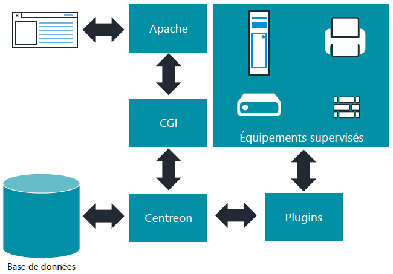

<figure markdown=1>
{width=400}
</figure>

# Installation Centreon

## Architecture et installation

Pour installer Centreon, il existe plusieurs solutions :  

- Utiliser l'ISO Centreon  
- A partir des paquets (CentOS, Rocky Linux, Oracle Linux)  
- A partir d'une VM  
- A partir des sources  

Les deux premières méthodes sont les plus conseillées  
Liens :  

- [Lien officiel](https://docs.centreon.com/current/fr/installation/introduction.html)  

Centreon est composé des éléments suivants :  

- Le moteur de supervision et ordonnanceur de tâches  
- Une base de données  
- Une interface graphique web  
- Des modules/sondes, appelés "plugins", fournis de base  

Contrairement à beaucoup d'autres outils de supervision, Centreon ne dispose pas de mécanismes internes pour vérifier l'état d'une machine, d'un service, etc...  
Il utilise un ensemble de **plugins** qui ne sont rien de plus que des **commandes externes** qu'on appellera **sondes de supervision**.  
Ces programmes peuvent être développés sous  différents langages.  

<figure markdown=1>

</figure>

## Pré-requis

- Une machine debian 11  
- Un accès internet  
- Rôle `sudo` ou `root`  

