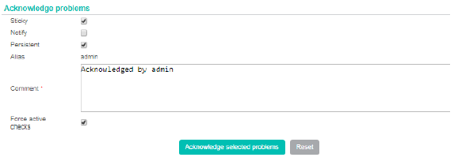
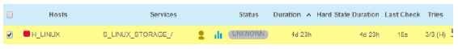
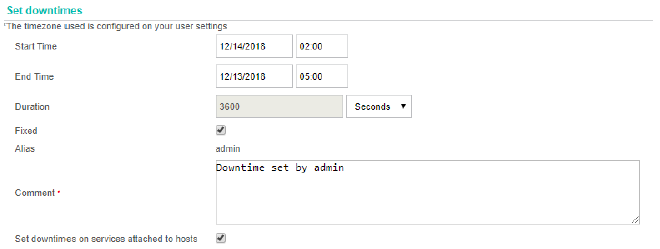
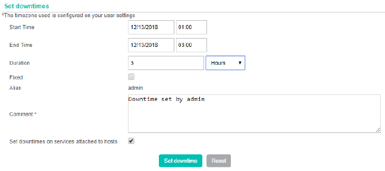
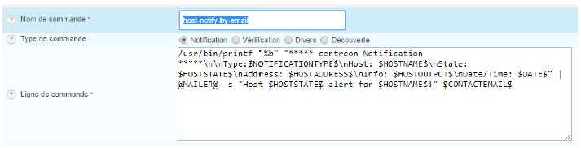
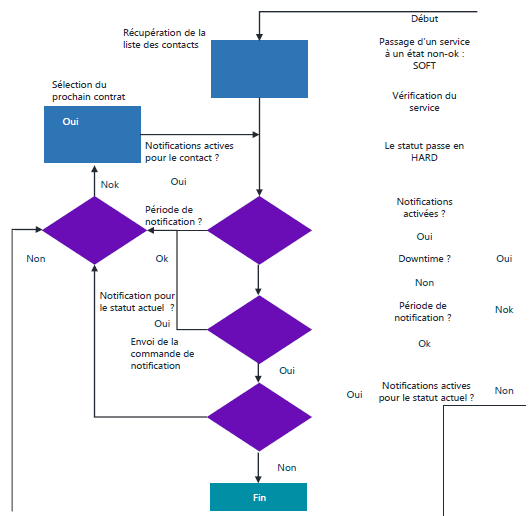

## Actions d'exploitation

### Acquittement et commentaires

Lorsqu'une alerte a lieu, il sera possible de l'acquitter et d'y ajouter un commentaire.  
Ca permettra d'indiquer que l'hôte ou le service qui est en erreur est bien pris en compte.  
Lors d'un acquittement les notifications, sauf si elles sont configurées comme devant être répétées, seront alors désactivées et l'alerte n'apparaîtra plus dans les listes des alertes non acquittées.  

Lors de l'acquittement d'un hôte, il sera possible de le propager à tous ses services qui risquent eux aussi d'être en état d'alerte  

<figure markdown=1>

</figure>

Le service ou l'host apparait sur fond jaune  

<figure markdown=1>

</figure>

### Downtime : Temps d'arrêt

A l'aide de ces temps d'arrêt, nous aurons la possibilité de faire en sorte que Centreon arrête momentanément la supervision des hôtes et service associés sur des périodes programmées en désactivant les notifications.  

Il existe 2 types de temps d'arrêt :  

- Le <u>**fixe**</u> aura pour caractéristique une heure de **début** et de **fin** après quoi les notifications reprendront.  

<figure markdown=1>

</figure>

- Le <u>**glissant**</u> aura une **intervalle** horaire de début et une durée. Il ne commencera seulement quand l'hôte ou le service passera à un état autre qu'**OK** pour une durée précise.  

Il s'agit de la manière la plus optimale pour attribuer un temps d'arrêt qui va correspondre au plus près de l'opération de maintenance.  

<figure markdown=1>

</figure>

### Contrôle immédiat d'un service

Depuis l'interface de supervision des hôtes ou services, on pourra lancer un contrôle immédiat ou immédiat forcé.  
Le contrôle immédiat prendra compte de la période de contrôle définie sur l'hôte ou le service et donc ne donnera rien si nous sommes en dehors.  
Le contrôle immédiat forcé a la particularité de passer outre :  

- C'est la raison pour laquelle on va le privilégier

## Notifications

L'objectif d'une stratégie de notification est d'alerter les bonnes personnes au bon moment et de la bonne manière.  
Quand un statut va passer en HARD, une alerte est générée en interne dans NAGIOS/CENTREON et va enclencher un ensemble de vérifications.  
Cette alerte **pourra** ensuite être envoyée à un ou plusieurs contacts ou groupes de contacts.  

Il est important de veiller à gérer intelligemment les flux d'alertes car trop d'information tue l'information !  
Seules les personnes disponibles et en charge de la gestion du problèmes seront à cibler.  
A la fois sur les hôtes comme pour les services, l'utilisation des modèles permet de générer un héritage sur les comportements des alertes.  

### Méthode d'envoi des alertes

Par défaut, la méthode de notification préférée de Centreon est le courriel.  
Aperçu de la commande `host-notify-by-email`  
<figure markdown=1>

</figure>
Il est cependant possible de le configurer pour envoyer tout autre type de messages (SMS, téléphone, syslog, etc.).  
Après que Centreon ait récupéré la liste de tous les contacts devant être notifiés, ce sont des commandes de notification qu'il utilisera : tout comme les commandes de vérification.  

### Relation parents-enfants

Lorsqu'un service passe en critique sur un hôte, Centreon va d'abord vérifier l'état de l'hôte afin de ne pas envoyer autant de notification qu'il y a de service associés à l'hôte s'il est **DOWN**.  
De plus, si la supervision de plusieurs hosts dépend d'un autre host qui lui-même dépend d'un autre etc,etc.  
Il sera possible de mettre en place du **Network Outage** en déclarant des relations parents/enfants entre les hosts.  
Ainsi, si un host devient DOWN, Centreon vérifiera l'état de son parent et si lui est DOWN, dans ce cas, l'enfant ne sera pas DOWN, mais UNREACHABLE et seul le parent pourra être notifié.  
A savoir qu'il est également possible de notifier pour le statut UNREACHABLE.  

Les points clés du réseau qui en cas de panne provoquent d'importants problèmes, voire l'arrêt du système, seront appelés des SPOF (Single Point Of Failure).  
Il conviendra de les identifier afin de mettre en place les relations parents/enfants.  
Lors de l'implémentation d'un serveur de supervision, il faudra veiller à limiter le nombre de Network Outage en réduisant la taille du plus grand chemin.  

### Comportement des alertes

Lors d'un changement de statut d'un hôte, ou service, et qu'une alerte, par exemple par mail s'en suit, on pourra faire en sorte que la notification ne soit envoyée qu'une ou plusieurs fois à intervalle régulier.  
En cas d'envoi réguliers, c'est l'acquittement de l'alerte qui stoppera les notifications suivantes.  
De plus, on pourra mettre en place un système d'escalade d'alerte.  
En cas de non-prise en compte d'une alerte par un acquittement, au lieu que les notifications soient toujours envoyées aux mêmes personnes, d'autre personnes les recevront.  

## Workflow de notification

Afin de débugger tout problème de notification dans son environnement de supervision, il est important de connaître les différentes étapes entre la vérification d'un service/hôte et sa notification.  

S'assurer que le statut de l'hôte, ou service, est bien en HARD.  
Le statut SOFT n'enclenche pas le moteur de notification.  
Est-ce que les notifications sont activées dans la configuration du service/hôte ou de ses templates ?  
Est-ce que l'hôte/service est dans un temps d'arrêt programmé ?  
Est-ce que la **Notification Period** configurée sur l'hôte ou le service permet la notification ?  
Pour le statut en cours, les notifications sont-elles configurées ?  

Récupération de tous les contacts à notifier et pour chacun d'eux :  

- Est-ce que les notifications sont activées pour le contact ?  
- Est-ce que la période de notification du contact lui permet de recevoir une notification ?  
- Est-ce que le contact est configuré pour recevoir une notification pour le statut actuel ?  
- La notification est envoyée au contact avec la commande adaptée ?  

<figure markdown=1>

</figure>