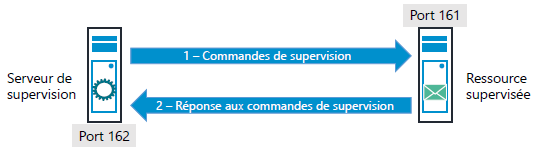
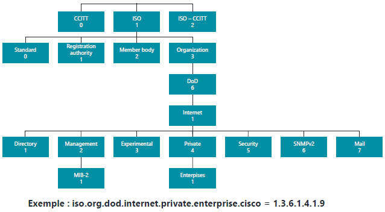
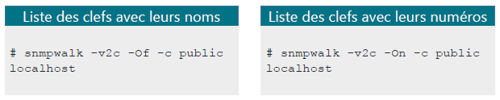
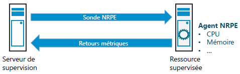

## Le protocole SNMP (Simple Network Management Protocol)

Il s'agit d'un protocole de sgestion de réseaux fourni par l'IETF (Internet Engineering Task Force)  
Celui-ci se situe dans la couche Application (couche 7) du modèle OSI.  
SNMP utilise le protocole UDP pour le transfert des messages.  
Il est très utilisé pour la supervision d'équipements réseau et la gestion de parc.  
Il permet d'accéder, à distance, en lecture et en écriture à la configuration d'un matériel.  

Les éléments prenant part à l'utilisation de ce protocole sont :  

- L'outil de supervision (superviseur)  
- Les éléments supervisés (agent supervisé)  
- Les variables MIB et les OID  
    - **MIB** : **M**anagement **I**nformation **B**ase  
    - **OID** : **O**bject **Id**entifier  
- Le protocole  

L'agent (supervisé) écoute les requêtes du superviseur sur le **port 161** (TCP ou UDP)  
Le superviseur écoute sur son **port 162** pour recevoir les alertes des agents.  

<figure markdown=1>

</figure>

Le protocole **SNMP** exite en 3 versions majeures.  

Les version **1** et **2c** (version la plus utilisée) disposent du même dispositif de sécurité, une simple chaîne de caractère appelée <u>communauté</u> (valeur par défaut à changer).  

Enfin la version **3**, la plus récente, présente pour principal intérêt d'améliorer la sécurité, notamment l'apport de l'authentification.  
Elle est cependant encore mal implémentée sur certains équipements.  

### Les MIB et OID

#### OID

Les OID permettent d'identifier de manière unique chacun des objets gérés qui sont définis dans des fichiers MIB.  
La hiérarchie des objets OID est représentée sous la forme d'une arborescence à plusieurs niveaux.  
Chaque OID a une adresse qui coïncide avec les niveaux de l'arborescence des OID.  

<figure markdown=1>

</figure>

Les identifiants d'objets MIB de niveau élévé ou général sont attribués par divers organismes de normalisation comme ISO.  
Les fabricants définissent des OID pour leurs propres produits dans des ramifications prévées de l'arborescence d'OID.  

Les objets administrés peuvent prendre une forme scalaire ou tabulaire. Les objets scalaires définissent une seule instance d'objet, alors que les objets tabulaires définissent plusieurs instances liées d'objets, et celles-ci sont regroupées dans des tables MIB.

#### MIB

Les **MIB** sont des bases d'information, il s'agit d'un format indépendant, dont disposent les agents, que le superviseur interrogera via **SNMP** pour obtenir des informations.  
Dans une **MIB**, tous les objets ont leur propre définition qui détermina ses propriétés sur l'appareil à gérer.  
La structures des **MIB** est hiérarchique et arborescente. Chaque noeud de cette arborescence a un **O**bject **I**Dentifier (**OID**) qui lui correspond.  

#### OID et MIB sont nécessaires

Qu'il s'agisse de l'utilisation de mémoire d'un serveur, du trafic, que reçoit un commutateur ou des fichiers présents dans la file d'attente d'une imprimante, chacune des informations que le protocole **SNMP** permet d'extraire est traitée individuellement grâce à son OID.  
C'est cette propriété qui explique la nécessité du recours aux OID. Ces derniers aident les administrateurs à identifier et superviser les objets présents sur leur réseau, et donc à donner tout son sens à la supervision réseau.  

Pour que l'entité de gestion puisse communiquer avec un périphérique géré via la réseau, les deux doivent savoir quels OID sont disponibles.  

C'est la raison pour laquelle les fichiers **MIB** ont été créés et pour laquelle les administrateurs système en ont besoin.  
Chaque objet destiné à être supervisé sur un périphérique doit être stipulé par la/les MIB de ce dernier.  
Ainsi, les administrateurs doivent s'assurer que tous les fichiers MIB nécessaires sont bien stockés sur les appareils-agents SNMP mais également sur le système de l'entité de gestion.  
Un fichier MIB se reconnait à son extension ".my" ou ".mib".  

D'ordinaire les fabricants de périphérique fournissent d'ordinaire les MIB nécessaires avec leurs produits dès lors qu'ils sont compatibles avec SNMP.  
En fonction de la solution de supervision utilisé, on peut être obligé de convertir ces fichiers MIB pour en produire des versions spéciales.  

### Trap SNMP

Quand un événement anormal se produit sur un élément supervisé, celui-ci peut en informer son superviseur.  
Dans ce cas, l'agent envoie une **TRAP** (ou alerte) **SNMP**.  
Il est préférable de paramétrer ces trap en utilisant le protocole **UDP**.  

### Mise en place

#### Sous Windows

Sur Windows le service SNMP peut s'installer depuis les fonctionnalités Windows.  
Une fois celui-ci installé, sa configuration s'effectue depuis le gestionnaire de services (services.msc) via l'onglet **sécurité**.  

ou via une commande *PowerShell* :  

```ps1
Get-WindowsCapability -Online -Name "SNMP*"

Name         : SNMP.Client~~~~0.0.1.0
State        : NotPresent
DisplayName  : Protocole SNMP (Simple Network Management Protocol)
Description  : Cette fonctionnalité inclut des agents SNMP (Simple Network Management Protocol) qui analysent
               l’activité des périphériques réseau et envoient leur rapport à la console système du réseau.
DownloadSize : 4454152
InstallSize  : 2638816

Add-WindowsCapability -Online -Name "SNMP.Client~~~~0.0.1.0"


Path          :
Online        : True
RestartNeeded : False
```
Un redémarrage du service est nécessaire pour la prise en compte des modifications sur le service.  
Afin de promouvoir et favoriser l'utilisation du protocole **WMI** (limité aux systèmes Microsoft), la configuration du service **SNMP** est limitées et ne permet pas l'utilisation du protocole v3.  

#### Sous Debian

L'installation du service **SNMP** s'effectue avec le paquet **snmpd**  
```bash
apt install snmp snmpd
```

Le fichier de configuration est situé `/etc/snmp/snmpd.conf`  

```bash
agentaddress 0.0.0.0,[::]                               # Remplacez 0.0.0.0 par l'IP de l'interface SNMP sur laquel il doit écouter
#       sec.name  source          community
com2sec notConfigUser  default       my-snmp-community  # Remplacez my-snmp-community par la valeur de votre environnement
####
# Second, map the security name into a group name:
#       groupName      securityModel securityName
group   notConfigGroup v1           notConfigUser
group   notConfigGroup v2c           notConfigUser
####
# Third, create a view for us to let the group have rights to:
# Make at least  snmpwalk -v 1 localhost -c public system fast again.
#       name           incl/excl     subtree         mask(optional)
view centreon included .1.3.6.1                          # Ajoutez la ligne pour avoir accès à toutes les informations de la MIB requises par le plugin
view    systemview    included   .1.3.6.1.2.1.1
view    systemview    included   .1.3.6.1.2.1.25.1.1
####
# Finally, grant the group read-only access to the systemview view.
#       group          context sec.model sec.level prefix read   write  notif
access notConfigGroup "" any noauth exact centreon none none
access  notConfigGroup ""      any       noauth    exact  systemview none none
```
Pour interroger les différents points de fonctionnement d'un équipement, il faut explorer son arborescence **MIB**  
On utilisera des outils nous permettant de lister les **MIB** de ces équipements à ces fins.  
Deux outils pour comprendre et débugger **SNMP** sont présents dans le paquet **SNMP** :  

- **snmpwalk** va permettre de récupérer un ensemble de clefs  
- **snmpget** va permettre de récupérer une information avec un clef définie  

<figure markdown=1>

</figure>

## Le protocole NRPE

Moins universel que le protocole SNMP, il est également possible de superviser des hôtes et services au moyen de sondes NRPE.  
L'étendue des données récupérables est importante, nous n'aborderons, ici, que celles relatives à des éléments matériels (CPU, mémoire vive, etc...)  
En entreprise, il est courant d'employer ce type de sondes lorsque des hôtes Windows, notamment, sont à superviser, principalement pour des raisons de sécurité.  

En effet, le flux de sondes NRPE peut être chiffré (via SSL/TLS), chose impossible en SNMP, car Windows ne supporte pas la version 3 du protocole.  
L'acronyme NRPE signifie **N**agios **R**emote **P**lugin **E**xecutor, indiquant clairement l'origine de cette sonde, créée à la base pour l'envoi de commandes à distance par Nagios.  

### Fonctionnement

Lorsque des sondes NRPE sont lancées depuis le superviseur, ce dernier, demande à l'hôte, ou plus exactement à un **agent spécifique** d'exécuter des plugins afin de collecter des métriques sur divers éléments matériels ou logiciels.  
Nous sommes typiquement dans un fonctionnement d'application client <-> serveur.  

<figure markdown=1>

</figure>

Le superviseur s'adresse donc à un logiciel déployé sur l'hôte supervisé via un port d'écoute bine spécifique (par défaut 5666).  

L'agent (ou démon) NRPE recevant des instructions réalisera la collecte d'informations qui lui est demandée (ex. la charge CPU), puis renverra les données au superviseur.  

Du côté du superviseur, il faudra juste s'assurer de la présence du plugin NRPE.  

Les hôtes à superviser ne possèdent aucun service par défaut permettant de recevoir des instructions NRPE.  

Il faudra donc mettre en oeuvre une stratégie de déploiement/installation de ce type d'application selon le nombre d'hôtes devant être supervisés.  

Une des solutions logicielles les plus utilisées en la matière se nomme **[NSClient++](https://www.nsclient.org)**.  

Celui-ci est disponible autant sur Windows que sur Linux et librement téléchargeable.  
