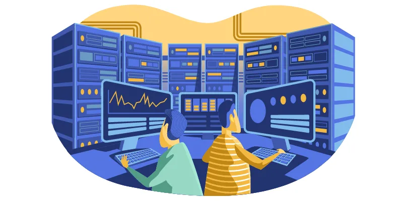
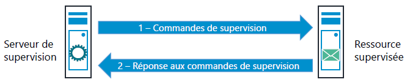
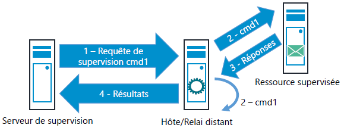
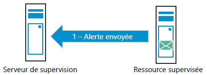
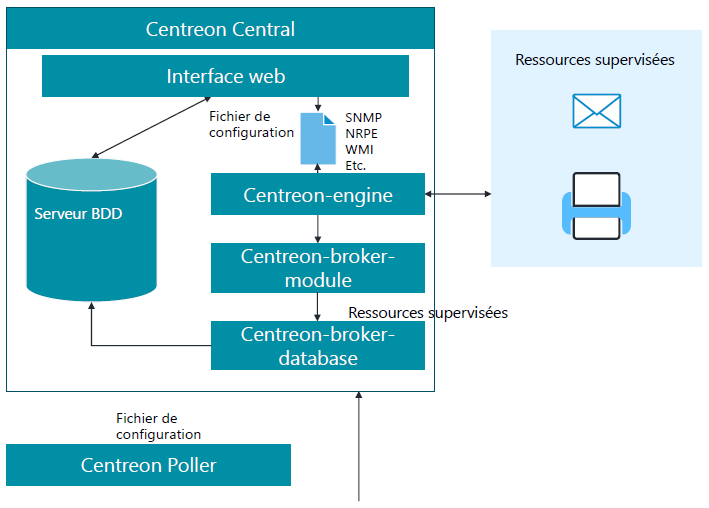

<figure markdown=1>

</figure>

## Supervision d'Infrastructure

La supervision informatique correspond à l'ensemble des mécanismes mis en place pour **la surveillance du bon fonctionnement d'un système** ou **d'un service.**  
Elle a pour objectifs la **Prévention d'incidents**, le **raccourcissement de la durée entre l'incident et son constat**.  

La supervision apporte la possibilité d'être averti rapidement d'un dysfonctionnement matériel ou logiciel, de localiser l'incident et d'agir en fonction du problème.  
Cela permet la réduction du temps de résolution d'incidents et réduira donc l'impact au niveau des utilisateurs.  

### Aspects Fonctionnels

La mise en oeuvre d'une supervision, dans un réseau informatique, apporte un certains nombre de bénéfices :  

- La prévention des incidents :  
    - Détection des pannes  
    - Localisation de la panne  
    - Réparation  
- L'audit des performances :  
    - Le temps de réponse  
    - Le débit  
    - Le taux d'erreur par bit  
    - La disponibilité  
- Le suivi de l'évolution de son infrastructure :  
    - Identifier les différents éléments de son infrastructures  
    - Conserver un état des différents changements intervenus  

### Données Traitées

La supervision s'appuie, pour son bon fonctionnements, sur :  

- La collecte d'information (notamment des métriques afin de traiter des graphiques)  
- Le contrôle de l'état du système (fonctionnel ou non)  
- La sauvegarde de l'état d'un historique  

### Types de Supervision

La supervision est définis en 4 types :  

- **Inactif** : pas de supervision ou alarmes ignorées  
- **Réactif** : pas de supervision ou réaction aux problèmes lorqu'ils surviennent  
- **Interactif** : supervision présente, mais la correction des pannes demande une intervention humaine  
- **Proactif** : supervision, détection des causes réelles et dans la mesure du possible intervention automatisée  

### Surveillance des services et ressources

Le bon fonctionnement des services peut être contrôlé directement, sans installation d'agent de supervision sur les éléments à superviser, par vérification en utilisant le port ouvert par le service sur le serveur (ex: port 80 pour le http)  
La collecte des informations se fera grâce aux indicateurs de qualité et de disponibilité.  
En cas d'incident, le déclenchement d'un événement de supervision va permettre de prévenir et d'agir rapidement en conséquence.  

Le suivi des ressources est essentiel afin de garantir le bon fonctionnement des services et applications les utilisants.  
Afin de collecter des informations en temps réel (données et/ou états) l'installation d'agents pourra être nécessaire sur les différentes machines à superviser.  
Les ressources collectées sont principalement des indicateurs de consommation. une variation brusque ou l'atteinte d'une limite de consommation déclenche un événment de supervision (notification,alerte ou des actions depuis le serveur de supervision)  

### Découpe fonctionnelle

Quel que soit le but, il est possible de découper la supervision en actions :  

- Observer, découvrir et inventorier de l'information  
- Contrôler, collecter et stocker des données  
- Agréger, analyser, corréler et consolider de l'information  
- Présenter, indiquer et synthétiser les données  
- Alerter, notifier et réagir en cas de problème sur le système  

### Points de contrôle

Peu importe le système supervisé, celle-ci sera toujours découpée en 3 catégories de points de contrôle :  

- **Contrôle de disponibilité** : s'assure de la présence d'un équipement, d'une application ...  
- **Contrôle de performance** : s'assure des performances fournies par un équipement, une application...  
- **Contrôle d'intégrité** : s'assure qu'il n'existe pas d'incohérence dans le fonctionnementprévu d'un équipement, d'un service, d'une application...  

C'est différent controle sont mis en place sur la supervison afin de récolter suffisament d'information en cas de problème sur le système d'information.  

### Domaine d'application

La supervision peut être appliquée à plusieurs domaine tel que :  

- Le réseau :  
    - Disponibilité d'équipement,  
    - Latence,  
    - Taux d'erreur d'une liaison,  
    - Bande Passante,  
    - Routage...
- Matériel et environnement :  
    - Température,  
    - Humidité,  
    - Taux de charges I/O d'un disque,  
    - Charge d'Onduleur,  
    - RAID,  
    - Alimentations,  
    - Ventilateurs,  
    - Lecteurs,  
    - Imprimantes...  
- Système :  
    - Fréquence Processeur,  
    - Utilisation Mémoire (Physique ou Virtuelle),  
    - Journaux d'événements système...  
- Middlewares :  
    - Lancement des services,  
    - Temps de réponse d'un serveur Web,  
    - Nombre de VM sur un hyperviseur,  
    - Envois de mails...  
- Applications :  
    - Disponibilité d'un socket,  
    - Processus lancé,  
    - Tests spécifiques couvrant les fonctionnalités de l'application...
- SLA :  
    - Garantir les SLA d'un service en récupérant certains indicateurs : temps d'affichage d'une page, page non fonctionnelle, nombre de connexions...  

## Comment Superviser ?

Il existe deux règles qu'il est préférable de respecter :  

- La supervision doit être la moins intrusive possible  
- La supervision doit être la plus indépendante possible des éléments supervisés  

### Méthode de supervision

#### Supervision Active

Il s'agit de la méthode la plus employées.  
Elle consiste à émettre des requêtes d'interrogation par la plateforme de supervision à destination des éléments supervisés.  
On parlera dans ce cas de **checks actifs**  
La supervision Active comporte 2 sous-ensembles :  

##### Checks actifs locaux

Ce sont des vérifications des services / ressources directement hébergées et éxécuté depuis sur le serveur de supervision (CPU, mémoire, espace disque, ...)  
Ces vérifications sont effectuées sur les composants du réseau mais également sur le serveur lui même.  
C'est au serveur de supervision d'effectuer les commandes de récupération de l'information et d'en faire le traitement.  

<figure markdown=1>

</figure>

Les principaux **checks actifs locaux** s'effectueront grâce à :  

- La vérification d'un socket TCP/UDP  
- Ressource directement sur le serveur de supervision  

Les **checks actifs locaux** étant limité nous pourrons passer au :  

##### Checks actifs distant

L'élément exécutant les tests ne sera plus le serveur de supervision.  
Ce dernier initie une commande de check spécifique (distant) à destination de l'hôte distant responsable du test.  
Cette commande indique à l'hôte distant le test que celui-ci doit effectuer (commande, arguments, options, éléments ciblés...)  
Une fois l'action exécutée, l'hôte distant transmet au serveur de supervision les résultats obtenus.  

Ces test ne pourront être réalisés que si les commandes de check existent sur l'hôte distant et qu'un agent est installé sur le poste distant.  
Pour ce faire les principales commandes de **checks actifs distant** sont :  

- Check_by_ssh,  
- Check_nrpe,  
- Requêtes SNMP,  
- Requêtes WMI  

L'utilisation des **checks actifs distants** présente plusieurs avantages :  

- Moins de travail pour le superviseur,  
- Accès à des ressources normalement impossibles depuis le superviseur,  
- Dépassement des limites du système hôte de supervision  

<figure markdown=1>

</figure>

L'hôte distant peut effectuer des test sur ses propres services/ressources ou sur d'autre éléments de son réseau (on parlera dans ce cas de relais distant)  

#### Supervision Passive

A la différence de la supervision active ou le serveur emet des requêtes pour récuperer les informations, la supervision passive consiste à attendre que les ressources supervisées transmettent des alertes au serveur de supervision.  
La ressource supervisée vérifie son état et transmet de manière autonome le résultat au serveur de supervision qui après réception la traitera.  

<figure markdown=1>

</figure>

La **supervision passive** permet la surveillance en temps réel, à l'inverse de la supervision active qui emet des requetes de manière periodique.  
Cependant, l'absence d'alerte ne signifie pas forcément que la ressource supervisée est dans un état correct de fonctionnement. De plus ce genre de supervision n'est pas forcément applicable à toutes les situtations.  
Il sera préférable de l'utiliser conjointement avec de la **supervision Active**.  

Les principaux checks passif seront réalisés via les protocoles :  

- **SNMP** : (**S**imple **N**etwork **M**anagement **P**rotocol) On parlera alors de *trap SNMP*. Ils sont massivement implémentés sur les équipements réseaux/d'infrastructure et les possibilités sont définies à l'avance par le constructeur.  
- **NSCA** : (**N**agios **S**ervice **C**heck **A**cceptor) Permettra l'envoi d'informations au serveur de supervision à des fins de supervision. Ce protocole a l'avantage d'être utilisable depuis n'importe quel contexte, sous Linux et Windows.  

## Supervision Distribuée

### Théorie et historique

#### Théorie

La supervision distribuée est faite pour les grandes structures de supervision.  
Elle met en oeuvre un serveur Central ainsi que plusieurs serveurs collecteurs, également appelés "satellites" ou "pollers".  
Chaque collecteur est chargé d'un ensemble de vérifications qu'il reporte en base de données, qui se charge ensuite sur le serveur Central afin de l'afficher sur son interface Web.  

On s'orientera vers une architecture distribuée pour deux raisons :  

- Le superviseur se doit de contrôler plusieurs centaines d'hôtes. On décide de distribuer la supervision entre plusieurs moteurs afin de répartir la charge.  
- Le souhait de superviser des ressources sur un site distant, pas directement accessible depuis notre superviseur Central ou alors avec un lien réseau à bande passante réduite.  

#### Serveur Satellite

Les serveurs satellites fonctionnent de manière complétement indépendante.  
Si un serveur satellites n'arrivent plus à joindre le Central, ils continuera les vérifications de manière autonome, stockera les résultats en cache et les enverra une fois la communication vers le Central rétablie.  

La configuration des serveurs satellite s'effectue comme pour le Central, depuis l'interface Web.  
Il faudra définir depuis quel serveur de supervision sera supervisé chaque hôte et lui exporter sa configuration.  
Cette étape est effectuée par le service "gorgone" sur le Central qui, à l'aide de SSH (ou ZMQ), copiera les fichiers de configuration respectifs de chaque poller.  

NDOUtils est un module additionnel permettant à Nagios d'écrire dans une base de données l'état des machines et services à superviser.  
NDOUtils est composé de deux modules : NDOMOD et NDO2DB.  
NDOMOD doit être lancé sur le serveur Nagios et permet de récupérer les informations remontées par Nagios pour les transmettre via TCP (port 5669) (ou un socket Unix) vers NDO2DB.  
NDO2DB est un démon qui écoute sur un port TCP (ou un socket Unix) et écrit les données reçues dans une base de données (MySQL ou PostgreSQL).  

Aujourd'hui avec Centreon, le moteur Nagios est devenu Centreon-Engine et les NDOUtils Centreon-Broker.  
Comme pour les NDOUtils, Centreon-Broker est divisé en deux éléments :  

- Centreon-broker-module pour récupérer les informations de supervision de Centreon-Engine  
- Centreon-broker-database pour l'inscription des données de supervision en base de données et la génération des graphiques (RRD files).  

### Rôles dans Centreon

#### Centreon Central Database

Ce serveur peut être composé de tous les rôles importants de la supervision :  

- Centreon-Engine : Moteur de supervision,  
- Centreon : interface Web,  
- Centreon-broker-module & Centreon-broker-database : Broker,  
- MariaDB : Base de données,  
- etc.  

!!! note ""
    Il est possible d'utiliser tout autre type de base de données à la place de MariaDB.  
    Elle peut également être déportée sur un autre serveur.  

#### Centreon Poller

Ces serveurs sont composés uniquement d'un moteur de supervision (Centreon-Engine) et du broker (Centreon-broker-module).  
Les différents échanges de données sont faits via des connexions SSH (ou ZMQ).  
Il est donc important de bien gérer les échanges de clef RSA entre les POLLERS et le Central DATABASE.  

<figure markdown=1>

</figure>